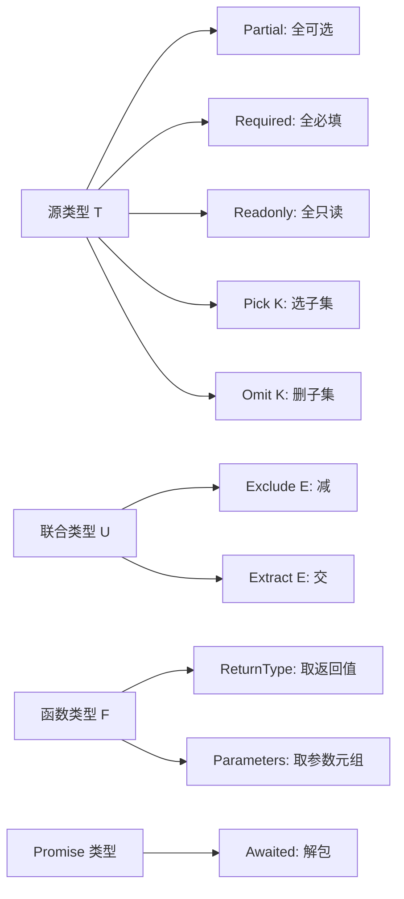

# 09 · 内置工具类型（Utility Types）
> TypeScript 标准库自带的一组「类型函数」，输入一个类型、输出一个变形后的新类型，免去手写映射/条件类型，专治各种常见的类型变换需求。

## 📖 知识讲解

工具类型（Utility Types）是 TS 在全局可用、无需 import 的内置泛型类型。它们底层多由「映射类型 + 条件类型 + infer」实现，但你只需把它们当成函数来用即可。常用清单：

| 工具类型 | 作用 | 一句话记忆 |
| --- | --- | --- |
| `Partial<T>` | 所有属性变可选 | 全部加 `?` |
| `Required<T>` | 所有属性变必填 | 全部去 `?` |
| `Readonly<T>` | 所有属性变只读 | 全部加 `readonly` |
| `Pick<T, K>` | 只挑选 K 这些键 | 做加法（选） |
| `Omit<T, K>` | 剔除 K 这些键 | 做减法（删） |
| `Record<K, V>` | 构造键 K 值 V 的对象 | 造字典 |
| `Exclude<U, E>` | 联合中排除 E | 联合做减法 |
| `Extract<U, E>` | 联合中提取 E | 联合做交集 |
| `NonNullable<T>` | 去掉 null/undefined | 去空 |
| `ReturnType<F>` | 取函数返回值类型 | 看输出 |
| `Parameters<F>` | 取函数参数元组类型 | 看输入 |
| `Awaited<T>` | 递归解包 Promise | 脱 Promise |

**易错点**
- `Pick`/`Omit` 的第二个参数：`Pick` 的 K 受 `keyof T` 约束（写错键会报错），而 `Omit` 的 K **不受**严格约束（写不存在的键不会报错，TS 设计如此，要小心拼写）。
- `Record<K, V>` 要求 K 的**每个**成员都必须出现，漏一个就报错。
- `Exclude`/`Extract` 只对**联合类型**有意义（它们是分布式条件类型）。
- `ReturnType`/`Parameters` 的入参通常配合 `typeof 函数名` 使用，而不是直接传函数值。
- `Awaited` 是 TS 4.5+ 引入的，会**递归**解包，`Promise<Promise<T>>` 也能拆到 `T`。

## 🔄 流程图 / 原理图



## 💻 代码说明

- `Partial<User>` 用作 `updateUser` 的 patch 参数：调用方只需传想改的字段，是「部分更新」最常见的写法。
- `Required<User>` 把原本可选的 `age` 变必填，演示与 `Partial` 相反的方向。
- `Readonly<User>` 后对 `ro.name` 赋值会触发只读报错，体现不可变约束。
- `Pick<User, "id" | "name">` 做加法只保留需要的字段；`Omit<User, "email">` 做减法去掉敏感字段。
- `Record<Role, string[]>` 把字面量联合 `Role` 当成键，强制每个角色都要配置权限数组。
- `Exclude`/`Extract` 对联合 `"a"|"b"|"c"` 分别做减法与交集。
- `ReturnType<typeof createUser>` 与 `Parameters<typeof sendMail>` 展示从函数「反推」出输出/输入类型，配合 `...args` 展开调用。
- `Awaited<Promise<Promise<number>>>` 演示递归解包，最终得到 `number`。

## ▶️ 运行方式

在工程根 `06-typescript` 下：

```bash
npm i -D typescript ts-node     # 首次准备依赖
npx ts-node 09-utility-types/demo.ts   # 直接运行
# 或编译为 JS
npx tsc
```

## ⚠️ 常见坑 / 最佳实践
- **`Omit` 不校验键名拼写**：`Omit<User, "emial">`（拼错）不会报错，多打几次单元类型测试或用 `keyof` 自己约束更安全。
- **更新场景优先 `Partial`，公开 API 优先 `Readonly`/`Pick`**：暴露给外部的数据用 `Readonly`/`Pick` 收窄字段，避免泄露与误改。
- **`Record` 配合字面量联合做字典**，比 `{ [k: string]: V }` 更精确，能在编译期发现漏配的键。
- **优先组合而非手写**：`Awaited<ReturnType<typeof fn>>` 这类组合非常常用，远胜手写条件类型。

## 🔗 官方文档
- Utility Types：https://www.typescriptlang.org/docs/handbook/utility-types.html
