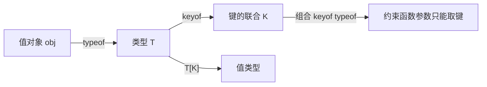

# 10 · 索引类型查询（Keyof / Typeof / Indexed Access Types）
> 在「类型层面」对一个类型或一个值做查询：`keyof` 取键、`typeof` 取值的类型、`T[K]` 取键对应的值类型，三者组合是编写泛型工具类型的基本功。

## 📖 知识讲解

- **`keyof T`（索引类型查询运算符）**：取出类型 `T` 所有公开属性名，组成一个**字符串/数字字面量联合类型**。例如 `keyof Person` => `"name" | "age" | "email"`。
- **`typeof value`（类型查询）**：在**类型上下文**里写 `typeof 变量`，会把这个**值**反推成它的**类型**。注意它和 JavaScript 运行时的 `typeof`（返回 `"string"` 等字符串）完全是两码事，区别在于它出现在类型位置。
- **`T[K]`（索引访问类型 / Indexed Access Types）**：用「键」去索引「类型」，取出对应的**值类型**。`Person["name"]` => `string`；传联合 `Person["name" | "age"]` => `string | number`；取数组元素类型的惯用法是 `T[number]`。
- **组合 `keyof typeof obj`**：先 `typeof` 把值对象变成类型，再 `keyof` 取它的键。常用于把一个常量对象（配置表、颜色表、枚举式常量）的键收窄成联合类型。

**易错点**
- 类型上下文的 `typeof` 不能用于「类型」，只能用于「值（变量/函数）」：`typeof Person`（Person 是类型）会报错。
- 不加 `as const` 时，`const obj = { a: 1 }` 的值类型会被放宽（`a: number`）；加了 `as const` 才是字面量 `1`。
- `keyof` 作用在带索引签名的类型上结果不同：`keyof { [k: string]: V }` 得到的是 `string | number`。
- 泛型里写 `K extends keyof T` 是让键名「锚定」到对象上，从而让返回值 `T[K]` 精确联动。

## 🔄 流程图 / 原理图



## 💻 代码说明

- `keyof Person` 得到 `"name" | "age" | "email"`，赋值非法键即报错。
- `typeof config` 把配置对象反推成 `{ host: string; port: number; https: boolean }`，再用它约束另一个对象。
- `Person["name"]` / `Person["name" | "age"]` 演示索引访问取单键与多键；`(typeof fruits)[number]` 是取数组元素类型的经典写法。
- `COLORS as const` + `keyof typeof COLORS` 把颜色表的键收窄为 `"red" | "green" | "blue"`，`getColorHex` 只接受合法颜色名。
- `getProperty<T, K extends keyof T>(obj, key): T[K]` 是教科书级用法：返回值类型随传入的键名精确变化，传错键直接编译期报错。

## ▶️ 运行方式

在工程根 `06-typescript` 下：

```bash
npm i -D typescript ts-node
npx ts-node 10-keyof-typeof/demo.ts
# 或编译
npx tsc
```

## ⚠️ 常见坑 / 最佳实践
- **想约束「只能传某常量对象的键」时**，固定套路是 `keyof typeof OBJ`，记得给对象加 `as const` 让键值更精确。
- **区分两个 typeof**：类型位置（注解、`type X = ...`）里的 `typeof` 是类型查询；表达式位置里的是 JS 运行时运算符。
- **取数组/元组元素类型用 `T[number]`**，取对象所有值类型的联合用 `T[keyof T]`。
- **写泛型取值函数务必加 `K extends keyof T`**，否则返回类型会塌缩为 `any` 或联合，失去精确性。

## 🔗 官方文档
- Keyof Type Operator：https://www.typescriptlang.org/docs/handbook/2/keyof-types.html
- Typeof Type Operator：https://www.typescriptlang.org/docs/handbook/2/typeof-types.html
- Indexed Access Types：https://www.typescriptlang.org/docs/handbook/2/indexed-access-types.html
