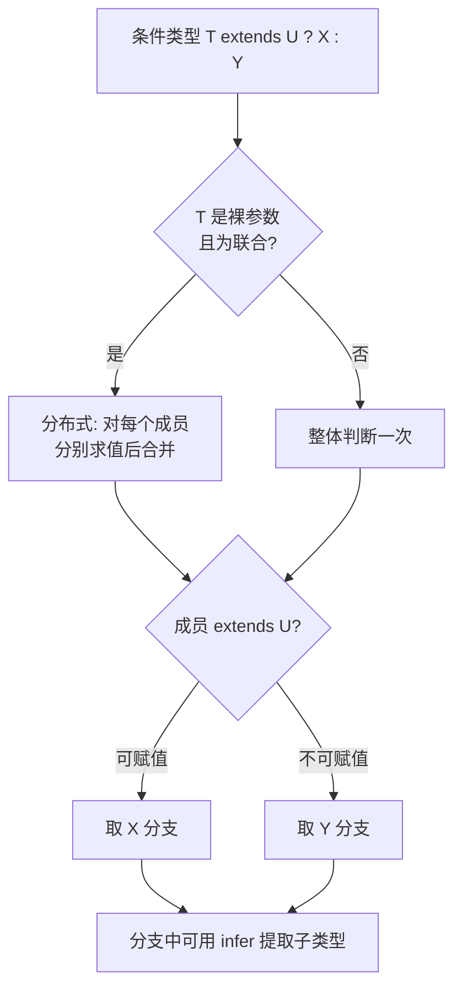

# 11 · 条件类型（Conditional Types）
> 在类型层面写「if-else」：`T extends U ? X : Y`，再配合分布式特性与 `infer`，就能在编译期对类型做条件判断与子类型提取，是工具类型的核心机制。

## 📖 知识讲解

- **基本语法 `T extends U ? X : Y`**：读作「如果 T 可赋值给 U，则结果是 X，否则是 Y」。`extends` 在这里是「是否是子类型/可赋值」的判断，不是继承。
- **嵌套条件类型**：把 `Y` 再写成一个条件类型，就形成 `else if` 链，常用于按类型分发（如 `TypeName<T>`）。
- **分布式条件类型（Distributive）**：当 `T` 是**裸类型参数**（直接是 `T`，没被包成 `[T]`、`{ t: T }` 等），且传入的是**联合类型**时，条件类型会**对联合的每个成员分别求值再合并**。例如 `ToArray<string | number>` => `string[] | number[]`。这正是 `Exclude`/`Extract`/`NonNullable` 的实现原理。
  - 想**关闭**分布式行为，把两侧都用元组包起来：`[T] extends [U] ? ...`。
- **`infer` 关键字**：在条件类型的 `extends` 子句里**就地声明一个待推断的类型变量**，TS 会帮你把对应位置的类型「填」进去。例如 `T extends (...args: any[]) => infer R ? R : never` 提取返回值；`T extends (infer E)[] ? E : T` 提取数组元素类型。

**易错点**
- `infer` 只能出现在条件类型 `extends` 的**右侧**，不能单独使用。
- 分布式只在「裸类型参数 + 联合」时触发；一旦包成 `[T]` 或属性，就不分布。
- 条件类型里 `never` 是「分布式的单位元」：`never extends U ? X : Y` 会直接得到 `never`（联合为空）。
- 多个同名 `infer` 出现在协变位置取联合、逆变位置（如参数）取交集，属进阶细节。

## 🔄 流程图 / 原理图



## 💻 代码说明

- `IsString<T>` 是最小条件类型，区分 string 与非 string。
- `TypeName<T>` 用嵌套条件实现 `else if` 链，把类型映射成名字字符串。
- `ToArray<T>` 演示分布式：传 `string | number` 得到 `string[] | number[]`；`MyExclude` 用同样机制重现内置 `Exclude`；`ToArrayNonDist` 用 `[T] extends [any]` 关闭分布式，得到 `(string|number)[]`。
- `MyReturnType` 用 `infer R` 提取函数返回值；`ElementType` 用 `(infer E)[]` 提取数组元素类型（只脱一层）；`Unwrap` 用 `Promise<infer V>` 解包 Promise。
- 末尾注释展示 `infer` 不能脱离 `extends` 使用会报错。

## ▶️ 运行方式

在工程根 `06-typescript` 下：

```bash
npm i -D typescript ts-node
npx ts-node 11-conditional-types/demo.ts
# 或编译
npx tsc
```

## ⚠️ 常见坑 / 最佳实践
- **想要分布式就保持裸参数**，不想要就用 `[T] extends [U]` 包起来——这是控制行为的关键开关。
- **`infer` 命名只在该条件类型内有效**，把它当成「临时占位变量」即可。
- **优先用内置工具类型**（`ReturnType`/`Awaited`），手写条件类型主要用于库级抽象或学习原理。
- **小心 `never` 的吞噬效应**：联合里若某分支求值为 `never`，会从结果中「消失」，这通常正是你想要的过滤效果。

## 🔗 官方文档
- Conditional Types：https://www.typescriptlang.org/docs/handbook/2/conditional-types.html
