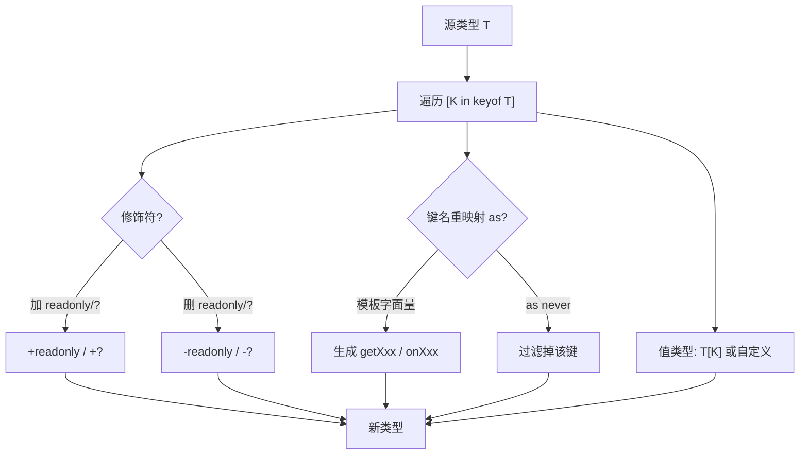

# 12 · 映射类型（Mapped Types / Template Literal Types）
> 基于一个旧类型「逐个键」批量生成新类型：`{ [K in keyof T]: ... }`，可批量改值类型、增删 `readonly`/`?` 修饰符、用 `as` 重映射键名，并配合模板字面量类型生成新键名。

## 📖 知识讲解

- **基本语法 `{ [K in keyof T]: X }`**：`K in keyof T` 表示遍历 `T` 的每个键，`X` 是新生成的值类型。值类型可写死（如 `boolean`），也可用 `T[K]` 保留原值类型。`Partial`/`Readonly`/`Pick` 等内置工具类型都是用映射类型写的。
- **修饰符增删（`+` / `-`）**：
  - 加修饰符：`readonly [K in keyof T]?` 给每个键加只读和可选（`+` 可省略）。
  - 删修饰符：`-readonly [K in keyof T]-?` 去掉只读、去掉可选。内置 `Required<T>` 就是 `{ [K in keyof T]-?: T[K] }`。
- **键名重映射 Key Remapping via `as`（TS 4.1+）**：`[K in keyof T as 新键名]`。结合模板字面量与 `Capitalize` 可批量生成 `getXxx`、`onXxx` 这类键名；把某个键映射成 `never` 即可**过滤掉**该键。
- **模板字面量类型（Template Literal Types）**：用反引号在类型层面拼字符串，如 `` `get${Capitalize<K>}` ``，配合内置 `Capitalize` / `Uppercase` / `Lowercase` / `Uncapitalize` 做大小写变换。

**易错点**
- `K` 在键名重映射时常需 `string & K`（如 `Capitalize<string & K>`），因为 `keyof T` 可能含 `number | symbol`，而模板字面量只能拼字符串。
- 映射类型默认会**复制**修饰符（homomorphic），`{ [K in keyof T]: T[K] }` 会保留原本的 `readonly`/`?`；改值类型时要注意这点。
- `as never` 是「删键」的标准技巧，但只在键名重映射位置有效。

## 🔄 流程图 / 原理图



## 💻 代码说明

- `Flags<T>` 把每个值类型改成 `boolean`；`Clone<T>` 用 `T[K]` 原样保留值类型。
- `Weaken<T>` 演示加 `readonly` + `?`；`Strict<T>` 用 `-readonly [K in keyof T]-?` 同时去掉只读与可选，把「松散类型」转正为可写且必填——这正是 `Required` 的底层写法。
- `Getters<T>` 用 `` as `get${Capitalize<string & K>}` `` 把属性键重映射成 getter 方法名；`RemoveEmail<T>` 用 `as Exclude<K, "email">`（不匹配的映射为 `never`）过滤键。
- `EventHandlers<T>` 把字符串联合 `"click" | "hover" | "focus"` 通过模板字面量造出 `onClick` / `onHover` / `onFocus` 回调字段，体现「映射类型 + 模板字面量」的组合威力。

## ▶️ 运行方式

在工程根 `06-typescript` 下：

```bash
npm i -D typescript ts-node
npx ts-node 12-mapped-types/demo.ts
# 或编译
npx tsc
```

## ⚠️ 常见坑 / 最佳实践
- **重映射拼字符串时记得 `string & K`**，否则 `number`/`symbol` 键会让 `Capitalize` 报错。
- **删键用 `as never`，过滤键用 `as Exclude<K, ...>`**，这是两种最常见的「键裁剪」套路。
- **修饰符的 `+`/`-` 要成对理解**：`-?` 转必填、`-readonly` 转可写，常用于「把宽松 DTO 收紧」。
- **优先复用内置工具类型**，确需自定义键名变换（getter/事件名/前缀后缀）时再手写映射类型。

## 🔗 官方文档
- Mapped Types：https://www.typescriptlang.org/docs/handbook/2/mapped-types.html
- Template Literal Types：https://www.typescriptlang.org/docs/handbook/2/template-literal-types.html
