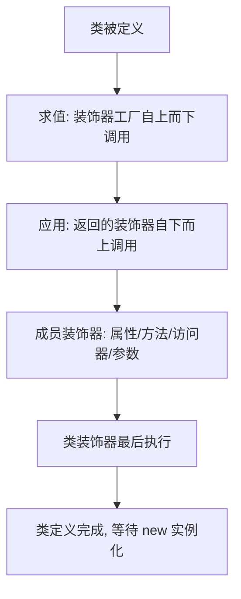

# 13 · 装饰器（Decorators）
> 装饰器是给类及其成员「在声明时附加额外行为」的语法，本质是在类定义阶段被调用的函数，常用于日志、校验、依赖注入、ORM 映射等横切逻辑。

## 📖 知识讲解

TypeScript 目前存在**两套装饰器**，务必分清：

| | 旧版 / Legacy 装饰器 | 标准 / Stage 3 装饰器 |
| --- | --- | --- |
| 开启方式 | tsconfig `experimentalDecorators: true` | TS 5.0+ 默认，不要开 experimentalDecorators |
| 规范来源 | 早期 TC39 草案 | ECMAScript Stage 3 提案 |
| 方法装饰器签名 | `(target, key, descriptor)` | `(value, context)` |
| 参数装饰器 | 支持 | **不支持**（标准装饰器暂无参数装饰器） |
| 元数据 | 配合 `emitDecoratorMetadata` + reflect-metadata | 用 `context.metadata` |

> 本模块按工程要求演示**旧版装饰器**（很多框架如 Angular、NestJS、TypeORM 仍在用），因此 tsconfig 开了 `experimentalDecorators: true`。

旧版的五种装饰器：

1. **类装饰器** `(constructor)`：装饰类本身，可返回新构造函数替换原类。
2. **方法装饰器** `(target, key, descriptor)`：可改写 `descriptor.value` 包裹原方法。
3. **访问器装饰器** `(target, key, descriptor)`：装饰 `get`/`set`。
4. **属性装饰器** `(target, key)`：**没有 descriptor**（实例属性值此时还不存在），只能登记元数据。
5. **参数装饰器** `(target, key, index)`：标记某个参数，本身不能改值。

**装饰器工厂**：当装饰器需要参数时，写一个「返回装饰器的函数」，例如 `@logClass('A')`。

**易错点**
- 装饰器作用于「定义阶段」，不是实例化阶段。
- 每种装饰器签名固定，用错位置会报 TS1238/TS1240 等错。
- 旧版与标准装饰器不能混用；同一项目要么开 experimentalDecorators，要么用标准装饰器。

## 🔄 流程图 / 原理图




## 💻 代码说明

- `sealed`：**类装饰器**，对构造函数与原型 `Object.seal`，演示「装饰类本身」。
- `logClass(prefix)`：**装饰器工厂**，外层收 `prefix`，返回真正的类装饰器；用 `@logClass('A') @logClass('B')` 叠加可观察「求值自上而下、应用自下而上」。
- `logMethod`：**方法装饰器**，保存 `descriptor.value` 原方法，再用新函数包裹，实现调用前后打印日志。
- `configurableFalse`：**访问器装饰器**，把 `age` 的 `descriptor.configurable` 置 false。
- `readonlyHint`：**属性装饰器**，只有 `(target, key)`，用于登记元数据。
- `logParam`：**参数装饰器**，拿到参数 `index`。
- 错误示范段落演示：把参数装饰器用到属性上会因签名不符报错（已注释避免编译失败）。

运行后先打印各装饰器在「定义阶段」的日志，再打印实例化调用结果，直观体现执行顺序。

## ▶️ 运行方式

在工程根 `06-typescript` 下：

```bash
npm i -D typescript ts-node       # 首次安装依赖
npx ts-node 13-decorators/demo.ts # 直接运行
# 或编译：npx tsc 后运行 dist 下产物
```

> 确保 tsconfig 里 `experimentalDecorators: true`（本工程已开）。

## ⚠️ 常见坑 / 最佳实践

- **不要混用两套装饰器**：开了 `experimentalDecorators` 就是旧版；TS 5.0 标准装饰器请删掉该选项。
- 属性装饰器拿不到值，别试图在里面读取实例属性。
- 方法装饰器包裹时用 `function` 而非箭头函数，否则 `this` 丢失。
- 参数装饰器多用于「配合方法装饰器 + reflect-metadata」做参数校验/注入，单独用途有限。
- 类装饰器若返回新类，需保证签名兼容，否则类型会变。

## 🔗 官方文档

- Decorators（旧版）: https://www.typescriptlang.org/docs/handbook/decorators.html
- Decorators（TS 5.0 标准/Stage 3）: https://www.typescriptlang.org/docs/handbook/release-notes/typescript-5-0.html#decorators
