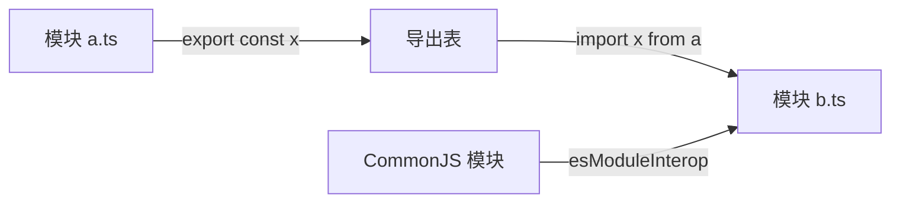
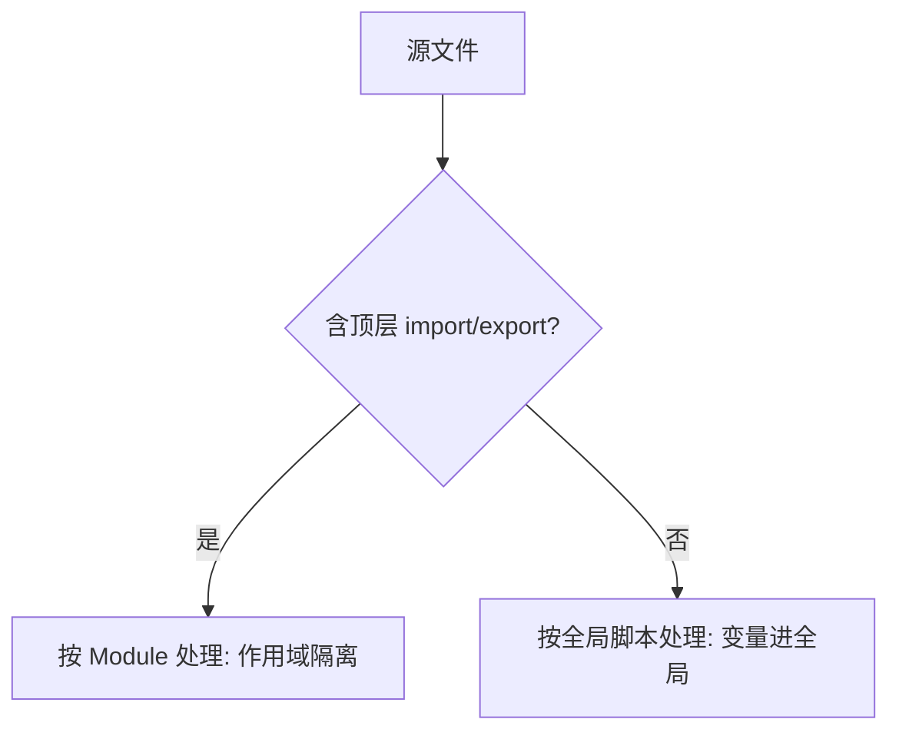

# 14 · 模块系统（Modules）
> ES Module 用 `import` / `export` 组织代码，让每个文件成为独立作用域，解决全局命名冲突与依赖管理问题。

## 📖 知识讲解

**判定标准**：一个文件只要含有顶层 `import` 或 `export`，TS 就把它当成「模块」，文件内声明默认私有；没有任何 import/export 的文件被视为全局脚本。

核心语法：

- **命名导出 / 导入**：`export const x` / `import { x } from '...'`，可导出多个，名字需对应。
- **重命名** `as`：`export { a as b }`、`import { b as c }`。
- **默认导出 / 导入**：`export default ...`，每个模块最多一个；导入时名字任取：`import Foo from '...'`。
- **整体导入** `import * as ns`：把模块所有命名导出收进一个命名空间对象。
- **仅类型导入 / 导出** `import type` / `export type`：明确「只导入类型」，编译后被擦除，零运行时开销；也可写 `import { type X, fn }` 混合。
- **再导出（re-export）**：`export { x } from './a'`、`export * from './b'`，做聚合入口（barrel）。

**与 CommonJS 互操作（esModuleInterop）**：CommonJS 模块用 `module.exports = X` 整体导出。开启 `esModuleInterop: true` 后，可用默认导入语法 `import path from 'path'` 引入这类模块，否则得写 `import * as path`。本工程已开启。

**namespace（命名空间）**：TS 早期的「内部模块」方案，用于无模块系统年代组织代码。现代项目**不推荐**——它无法做摇树优化、与 ES Module 生态割裂，应统一用 `import/export`。

**易错点**
- `import type` 导入的标识符不能当值用（运行时不存在）。
- 默认导出过度使用会让重命名失控、不利于自动补全，社区更推崇命名导出。
- ts-node 默认按 tsconfig 的 `module: CommonJS` 编译，跨文件 import 才会真正走 require。

## 🔄 流程图 / 原理图





## 💻 代码说明

- 命名导出 `PI`、`add`，并用 `export { internalName as libName }` 演示重命名导出。
- `export default class Calculator` 演示默认导出。
- `export type Point` / `export interface Shape` 演示仅类型导出。
- 导入段集中演示四种写法：命名导入 + `as` 重命名、默认导入、`import * as MathLib`、`import type`。为单文件可运行，示例从 `./demo` 自身导入，真实项目只需替换路径。
- 错误示范：把 `import type` 进来的 `add` 当函数调用会报 TS1361。
- `namespace LegacyGeometry` 仅作了解，注释说明已被 ES Module 取代。

## ▶️ 运行方式

在工程根 `06-typescript` 下：

```bash
npm i -D typescript ts-node
npx ts-node 14-modules/demo.ts
# 或编译：npx tsc 后运行 dist 下产物
```

## ⚠️ 常见坑 / 最佳实践

- 优先使用**命名导出**，默认导出仅用于「模块只有一个主体」的场景。
- 类型导入统一用 `import type` 或 `import { type X }`，让打包器更好地擦除类型、减小体积。
- 处理第三方 CommonJS 包时记得开 `esModuleInterop`，否则默认导入会报错或拿到 `undefined`。
- 新代码不要用 `namespace`；老项目迁移时把 `namespace` 改写为文件级模块。
- barrel 文件（`index.ts` 大量 re-export）虽方便，但可能影响摇树，谨慎使用。

## 🔗 官方文档

- Modules: https://www.typescriptlang.org/docs/handbook/2/modules.html
- Modules Reference: https://www.typescriptlang.org/docs/handbook/modules/reference.html
- esModuleInterop: https://www.typescriptlang.org/tsconfig#esModuleInterop
