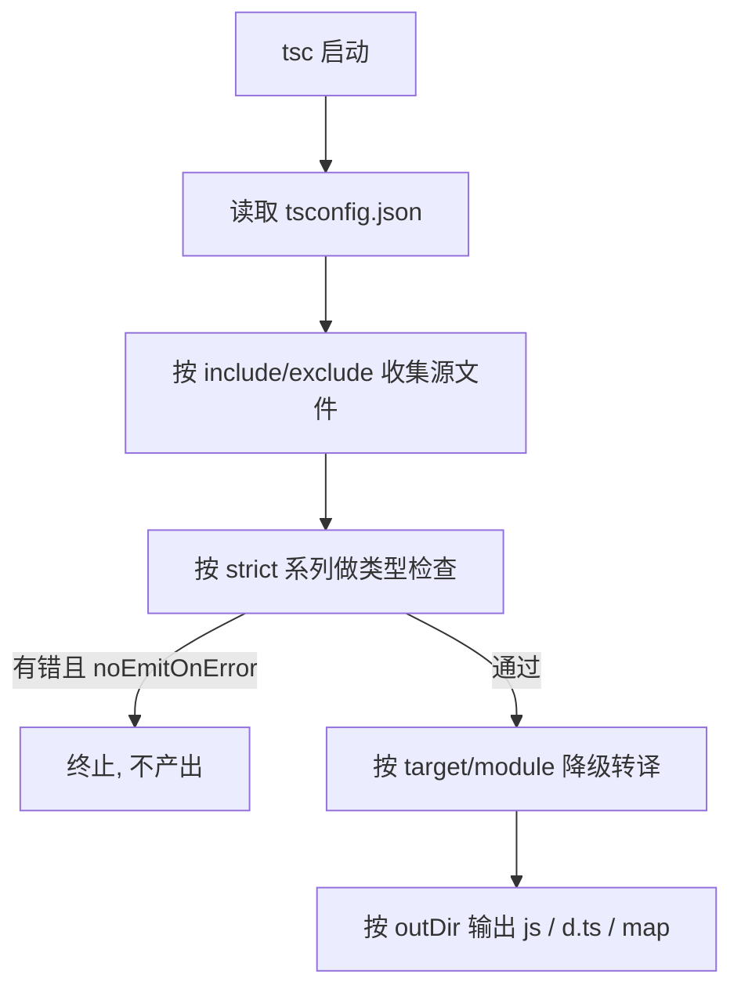
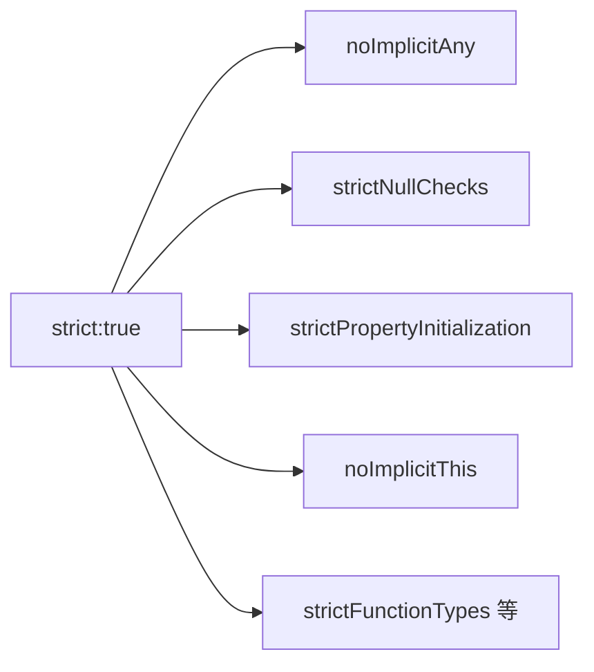

# 15 · 编译配置（tsconfig.json）
> tsconfig.json 是 TypeScript 项目的编译说明书，决定「编译到哪个 JS 版本、用什么模块规范、类型检查多严格、产物放哪里」等一切行为。

## 📖 知识讲解

### 核心字段一览（compilerOptions）

| 字段 | 作用 |
| --- | --- |
| `target` | 编译产物的 ECMAScript 版本（如 ES2020、ESNext），影响降级与 polyfill 需求 |
| `module` | 产物的模块规范（CommonJS / ESNext / NodeNext 等） |
| `lib` | 编译时可用的内置类型库（如 `DOM`、`ES2020`），不引入运行时代码 |
| `outDir` | 编译产物输出目录 |
| `rootDir` | 源码根目录，决定 outDir 下的目录结构 |
| `moduleResolution` | 模块解析策略（`node` / `node16` / `nodenext` / `bundler`） |
| `esModuleInterop` | 让 CommonJS 模块可用默认导入语法，建议开启 |
| `declaration` | 生成 `.d.ts` 类型声明文件（写库时必备） |
| `sourceMap` | 生成 `.map` 便于调试时映射回 TS 源码 |
| `skipLibCheck` | 跳过对 `.d.ts` 的类型检查，加快编译 |
| `paths` | 路径别名（配合 `baseUrl`），如 `@/*` 映射到 `src/*` |

### strict 展开的子项（重点）

`strict: true` 是一个总开关，等价于一次性开启下面这组：

- `noImplicitAny`：禁止「推断为隐式 any」的参数/变量。
- `strictNullChecks`：`null` / `undefined` 不再可随意赋给其它类型，必须显式处理。
- `strictFunctionTypes`：函数参数按逆变更严格地检查。
- `strictBindCallApply`：`bind/call/apply` 的参数类型受检。
- `strictPropertyInitialization`：类字段必须初始化或在构造函数中赋值。
- `noImplicitThis`：禁止 `this` 隐式为 any。
- `alwaysStrict`：以严格模式解析并在产物加 `"use strict"`。
- `useUnknownInCatchVariables`：`catch (e)` 中 `e` 类型为 `unknown` 而非 any。

**易错点**
- `lib` 不含 `DOM` 时用 `document`/`window` 会报错；Node 项目通常不需要 DOM。
- `target` 与 `module` 概念不同：前者是语法版本，后者是模块产物格式。
- `paths` 只影响类型解析，运行时还需打包器/`tsconfig-paths` 等配合才生效。
- 关掉 `strict` 看似省事，实则放弃了 TS 最大价值。

## 🔄 流程图 / 原理图





## 💻 代码说明

`demo.ts` 用 5 个片段展示「严格模式在编译期拦 bug」：

- **A `strictNullChecks`**：`findUser` 可能返回 `undefined`，直接 `.name` 会报 TS18048，必须先 `if (user)` 收窄。
- **B `noImplicitAny`**：参数不标类型会被推断为隐式 any 并报 TS7006，显式标注 `x: number` 修复。
- **C 类型赋值检查**：把字符串赋给 `number` 报 TS2322。
- **D `strictPropertyInitialization`**：类字段未初始化报 TS2564，给默认值或构造函数赋值修复。
- **E `noImplicitThis`**：方法内 `this` 类型明确，演示对象方法的安全用法。

所有反例均注释包裹，正确写法以 `// ✅` 标注，确保可直接运行。

## ▶️ 运行方式

在工程根 `06-typescript` 下：

```bash
npm i -D typescript ts-node
npx ts-node 15-tsconfig/demo.ts
# 或编译：npx tsc（会读取本工程 tsconfig.json）
```

### 逐行注释的 tsconfig.json 完整样例

```jsonc
{
  "compilerOptions": {
    /* ===== 目标与模块 ===== */
    "target": "ES2020",            // 编译到的 JS 版本
    "module": "CommonJS",          // 模块规范（Node + ts-node 常用 CommonJS）
    "lib": ["ES2020", "DOM"],      // 内置类型库；Node 纯后端可去掉 DOM
    "moduleResolution": "node",    // 模块解析策略（经典 node 算法）

    /* ===== 输入输出目录 ===== */
    "rootDir": "./",               // 源码根目录
    "outDir": "./dist",            // 产物输出目录

    /* ===== 严格类型检查（strict 总开关展开） ===== */
    "strict": true,                // 一次性开启下面整组
    "noImplicitAny": true,         // 禁止隐式 any
    "strictNullChecks": true,      // null/undefined 受检
    "strictFunctionTypes": true,   // 函数参数逆变检查
    "strictBindCallApply": true,   // bind/call/apply 参数受检
    "strictPropertyInitialization": true, // 类字段必须初始化
    "noImplicitThis": true,        // this 不可隐式 any
    "alwaysStrict": true,          // 产物加 "use strict"
    "useUnknownInCatchVariables": true, // catch 变量为 unknown

    /* ===== 互操作与产物 ===== */
    "esModuleInterop": true,       // 兼容 CommonJS 默认导入
    "declaration": true,           // 生成 .d.ts（写库时开）
    "sourceMap": true,             // 生成 source map 便于调试

    /* ===== 提速与路径别名 ===== */
    "skipLibCheck": true,          // 跳过 .d.ts 检查，加快编译
    "forceConsistentCasingInFileNames": true, // 文件名大小写一致
    "baseUrl": "./",               // paths 的基准目录
    "paths": {                     // 路径别名（需打包器/tsconfig-paths 配合运行时）
      "@/*": ["src/*"]
    }
  },
  "include": ["**/*.ts"],          // 参与编译的文件
  "exclude": ["node_modules", "dist"] // 排除
}
```

## ⚠️ 常见坑 / 最佳实践

- **新项目一律开 `strict: true`**，这是 TS 的核心价值，不要为图省事关掉。
- `skipLibCheck: true` 几乎是标配，能显著加快编译并规避第三方 `.d.ts` 报错。
- `paths` 仅作用于类型层；运行/打包还需 `tsc-alias`、`tsconfig-paths` 或打包器解析。
- 区分 `target`（语法版本）与 `module`（模块格式）；Node16+ 推荐 `module/moduleResolution: NodeNext`。
- 写库务必开 `declaration` 输出 `.d.ts`，否则使用方拿不到类型。
- `noEmitOnError` 在 CI 建议开（有错就不产出）；本教学工程关掉以便观察反例。

## 🔗 官方文档

- tsconfig 参考: https://www.typescriptlang.org/tsconfig
- What is a tsconfig.json: https://www.typescriptlang.org/docs/handbook/tsconfig-json.html
- Compiler Options（strict 系列）: https://www.typescriptlang.org/docs/handbook/compiler-options.html
