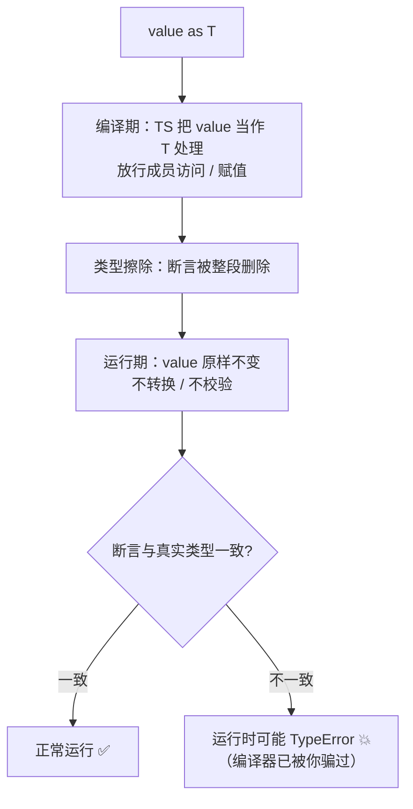

# 16 · 类型断言（Type Assertions）
> 当你比编译器更了解某个值的真实类型时，用类型断言告诉 TS「相信我，它就是这个类型」。断言只在编译期生效，运行时不做任何转换或校验。

## 📖 知识讲解

对照官方 Handbook 的 **Everyday Types → Type Assertions** 与 4.1/4.9 版本说明，四种断言形式：

| 形式 | 写法 | 作用 |
| --- | --- | --- |
| `as` 断言 | `value as T` | 把 value 视为类型 T（推荐，`.tsx` 里唯一可用） |
| 尖括号断言 | `<T>value` | 与 `as` 等价，但会和 JSX 冲突，已不推荐 |
| 非空断言 | `value!` | 断言 value 一定不是 `null` / `undefined` |
| const 断言 | `value as const` | 把字面量冻结为最窄的 `readonly` 字面量类型 |

核心要点与易错点：
- **断言不是运行时转换**：这是最容易误解的一点。`"123" as number` 不会把字符串变成数字，运行时它还是字符串。真正的转换要用 `Number()`、`String()` 等运行时函数。
- **只能在有重叠的类型间断言**：`"abc" as number` 会报错（两者无重叠）；确实要强转时得走 `as unknown as T` 的**双重断言**，这等于关掉安全网，务必慎用。
- **非空断言 `!` 是「我保证不为空」的承诺**：断言错了编译期不报错，但运行时照样 `TypeError`。能用类型收窄（`if (x)`）就不要用 `!`。
- **`as const` 的三个效果**：① 字面量不再被拓宽（`"GET"` 保持为 `"GET"` 而非 `string`）；② 所有属性变 `readonly`；③ 数组变**只读元组**，配合 `T[number]` 可推导出联合类型。

## 🔄 流程图 / 原理图



## 💻 代码说明

- `el as FakeInputElement`：把 `unknown` 断言成具体类型后才能取属性；`<FakeInputElement>el` 是等价的尖括号写法。
- `"abc" as unknown as number`：双重断言强转，并用 `typeof` 证明运行时值没变。
- `findUser(1)!.name`：非空断言 `!` 跳过 `undefined` 检查；反例展示对真的可能为空的值滥用 `!` 会运行时崩溃。
- `cfg2 = {...} as const`：对比不加 `as const` 的类型拓宽；`routes as const` + `(typeof routes)[number]` 推导出字面量联合 `Route`。
- 末尾 `notReallyNumber + 1`：直观证明「断言 ≠ 转换」——结果是字符串拼接而非数字相加。

## ▶️ 运行方式

在工程根 `06-typescript` 下：

```bash
npm i -D typescript ts-node
npx ts-node 16-type-assertions/demo.ts
# 或编译检查：npx tsc --noEmit
```

## ⚠️ 常见坑 / 最佳实践

- **优先用类型收窄，而非断言**。`typeof` / `instanceof` / `in` 守卫是安全的；断言是「关掉检查」，能不用就不用。
- **`.tsx` 里只用 `as`**，尖括号会被当成 JSX 标签。
- **双重断言 `as unknown as T` 是最后手段**，出现它通常意味着类型设计有问题。
- **`!` 不改变运行时**：如果一个值真的可能为空，用可选链 `?.` 或显式判空，别用 `!` 掩盖。
- **给对象/配置加 `as const`** 能获得精确字面量类型，是「用值推导类型」的利器（配合 `satisfies` 更佳，见 17 模块）。

## 🔗 官方文档

- Type Assertions: https://www.typescriptlang.org/docs/handbook/2/everyday-types.html#type-assertions
- const Assertions: https://www.typescriptlang.org/docs/handbook/release-notes/typescript-3-4.html#const-assertions
- Non-null Assertion Operator: https://www.typescriptlang.org/docs/handbook/release-notes/typescript-2-0.html#non-null-assertion-operator
