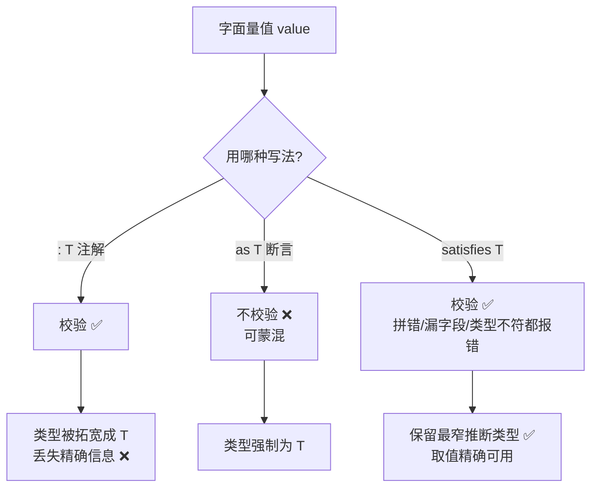

# 17 · satisfies 运算符（satisfies Operator）
> `satisfies` 在校验「值符合某个类型」的同时，保留该值被推断出的更精确类型。它是「类型注解」与「类型断言」之外的第三条路，鱼与熊掌兼得。

## 📖 知识讲解

`satisfies` 是 TypeScript **4.9** 引入的运算符，专门解决一个长期矛盾：你既想用一个宽泛的类型**约束/校验**一个对象的结构，又想在使用时拿到每个属性**精确的推断类型**。

三种写法的本质区别（记住这张表就够了）：

| 写法 | 是否校验结构 | 结果类型 | 典型问题 |
| --- | --- | --- | --- |
| 类型注解 `const x: T = ...` | ✅ 会校验 | **被拓宽为 T** | 丢失精确信息，`x.green` 变成联合类型没法直接用 |
| 类型断言 `... as T` | ❌ 不校验 | 强制为 T | 能蒙混过关，错了也不报错 |
| **`... satisfies T`** | ✅ 会校验 | **保留最窄推断类型** | 无（推荐） |

核心要点：
- **校验但不改变类型**：`satisfies T` 会检查表达式能否赋给 `T`（拼错 key、值类型不符、漏字段都会报错），但**最终变量的类型仍是 TS 自己推断出的那个精确类型**，而不是 `T`。
- **典型收益**：`Record<Colors, string | RGB>` 约束保证了「三种颜色都在、值合法」，而 `satisfies` 让 `palette.green` 仍被当作 `string`（可 `.toUpperCase()`）、`palette.red` 仍被当作数字元组（可下标访问）。
- **和 `as const` 是好搭档**：`as const` 负责「冻结成最窄字面量」，`satisfies` 负责「校验结构合法」，二者可叠加：`{...} as const satisfies T`。

## 🔄 流程图 / 原理图



## 💻 代码说明

- `paletteAnnotated: Record<...>`：用注解，`green` 被拓宽成 `string | RGB`，无法直接 `.toUpperCase()`（反例）。
- `palette = {...} satisfies Record<...>`：用 `satisfies`，`green` 仍是 `string`、`red` 仍是数字数组，取值精确可用——本模块核心对比。
- 三段 `❌ 错误示范`：分别演示 `satisfies` 会拦下「key 拼错」「值类型不符」「漏字段」。
- `routes ... satisfies Record<`/${string}`, Handler | string>`：混合值（函数/字符串）的路由表，保留精确类型后可分别当函数调用、当字符串处理。
- `sneaky ... as unknown as ...`：对比 `as` 能把毫不相干的值蒙混过关，而 `satisfies` 不会。

## ▶️ 运行方式

在工程根 `06-typescript` 下：

```bash
npm i -D typescript ts-node   # 需 TypeScript 4.9+，本工程用 5.x
npx ts-node 17-satisfies-operator/demo.ts
# 或编译检查：npx tsc --noEmit
```

## ⚠️ 常见坑 / 最佳实践

- **想同时要「校验」和「精确类型」就用 `satisfies`**，这是它唯一也是最大的价值。
- **不要用 `satisfies` 代替注解去声明函数参数/返回值类型**：它是「表达式后缀」，用于字面量值，不是变量类型声明的替代品。
- **`satisfies` 不做运行时任何事**，和所有类型语法一样会被擦除。
- **配置对象、常量表、路由表、主题色板**是它的黄金场景：用宽类型保证「不漏不错」，用推断类型保证「取值好用」。
- 需要 TypeScript **4.9 以上**；老项目升级后即可使用。

## 🔗 官方文档

- The satisfies Operator: https://www.typescriptlang.org/docs/handbook/release-notes/typescript-4-9.html#the-satisfies-operator
