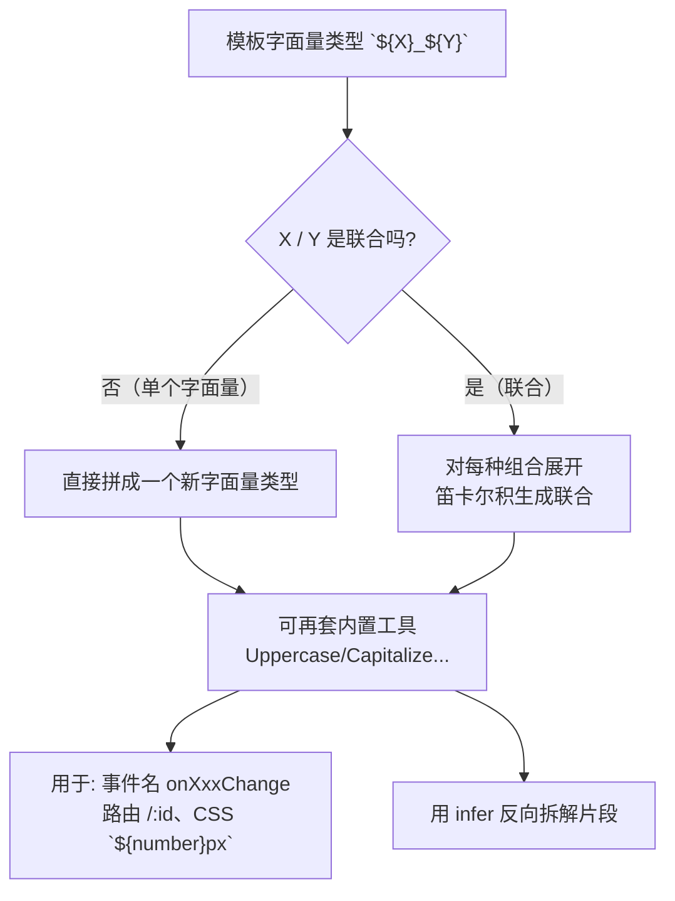

# 19 · 模板字面量类型（Template Literal Types）
> 在类型层面用反引号拼接字符串字面量，生成新的字符串字面量类型。配合联合类型会笛卡尔积展开，配合内置大小写工具可推导出事件名、路由、CSS 值等一整套字符串类型。

## 📖 知识讲解

对照官方 Handbook 的 **Template Literal Types**（TS **4.1** 引入）。语法和 JS 模板字符串一样用反引号 `` `...${T}...` ``，只不过发生在类型世界：

- **基础拼接**：`` type Greeting = `hello ${World}` ``，把字面量类型 `World` 插进模板得到新字面量类型。
- **联合插值 → 笛卡尔积**：当插值位置是联合类型时，会对每种组合分别展开。`` `${Lang}_${Page}` ``（3 个 × 2 个）会生成 6 个成员的联合。这是它最强大的地方——用少量声明生成大量字符串字面量类型。
- **四个内置字符串工具类型**（intrinsic，编译器内建、编译期完成）：
  - `Uppercase<S>` 全大写、`Lowercase<S>` 全小写；
  - `Capitalize<S>` 首字母大写、`Uncapitalize<S>` 首字母小写。
- **配合映射类型的 key remapping**：`` [K in keyof T as `on${Capitalize<string & K>}Change`] `` 可把属性名批量改写成 `onXxxChange` 形式的方法名——这是 UI 库生成事件处理器类型的核心手法。
- **配合 `infer` 拆解**：`` T extends `${infer M} ${string}` ? M : never `` 能从 `"GET /users"` 这样的字符串类型里**反向拆出**片段。

易错点：
- 拼出来的字面量必须**完全匹配**（大小写、空格都算），差一个字符就报错——这正是它做「格式约束」的价值。
- 和 `keyof` 联用时，键可能是 `string | number | symbol`，需要用 `string & K` 把它约束成 string 才能拼接。

## 🔄 流程图 / 原理图



## 💻 代码说明

- `` `hello ${World}` ``：基础拼接；反例展示字面量必须精确匹配。
- `` `${Lang}_${Page}` ``：两个联合插值，笛卡尔积展开成 6 个成员。
- `Uppercase / Lowercase / Capitalize / Uncapitalize`：四个内置大小写工具。
- `Handlers` 映射类型：用 `` as `on${Capitalize<string & K>}Change` `` 把 `name/email` 改写成 `onNameChange/onEmailChange` 方法名。
- `ExtractMethod<T>`：用 `` `${infer M} ${string}` `` 从 `"GET /users"` 拆出 `"GET"`。
- `Path = `/${string}`` 与 `CSSSize = `${number}px` | ...`：用模板字面量类型做「格式/前缀约束」，非法字符串直接编译报错。

## ▶️ 运行方式

在工程根 `06-typescript` 下：

```bash
npm i -D typescript ts-node   # 需 TypeScript 4.1+，本工程用 5.x
npx ts-node 19-template-literal-types/demo.ts
# 或编译检查：npx tsc --noEmit
```

## ⚠️ 常见坑 / 最佳实践

- **联合插值会指数级膨胀**：`${A}${B}${C}` 若每个都是大联合，组合数会爆炸，可能拖慢编译甚至报「联合过于复杂」。控制规模。
- **和 `keyof` 拼接时加 `string &`**：键类型含 `symbol` 时不能直接拼，需 `` `...${string & K}...` ``。
- **大小写工具是编译器内建**，不能自定义实现，也不感知语言环境（走 JS 的 `toUpperCase` 等）。
- **用它做格式约束**（路径、CSS 值、事件名、i18n key）非常香，但别拿它替代真正的运行时校验——类型只在编译期。
- 配合 `mapped-types`（12）和 `conditional-types`（11）威力最大，建议一起看。

## 🔗 官方文档

- Template Literal Types: https://www.typescriptlang.org/docs/handbook/2/template-literal-types.html
