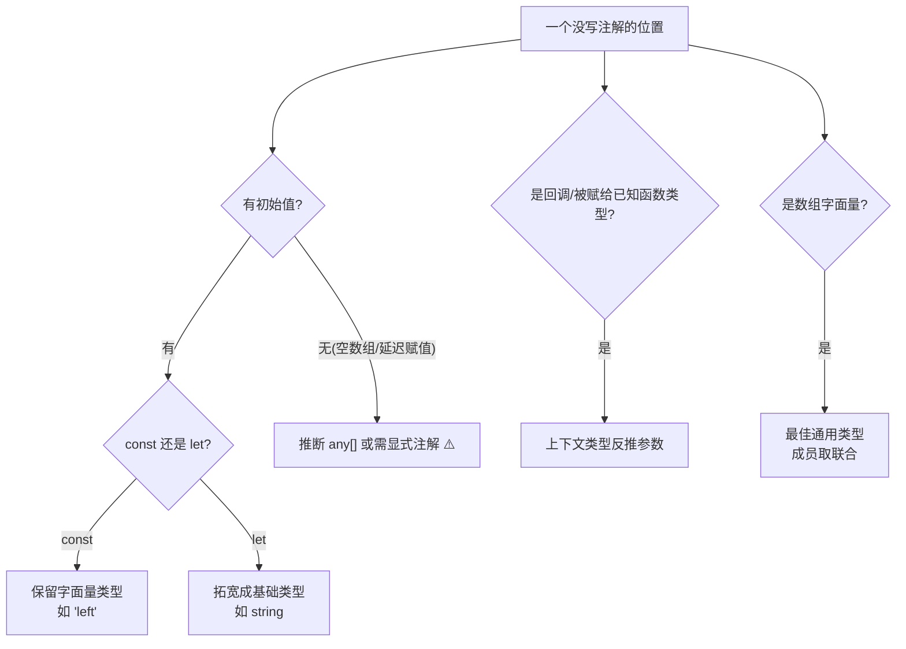

# 20 · 类型推断（Type Inference）
> TypeScript 在你不写类型注解时，会根据初始值、返回语句、使用上下文自动推断类型。理解推断规则，才知道哪些注解可以省、哪些必须写。

## 📖 知识讲解

对照官方 Handbook 的 **Type Inference** 与 **Everyday Types**。TS 的推断分几种典型场景：

| 场景 | 规则 |
| --- | --- |
| **变量初始化** | 由初始值推断（`let count = 10` → `number`） |
| **`const` vs `let`（字面量拓宽）** | `const` 保留字面量类型；`let` 拓宽成基础类型 |
| **函数返回值** | 由 `return` 语句推断，无需写返回类型 |
| **最佳通用类型** | 数组元素取各成员的「共同超类型」，通常是**联合** |
| **上下文类型** | 从「值被使用/赋值的位置」反推参数类型（如回调参数） |

核心要点与易错点：
- **字面量拓宽（Literal Widening）是最常见的坑**：`let s = "left"` 被拓宽成 `string`，传给只收 `"left" | "right"` 的函数会报错；而 `const s = "left"` 保留字面量 `"left"`，可以直接传。解决办法：改 `const`、显式注解，或用 `as const`。
- **最佳通用类型不是「最近公共父类」**：`[new Dog(), new Cat()]` 推断为 `(Dog | Cat)[]`，不是 `Animal[]`。想要父类数组得显式注解。
- **上下文类型让回调参数免注解**：`arr.forEach(n => ...)` 里的 `n` 自动是元素类型；把箭头函数赋给已知函数类型的变量，参数类型也会被反推。
- **推断给不出你要的类型时才注解**：空数组 `[]` 会推断成 `any[]`（危险）、声明与赋值分离的变量、公共 API 的边界——这些地方应显式写类型。
- 官方建议：**能省则省**，让推断替你写类型；只在「函数参数、公共导出、推断不准」处显式标注。

## 🔄 流程图 / 原理图



## 💻 代码说明

- `let count = 10` / `const title = "TS"`：变量初始化推断；反例展示推断类型仍约束后续赋值。
- `mutable`(let) vs `immutable`(const) 与 `move(d1)`/`move(d2)`：演示字面量拓宽如何影响能否传给联合类型参数——本模块核心。
- `add` / `makeUser`：函数返回值自动推断为 `number`、`{ name; createdAt }`。
- `mixed` 与 `pets = [new Dog(), new Cat()]`：最佳通用类型推断为联合数组，而非公共父类。
- `names.forEach(n => ...)` 与 `onClick: ClickHandler`：上下文类型让回调参数免注解。
- `emptyBad = []`（any[]）vs `emptyGood: string[]`、`let later: number`：演示必须显式注解的两种场景。

## ▶️ 运行方式

在工程根 `06-typescript` 下：

```bash
npm i -D typescript ts-node
npx ts-node 20-type-inference/demo.ts
# 或编译检查：npx tsc --noEmit
```

## ⚠️ 常见坑 / 最佳实践

- **传字面量给联合类型报错？** 十有八九是 `let` 拓宽了，改成 `const` 或加 `as const`。
- **想要父类数组**（`Animal[]`）时要显式注解，别指望推断替你「向上取父类」。
- **空数组一定注解**：`const list: T[] = []`，否则是 `any[]`。
- **回调别手写参数类型**：交给上下文推断更简洁，还能随目标类型自动更新。
- **函数返回类型**通常可省，但对**公共导出的 API** 建议显式写，既是文档也能防止无意间改动返回结构。

## 🔗 官方文档

- Type Inference: https://www.typescriptlang.org/docs/handbook/type-inference.html
- Everyday Types（推断相关）: https://www.typescriptlang.org/docs/handbook/2/everyday-types.html
