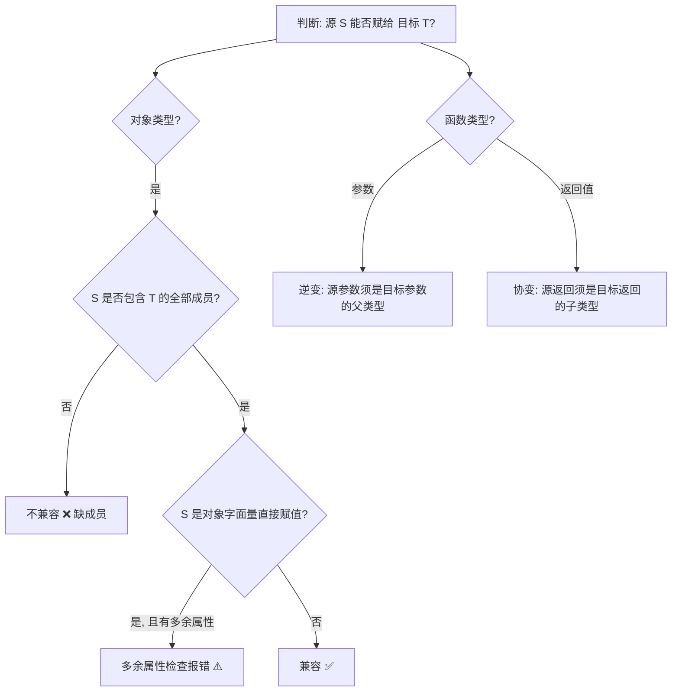

# 21 · 类型兼容性（Type Compatibility）
> TypeScript 用「结构化类型系统（鸭子类型）」判断 A 能否赋给 B：只看形状/成员是否匹配，不看类型名字，也不要求显式 implements。

## 📖 知识讲解

对照官方 Handbook 的 **Type Compatibility**。核心是**结构化类型（Structural Typing）**——「长得像就是」，这与 Java/C# 的「名义类型（Nominal Typing）」相反。

关键规则：

| 场景 | 规则 | 直觉 |
| --- | --- | --- |
| **对象兼容** | 源类型有目标要求的**全部**成员即可（源可以更多） | 长得像就能用 |
| **多余属性检查** | **对象字面量直接赋值**时，额外做一次更严格检查：不许有目标没有的属性 | 字面量多写属性多半是拼错 |
| **函数参数个数** | 参数**少**的可赋给参数**多**的 | 回调可以忽略用不到的参数 |
| **函数参数类型（逆变）** | 源参数类型必须是目标参数类型的**父类型**（`strictFunctionTypes`） | 能处理更宽的输入才安全 |
| **函数返回值（协变）** | 源返回类型可以是目标返回类型的**子类型** | 返回更具体的东西没问题 |

核心要点与易错点：
- **「多属性可赋给少属性」但字面量除外**：把变量赋过去，多余属性无所谓；但**直接写对象字面量**赋值时会触发「多余属性检查」而报错。绕过方式：先存入变量、或 `as` 断言、或加索引签名。
- **参数逆变**是最反直觉的点：一个接收 `Animal`（父）的函数，可以放到需要处理 `Dog`（子）的位置；反过来不行。因为「能处理更宽的输入」的函数用在「更窄输入」的地方总是安全的。`strict` 模式默认开启 `strictFunctionTypes` 来做这个检查（注意：**方法（method）形式的参数是双变的**，属历史兼容例外）。
- **返回值协变**符合直觉：承诺返回 `Animal`，实际返回 `Dog` 没问题；反之不行。

## 🔄 流程图 / 原理图



## 💻 代码说明

- `const p: Point2D = new Vector(1,2)`：`Vector` 未 implements 却结构一致，可赋值——鸭子类型。
- `richer` 赋给 `p2`：多属性可赋给少属性（经变量中转）。
- `p4 = {...} as Point2D`：直接写字面量含多余属性 `z` 会触发多余属性检查，用 `as`/变量绕过。
- `cb: Callback = (a) => ...`：少用参数的函数兼容多参数类型。
- `handleDog: HandleDog = (a: Animal) => ...`：参数逆变——接收父类型 `Animal` 的函数可赋给需要处理 `Dog` 的位置；反例展示反过来不安全。
- `makeDog: MakeAnimal = () => Dog对象`：返回值协变——返回更具体子类型安全；反例展示返回更宽父类型报错。

## ▶️ 运行方式

在工程根 `06-typescript` 下：

```bash
npm i -D typescript ts-node
npx ts-node 21-type-compatibility/demo.ts
# 或编译检查：npx tsc --noEmit
```

## ⚠️ 常见坑 / 最佳实践

- **对象字面量赋值报「不能指定已知属性之外的属性」** → 这是多余属性检查，不是结构不兼容；先存变量或用 `satisfies`（见 17）更优雅。
- **结构化类型带来的意外兼容**：两个语义不同但形状相同的类型会互相兼容。想要「名义类型」隔离，可加一个 `readonly __brand: "X"` 品牌字段（branding）。
- **函数参数逆变**：把「更专用（子类型参数）」的回调传给「更通用」的位置会被拦，这是保护而非刁难。
- **方法参数是双变的**（历史兼容），若想严格逆变，把成员写成属性形式的函数类型 `f: (x: T) => void` 而非方法 `f(x: T): void`。
- 善用结构化特性写「只依赖所需最小接口」的函数，天然解耦、易测试。

## 🔗 官方文档

- Type Compatibility: https://www.typescriptlang.org/docs/handbook/type-compatibility.html
