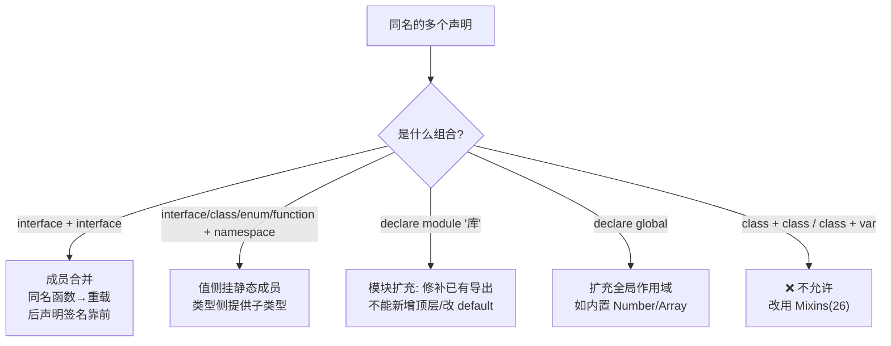

# 22 · 声明合并（Declaration Merging）
> TypeScript 允许同名声明自动「合并」成一个实体。它是 TS 为「给已有 JS 库补类型、扩展第三方类型」而设计的核心能力。

## 📖 知识讲解

对照官方 Handbook 的 **Declaration Merging**。编译器会把出现在同一作用域、名字相同的多个声明合并到一起。常见组合：

| 组合 | 结果 | 用途 |
| --- | --- | --- |
| **接口 + 接口** | 成员合并成一个接口 | 分散声明 / 扩展第三方接口 |
| **接口 + 命名空间** | 接口作类型，命名空间提供静态成员/子类型 | 给类型挂常量、工厂函数 |
| **函数 + 命名空间** | 给函数对象挂属性 | JS 里 `fn.prop = ...` 的模式 |
| **枚举 + 命名空间** | 给枚举加辅助方法 | 扩展枚举行为 |
| **类 + 命名空间** | 给类加内部类/静态成员 | 内部类型、命名空间化的静态 API |

规则要点：
- **接口合并**：非函数成员必须**唯一或类型完全相同**（同名不同类型会冲突报错）；同名函数成员会变成**重载**，且**后声明的接口其签名排在前面**（更「专用」的字面量签名会冒泡到最上面）。
- **命名空间合并**：只合并 `export` 的成员；未导出的成员仍只在各自原命名空间内可见，合并后也访问不到。
- **模块扩充（Module Augmentation）**：用 `declare module "模块名" { ... }` 给已存在的模块补/改类型（如给第三方库的类加方法）。限制：只能**修补已有导出**，不能凭空新增顶层声明；不能扩充 default 导出，只能扩充命名导出。
- **全局扩充**：在一个模块文件内想修改全局作用域，必须用 `declare global { ... }`（如给内置 `Number`/`Array`/`Window` 接口加成员）。
- **不能合并**：类不能和类合并、类不能和变量合并——要「类 + 能力拼装」请用 Mixins（26 模块）。

## 🔄 流程图 / 原理图



## 💻 代码说明

- 两个 `interface Box`：合并成含 `height/width/scale` 的接口；注释指出同名属性类型冲突会报错。
- `interface Config` + `namespace Config`：类型侧是 `Config`，值侧挂了 `DEFAULT_URL` 与 `create()`。
- `function buildLabel` + `namespace buildLabel`：给函数挂 `prefix/suffix` 属性——JS 常见模式的类型化。
- `enum Color` + `namespace Color`：给枚举加 `mix()` 方法。
- `class Album` + `namespace Album`：命名空间里的 `AlbumLabel` 成为 `Album` 的「内部类」。
- `declare global { interface Number { double() } }`：从模块内部扩充内置 `Number` 类型，并补上运行时实现，`(21).double()` 得 42。

## ▶️ 运行方式

在工程根 `06-typescript` 下：

```bash
npm i -D typescript ts-node
npx ts-node 22-declaration-merging/demo.ts
# 或编译检查：npx tsc --noEmit
```

## ⚠️ 常见坑 / 最佳实践

- **`declare` 只声明类型，不产生运行时代码**：给原型加方法时，类型声明和真正的 `X.prototype.method = ...` 实现都要写，缺一不可。
- **模块里改全局必须 `declare global`**，直接写 `interface Window {}` 在模块内只会被当成局部声明。
- **接口合并常被用来扩展第三方类型**（如给 `express` 的 `Request` 加字段、给 Vue 的 `ComponentCustomProperties` 加全局属性），这是它最实用的场景。
- **同名属性类型必须一致**，否则冲突；重载顺序对解析有影响，专用签名放前面。
- 声明合并很强大但也容易「隐形污染」，扩充全局/第三方类型时务必集中管理、写清注释。

## 🔗 官方文档

- Declaration Merging: https://www.typescriptlang.org/docs/handbook/declaration-merging.html
