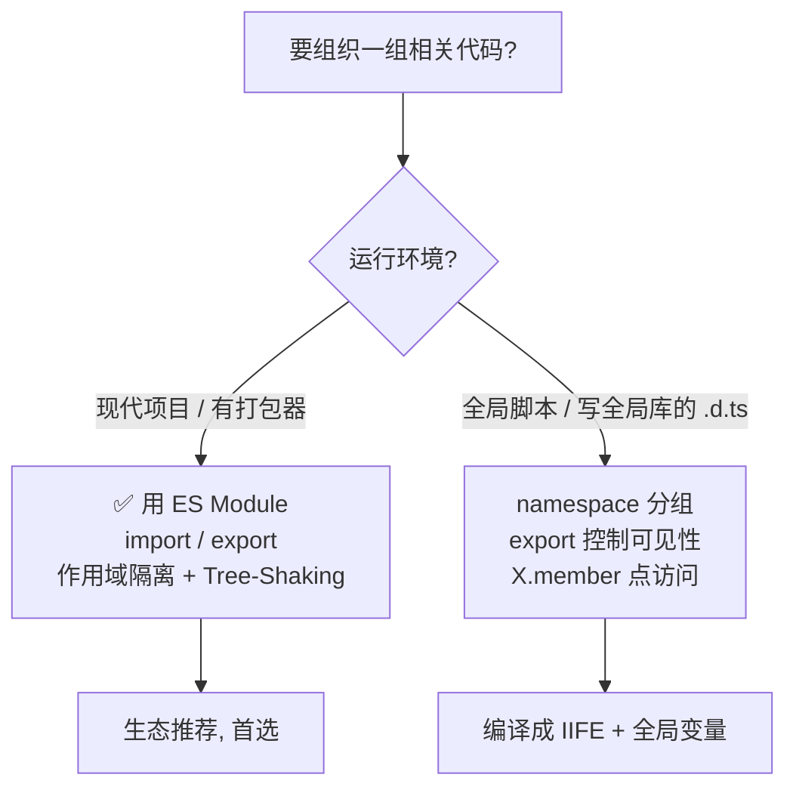

# 23 · 命名空间（Namespaces）
> `namespace` 是 TS 早期（内部模块）用来把相关代码归组、避免污染全局命名的机制。现代项目请优先用 ES Module；命名空间主要保留在全局脚本与声明文件里。

## 📖 知识讲解

对照官方 Handbook 的 **Namespaces** 与 **Namespaces and Modules**。`namespace X { ... }`（旧称「内部模块 internal module」）本质是一个挂在全局对象上的命名容器：

- **`export` 控制可见性**：命名空间内只有 `export` 的成员才能通过 `X.member` 从外部访问；未导出的成员是命名空间私有的。
- **嵌套**：命名空间可以层层嵌套，用「点」访问（`App.Utils.greet`）。
- **别名 `import X = A.B.C`**：给深层命名空间起短名。注意这是 **TS 的 import-equals 语法**，和 ES Module 的 `import` 不是一回事。
- **自动合并**：同名 `namespace` 会自动合并（属于「声明合并」，见 22），可分散在多处书写。
- **编译产物**：命名空间会被编译成一个 **IIFE + 全局变量**，内容仍在（近似）全局作用域用「点」访问，无需模块加载器即可在 `<script>` 里跑。

**namespace vs ES Module（官方推荐立场）：**

| 维度 | namespace（内部模块） | ES Module（import/export） |
| --- | --- | --- |
| 作用域隔离 | 挂全局对象，弱隔离 | 一文件一模块，天然隔离 |
| 按需加载 / Tree-Shaking | ❌ 差 | ✅ 好 |
| 打包器支持 | 无需也难优化 | 生态一等公民 |
| 适用场景 | 全局脚本、**全局型 `.d.ts` 分组**、老代码 | **现代项目一律推荐** |

> 官方明确建议：**新代码使用 ES Module**。`namespace` 现今几乎只在「给全局注入的库写声明文件（如 `.d.ts` 里描述挂在 `window` 上的全局对象）」时才用。

## 🔄 流程图 / 原理图



## 💻 代码说明

- `namespace Validation`：`lettersRegexp` 未导出（私有），`StringValidator`/`LettersOnlyValidator` 导出可外部访问；反例展示访问私有成员报错。
- `namespace App { export namespace Utils {...} }`：嵌套命名空间，`App.Utils.greet` 点访问。
- `import Utils = App.Utils`：命名空间**别名**（import-equals），非 ES import。
- 两个 `namespace Shape`：演示同名命名空间自动合并，`area` 与 `circumference` 都可用。
- 末尾大段注释：对比 namespace 与 ES Module 的编译产物与取舍，给出「新项目用 Module」的结论。

## ▶️ 运行方式

在工程根 `06-typescript` 下：

```bash
npm i -D typescript ts-node
npx ts-node 23-namespaces/demo.ts
# 或编译检查：npx tsc --noEmit
```

## ⚠️ 常见坑 / 最佳实践

- **不要在有模块系统的现代项目里用 namespace 组织业务代码**——用文件夹 + ES Module 即可，还能 Tree-Shaking。
- **别把 namespace 的 `import X = A.B` 和 ES Module 的 `import` 混淆**：前者是命名空间别名，后者是模块导入。
- **`namespace` 唯一推荐的现代用途**：写描述「全局注入库」的 `.d.ts`（见 24 声明文件），此时它能把全局 API 归组。
- 命名空间跨文件拆分曾需 `/// <reference path=...>` 三斜线指令拼接，繁琐且易错，这也是它被模块取代的原因之一。

## 🔗 官方文档

- Namespaces: https://www.typescriptlang.org/docs/handbook/namespaces.html
- Namespaces and Modules（取舍）: https://www.typescriptlang.org/docs/handbook/namespaces-and-modules.html
