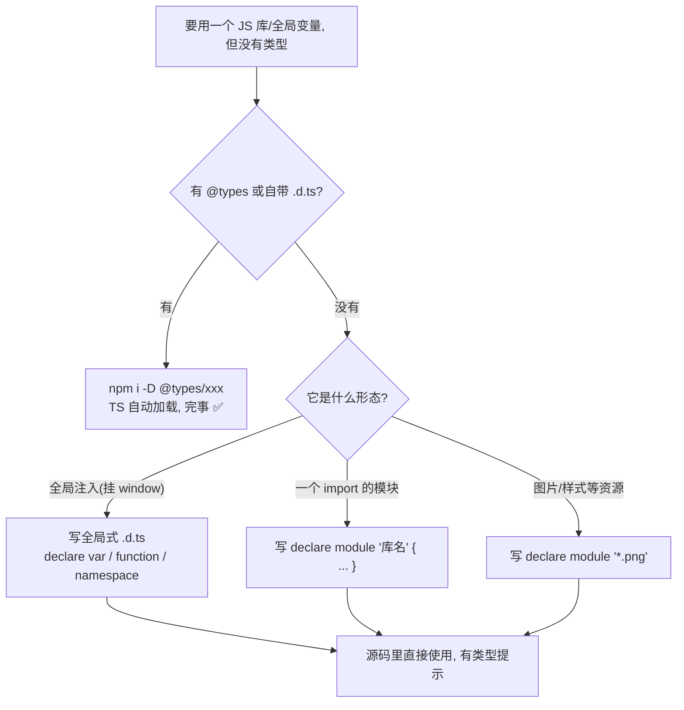

# 24 · 声明文件（Declaration Files / `.d.ts`）
> 声明文件只描述类型、不含实现，用 `declare` 告诉 TS「这东西在运行时已存在」。它是给纯 JS 库、全局注入变量、非代码资源补类型的标准手段。

## 📖 知识讲解

对照官方 Handbook 的 **Declaration Files** 章节。核心概念：

- **`.d.ts` 文件**：只包含类型声明（`declare ...`、`interface`、`type`），编译后不产生任何 JS。TS 自己的标准库（`lib.es2020.d.ts` 等）就是这种文件。
- **`declare` 关键字**：声明「某个值/函数/模块在别处已经存在」，只给它一个类型，不提供实现。用于描述运行时真实存在、但 TS 看不到源码的东西。
- **两种声明文件风格**：
  - **全局式（script）**：文件里**没有**顶层 `import/export`，其中的 `declare` 直接进入**全局作用域**，任何文件无需 import 即可使用（适合 `<script>` 注入的全局库，如 `$`、`_`）。
  - **模块式（module）**：文件里有 `export`，声明被限制在模块内，需要 import 才能用。
- **`declare module "库名" { ... }`**：给一个**没有类型**的 JS 模块补类型；也可用通配 `declare module "*.png"` 让 `import img from './a.png'` 这类资源导入不报错。
- **`@types` / DefinitelyTyped**：绝大多数流行库的类型由社区维护在 DefinitelyTyped 仓库，以 `@types/包名` 发布（如 `@types/node`、`@types/lodash`）。安装后 TS 自动从 `node_modules/@types` 加载。**优先用 `@types`，实在没有再自己写 `.d.ts`**。库若自带类型（`package.json` 里有 `"types"` 字段）则无需再装。

配套文件：本模块目录下的 `global-lib.d.ts` 是一个**全局式声明文件**，声明了全局对象 `MyLib` 和全局函数 `trackEvent`；`demo.ts` 直接使用它们、无需 import。

## 🔄 流程图 / 原理图



## 💻 代码说明

- `global-lib.d.ts`：无 import/export 的**全局式**声明文件；`interface MyLibStatic` + `declare var MyLib` + `declare function trackEvent` 描述一个全局库。
- `demo.ts` 顶部的 `/// <reference path="./global-lib.d.ts" />`：**三斜线指令**，显式引入全局声明文件，让「单文件运行 `ts-node demo.ts`」时也能加载它（整项目 `tsc` 靠 tsconfig 的 `include` 自动加载，可不写）。
- `demo.ts` 第 0 段：为了能真跑，手动在 `globalThis` 上挂实现（真实项目里由 `<script>` 提供）。
- 第 1 段：直接使用全局 `MyLib.version` / `MyLib.greet` / `trackEvent`，类型来自 `.d.ts`；反例展示传错类型/访问不存在属性会被编译期拦截，证明声明生效。
- 第 2 段：`declare const __BUILD_ENV__`——文件内 ambient 声明，描述构建工具注入的全局常量。
- 第 3 段：注释演示 `declare module "cool-js-lib"` 给无类型 JS 库补类型，以及 `declare module "*.png"` 资源模块声明。
- 第 4 段：`@types` / DefinitelyTyped 的用法与优先级说明。

## ▶️ 运行方式

在工程根 `06-typescript` 下：

```bash
npm i -D typescript ts-node
npx ts-node 24-declaration-files/demo.ts
# 或编译检查：npx tsc --noEmit
```

## ⚠️ 常见坑 / 最佳实践

- **`.d.ts` 只有类型没有实现**：给全局/原型补方法时，别忘了运行时也要有真正的实现。
- **全局 vs 模块看有没有 `export`**：一旦某个 `.d.ts` 出现顶层 `export`，它就变成模块式，原本的全局声明会「消失」，需改用 `declare global { ... }`。
- **优先装 `@types/xxx`**，不要重复造轮子；只有库没类型、又没人贡献 `@types` 时才自己写。
- **资源导入报错**（`import logo from './logo.png'`）：加一份 `declare module "*.png"` 即可。
- **把项目自己的全局声明集中放在一个 `types/` 目录**并在 `tsconfig` 的 `include` 里，方便管理、避免污染失控。

## 🔗 官方文档

- Declaration Files（介绍）: https://www.typescriptlang.org/docs/handbook/declaration-files/introduction.html
- Declaration Reference: https://www.typescriptlang.org/docs/handbook/declaration-files/by-example.html
- DefinitelyTyped: https://github.com/DefinitelyTyped/DefinitelyTyped
