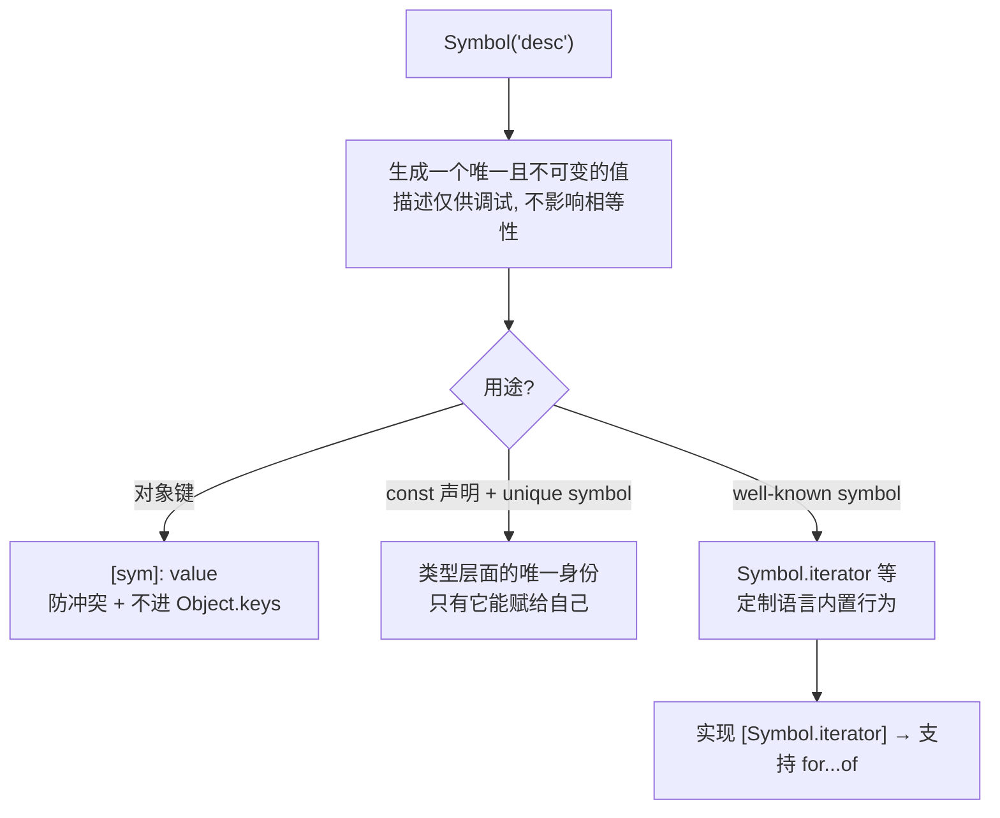

# 25 · 符号（Symbols）
> `symbol` 是 ES2015 的原始类型，每个值唯一且不可变，常用作「绝不与他人冲突」的对象键。`unique symbol` 则把某个 symbol 提升为类型层面的唯一身份。

## 📖 知识讲解

对照官方 Handbook 的 **Symbols**。

- **`symbol` 原始类型**：用 `Symbol()` 创建（不能 `new`）。参数是「描述」，仅用于调试，**不影响唯一性**——`Symbol("k") === Symbol("k")` 为 `false`。
- **作为对象/类的键**：用计算属性语法 `{ [sym]: value }`。symbol 键的最大好处是**天然防冲突**，且默认**不出现在 `Object.keys` / `for...in`** 里（需 `Object.getOwnPropertySymbols` 才拿得到），适合做「半私有」或「元数据」键。
- **`unique symbol`**：`symbol` 的子类型，代表**一个独一无二的字面量类型**。只能声明在 **`const` 变量** 或 **`readonly static` 属性**上（保证其身份可被静态追踪）。它的类型是 `typeof 该变量`，只有它自己能赋给自己。常用于「品牌键 / 名义类型 / 唯一标识」。
- **well-known symbols（内置符号）**：JS 预定义的一批符号，用来定制语言内部行为。最常用的是 **`Symbol.iterator`**——实现它就能让对象支持 `for...of`（见 27 模块）。其它还有 `Symbol.asyncIterator`、`Symbol.hasInstance`（定制 `instanceof`）、`Symbol.toPrimitive`（定制类型转换）、`Symbol.toStringTag` 等。

易错点：
- `symbol` 不能 `new`；它是原始类型。
- `unique symbol` 不能声明在 `let`/`var` 上（因为可变就无法保证唯一身份）。
- 需要 `target` 至少 ES2015 且 `lib` 含 Symbol（本工程 `ES2020` 满足）。

## 🔄 流程图 / 原理图



## 💻 代码说明

- `s2 === s3`：同描述的 symbol 也不相等，证明唯一性；反例展示不能 `new Symbol()`。
- `user[idKey]`：symbol 作为计算属性键；`Object.keys(user)` 不含 symbol 键，说明防冲突/半隐藏特性。
- `const TAG: unique symbol`：唯一符号类型，只能赋 `TAG` 本身；反例展示不能声明在 `let` 上；`Registry.key` 演示 `readonly static` 上的 unique symbol。
- `class Vault { [secret]: string }`：用 symbol 键实现半私有成员。
- `class Range { [Symbol.iterator]() }`：实现 well-known symbol `Symbol.iterator`，让对象可 `for...of` / 展开，衔接 27 模块。

## ▶️ 运行方式

在工程根 `06-typescript` 下：

```bash
npm i -D typescript ts-node
npx ts-node 25-symbols/demo.ts
# 或编译检查：npx tsc --noEmit
```

## ⚠️ 常见坑 / 最佳实践

- **描述不等于身份**：别以为 `Symbol("id")` 两次会相等；要复用同一个 symbol 就把它存成常量共享，或用 `Symbol.for("key")`（全局 symbol 注册表）。
- **`unique symbol` 必须 `const`**；放 `let` 会报错。
- **symbol 键不会被 `JSON.stringify` 序列化**，也不进 `Object.keys`——用它存内部元数据很干净，但别指望被序列化。
- **真正的私有字段**优先用类的 `#field`（ES 私有）或 TS `private`；symbol 键只是「不易被误访问」，并非语言级私有。
- 需要自定义可迭代、instanceof、转换行为时，用对应的 well-known symbol。

## 🔗 官方文档

- Symbols: https://www.typescriptlang.org/docs/handbook/symbols.html
