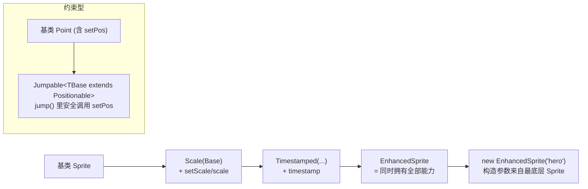

# 26 · 混入模式（Mixins）
> 用「构造函数类型 + 泛型约束」把多个可复用能力拼装到一个类上。这是 TS 里模拟「多重继承 / 能力组合」的官方推荐做法。

## 📖 知识讲解

对照官方 Handbook 的 **Mixins**。JS/TS 的类只支持单继承，当你想给一个类叠加多种正交能力（可缩放、带时间戳、可跳跃……）时，用 Mixins：

- **构造函数类型是地基**：
  ```ts
  type Constructor = new (...args: any[]) => {};       // 任意可 new 的类
  type GConstructor<T = {}> = new (...args: any[]) => T; // 约束实例至少有 T 的成员
  ```
- **一个 mixin 就是一个函数**：它接收一个「基类」，返回一个「继承了基类并扩展了新能力的子类（类表达式）」。
  ```ts
  function Scale<TBase extends Constructor>(Base: TBase) {
    return class extends Base { /* 新增状态与方法 */ };
  }
  ```
- **组合 = 函数嵌套**：`Timestamped(Scale(Sprite))` 像搭积木一样把能力层层叠加，最终类同时拥有所有能力，构造参数来自最底层基类。
- **有约束的 mixin**：用 `GConstructor<{ setPos: ... }>` 约束「基类必须已具备某些成员」，这样 mixin 内部才能安全地调用基类的方法。约束不满足时编译期直接报错。

要点与易错点：
- `TBase extends Constructor` 是让 `class extends Base` 合法的关键——TS 只允许继承「构造函数类型」。
- 返回的是**类表达式（匿名/具名 class）**，这也是 TS 原生支持 mixin 类型推导的前提。
- **静态成员/装饰器**在 mixin 里有额外注意：类表达式是「一次性实例」，需要泛型静态成员时改用「返回类的工厂」；装饰器无法通过控制流参与 mixin 组合，需手动组合类型。

## 🔄 流程图 / 原理图



## 💻 代码说明

- `type Constructor` / `type GConstructor<T>`：两个地基类型——任意构造函数、带成员约束的构造函数。
- `Scale` / `Timestamped`：两个无约束 mixin，各自给基类加「缩放」「时间戳」能力。
- `Timestamped(Scale(Sprite))`：函数嵌套组合能力，实例同时有 `name`(基类) / `scale`(Scale) / `timestamp`(Timestamped)。
- `Positionable = GConstructor<{ setPos }>` + `Jumpable`：有约束的 mixin，要求基类必须能 `setPos`，`jump()` 内部才能安全调用。
- 末尾反例：把 `Jumpable` 用在没有 `setPos` 的 `Bare` 上会报「不满足约束」，展示 `GConstructor<T>` 的静态保护作用。

## ▶️ 运行方式

在工程根 `06-typescript` 下：

```bash
npm i -D typescript ts-node
npx ts-node 26-mixins/demo.ts
# 或编译检查：npx tsc --noEmit
```

## ⚠️ 常见坑 / 最佳实践

- **基类参数一定约束成 `Constructor`**，否则 `class extends Base` 不合法。
- **能力有前置依赖时用 `GConstructor<T>` 约束**，让「缺前提」在编译期暴露，而不是运行时 `undefined is not a function`。
- **保持每个 mixin 单一职责、正交**，组合才清晰；能力之间尽量不互相耦合。
- **静态成员/装饰器**与 mixin 配合有坑：需要泛型静态成员时用「工厂返回类」，装饰器组合需手动写类型。
- Mixins 属进阶模式，业务里能用组合（composition）解决就别急着上 mixin；它更适合写通用能力库。

## 🔗 官方文档

- Mixins: https://www.typescriptlang.org/docs/handbook/mixins.html
