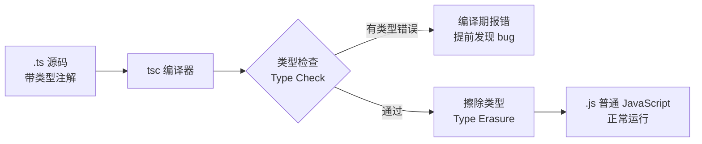
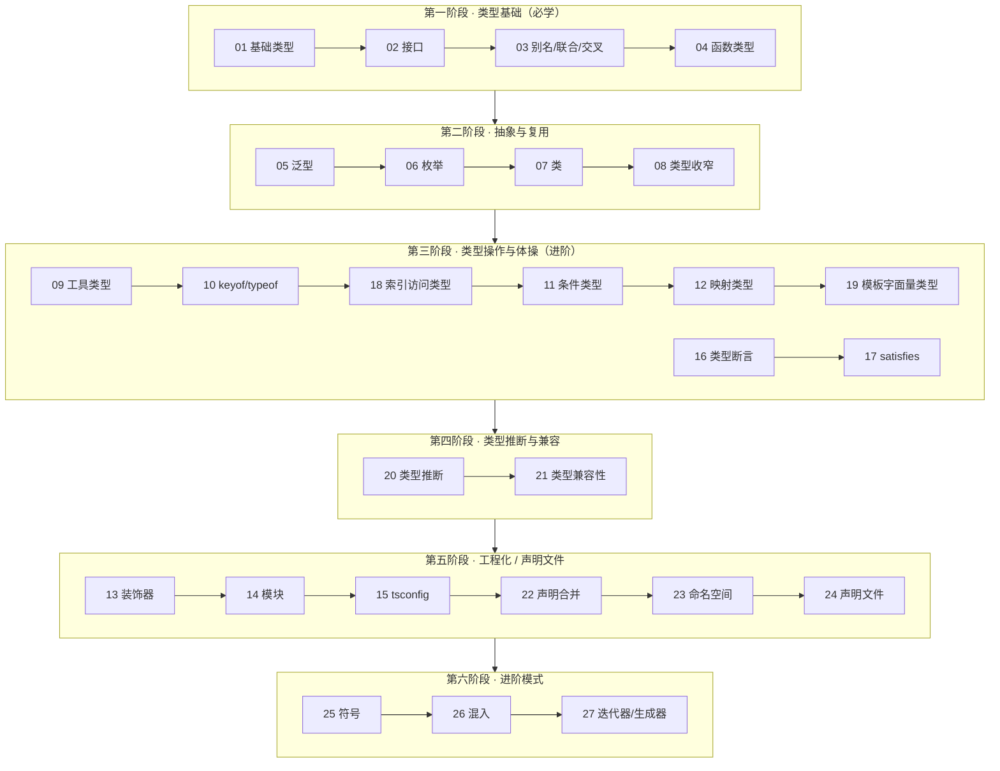

# 06 · TypeScript 教学工程

> TypeScript 是 JavaScript 的「带类型的超集」（Typed Superset of JavaScript）：在 JS 之上加了一套**静态类型系统**，在编译期就能发现 bug，并提供强大的编辑器智能提示。本工程对照官方 [TypeScript Handbook](https://www.typescriptlang.org/docs/handbook/intro.html) + Reference 整理，由易到难拆成 27 个聚焦模块，每个模块一个可运行的 `demo.ts`。

## 📖 TypeScript 简介

- **是什么**：TypeScript（简称 TS）由微软开发，是 JavaScript 的超集 —— 任何合法的 JS 都是合法的 TS。它在 JS 基础上增加了**类型注解、接口、泛型、枚举**等特性。
- **解决什么问题**：JS 是动态弱类型语言，很多错误（拼错属性名、传错参数类型、`undefined is not a function`）只能在**运行时**才暴露。TS 把这些错误提前到**编译期**，并让 IDE 能精准补全、重构、跳转。
- **怎么工作**：TS 代码经过 `tsc`（TypeScript 编译器）做**类型检查**后，**擦除类型**编译成普通 JS 运行。类型只存在于开发期，不进入运行时（zero runtime cost）。
- **现状**：当前主流版本为 TS 5.x，Vue 3 / React / Angular / Node 生态已全面拥抱 TS。



## 🗂️ 模块索引

| 序号 | 模块 | 知识点 | 官方 Handbook 章节 |
| --- | --- | --- | --- |
| 01 | [basic-types](./01-basic-types/) | 基础类型：string/number/boolean/array/tuple/any/unknown | Everyday Types |
| 02 | [interfaces](./02-interfaces/) | 接口：可选/只读属性、索引签名、继承 | Object Types |
| 03 | [type-alias-union](./03-type-alias-union/) | 类型别名、联合、交叉、字面量类型 | Everyday Types |
| 04 | [functions-types](./04-functions-types/) | 函数类型：可选/默认/剩余参数、重载 | More on Functions |
| 05 | [generics](./05-generics/) | 泛型：泛型函数/接口/类、约束 | Generics |
| 06 | [enums](./06-enums/) | 枚举：数字/字符串/常量枚举 | Enums |
| 07 | [classes](./07-classes/) | 类：访问修饰符、抽象类、继承 | Classes |
| 08 | [type-narrowing](./08-type-narrowing/) | 类型收窄：typeof/instanceof/类型守卫 | Narrowing |
| 09 | [utility-types](./09-utility-types/) | 工具类型：Partial/Pick/Omit/Record… | Utility Types |
| 10 | [keyof-typeof](./10-keyof-typeof/) | 索引类型查询：keyof/typeof/T[K] | Keyof & Typeof |
| 11 | [conditional-types](./11-conditional-types/) | 条件类型：extends ? :、infer | Conditional Types |
| 12 | [mapped-types](./12-mapped-types/) | 映射类型：[K in keyof T]、key remapping | Mapped Types |
| 13 | [decorators](./13-decorators/) | 装饰器：类/方法/属性/参数装饰器 | Decorators |
| 14 | [modules](./14-modules/) | 模块：ESM 导入导出、type-only、命名空间 | Modules |
| 15 | [tsconfig](./15-tsconfig/) | 编译配置：strict 系列、核心字段 | tsconfig Reference |
| 16 | [type-assertions](./16-type-assertions/) | 类型断言：as/尖括号、非空 `!`、`as const` | Everyday Types · Type Assertions |
| 17 | [satisfies-operator](./17-satisfies-operator/) | `satisfies`：既校验又保留精确类型 | Release Notes 4.9 |
| 18 | [indexed-access-types](./18-indexed-access-types/) | 索引访问类型：`T[K]`、`T[number]` | Indexed Access Types |
| 19 | [template-literal-types](./19-template-literal-types/) | 模板字面量类型 + Uppercase/Capitalize | Template Literal Types |
| 20 | [type-inference](./20-type-inference/) | 类型推断：拓宽、上下文类型、最佳通用类型 | Type Inference |
| 21 | [type-compatibility](./21-type-compatibility/) | 类型兼容：结构化类型、逆变、多余属性检查 | Type Compatibility |
| 22 | [declaration-merging](./22-declaration-merging/) | 声明合并：接口/命名空间合并、模块扩充 | Declaration Merging |
| 23 | [namespaces](./23-namespaces/) | 命名空间与 ES 模块的取舍 | Namespaces |
| 24 | [declaration-files](./24-declaration-files/) | 声明文件 `.d.ts`、`declare`、`@types` | Declaration Files |
| 25 | [symbols](./25-symbols/) | `symbol`/`unique symbol`、well-known symbols | Symbols |
| 26 | [mixins](./26-mixins/) | 混入：构造函数类型 + 泛型约束拼装能力 | Mixins |
| 27 | [iterators-generators](./27-iterators-generators/) | 迭代器/生成器：`Iterable`/`Generator<T>` | Iterators and Generators |

## 🛤️ 学习路线图



建议顺序：**先把第一、二阶段（01-08）吃透**，能写出类型安全的业务代码即可上手项目；第三阶段（09-12、16-19）是「类型操作与体操」，写库 / 封装通用工具时深入；第四阶段（20-21）理解推断与兼容规则，能读懂各种「为什么这样也能赋值」的报错；第五阶段（13-15、22-24）是工程化与声明文件，接第三方库 / 补类型时必备；第六阶段（25-27）是进阶模式，按需了解。

## ▶️ 运行说明

本工程为「工程化模块」，使用 npm + tsc，无需浏览器。所有命令在**本工程根目录** `06-typescript/` 下执行。

```bash
# 1. 进入工程目录
cd 06-typescript

# 2. 安装依赖（TypeScript 编译器 + ts-node 直跑工具）
npm install
# 等价于手动安装：
# npm i -D typescript ts-node @types/node

# 3a. 【推荐】用 ts-node 直接运行某个模块的 demo（免编译，立刻看结果）
npx ts-node 01-basic-types/demo.ts

# 3b. 或者用 tsc 编译全部 .ts → dist/ 目录下的 .js，再用 node 运行
npx tsc                          # 按 tsconfig.json 编译，产物在 dist/
node dist/01-basic-types/demo.js

# 4. 只做类型检查、不输出文件（CI 常用）
npx tsc --noEmit
```

> 说明：
> - `tsconfig.json` 已开启 `strict` 严格模式（逐项讲解见 `15-tsconfig`），并为 `13-decorators` 开启了 `experimentalDecorators`。
> - 各模块 `demo.ts` 中的「类型错误反例」均以**注释形式**保留（不会真的报错中断编译），方便你取消注释亲自观察报错信息。

## 🔗 官方文档

- TypeScript Handbook（入口）：https://www.typescriptlang.org/docs/handbook/intro.html
- TS Playground（在线试跑）：https://www.typescriptlang.org/play
- tsconfig 参考：https://www.typescriptlang.org/tsconfig
- 中文文档（社区）：https://ts.nodejs.cn/docs/handbook/intro.html
