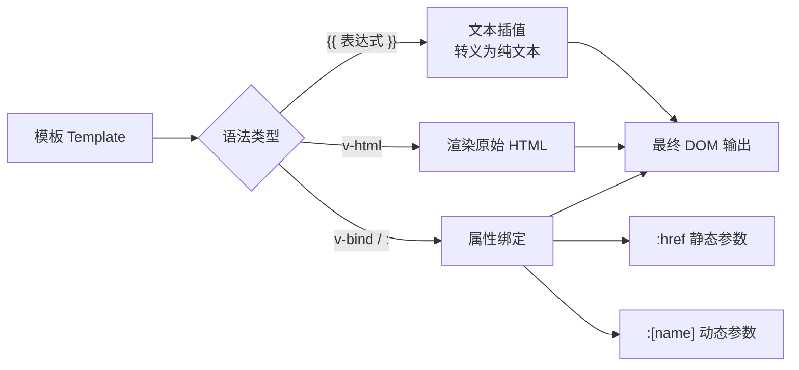

# 02 · 模板语法（Template Syntax）

> Vue 用「在 HTML 上扩展语法」的方式，把数据声明式地绑定到 DOM：插值、指令、属性绑定。

## 📖 知识讲解

Vue 模板语法主要由三类构成：

### 1. 文本插值 `{{ }}`
双大括号里放的是 **JavaScript 表达式**（不是语句），会被求值后显示：
- ✅ `{{ a + b }}`、`{{ ok ? 'yes' : 'no' }}`、`{{ msg.split('').reverse().join('') }}`
- ❌ 不能写 `if (...) {}`、`let x = 1`（这些是语句不是表达式）

### 2. `v-html` 渲染原始 HTML
插值会把内容转义成纯文本（防 XSS）；要渲染真正的 HTML 标签用 `v-html`。
> ⚠️ `v-html` 有 XSS 风险，**绝不要**对用户输入内容使用。

### 3. 指令（Directives）与 `v-bind`
以 `v-` 开头的特殊属性叫「指令」。最常用的是 `v-bind`，把元素属性绑定到数据：

| 写法 | 说明 |
| --- | --- |
| `v-bind:href="url"` | 完整写法 |
| `:href="url"` | 简写（推荐） |
| `:class` / `:style` | 动态绑定样式（详见模块 06） |
| `:[attrName]="val"` | **动态参数**：连绑定哪个属性都能动态决定 |

指令的完整结构：`v-指令名:参数.修饰符="表达式"`，例如 `v-on:click.stop="fn"`。

## 🔄 流程图 / 原理图



## 💻 代码说明

```html
<p>{{ rawName.toUpperCase() }}</p>        <!-- 插值里写表达式 -->
<span v-html="htmlSnippet"></span>         <!-- 渲染 HTML 标签 -->
<a :href="url">链接</a>                     <!-- v-bind 简写 -->
<p :[attrName]="'提示'">悬停</p>           <!-- 动态参数 -->
```

`attrName` 在 `title` 与 `data-tip` 间切换时，绑定的目标属性也随之改变 —— 这就是动态参数的威力。

## ▶️ 运行方式

CDN 免构建：直接用浏览器打开 `index.html`。

## ⚠️ 常见坑 / 最佳实践

- 插值里 **只能放表达式**，放 `if/for` 等语句会报错。
- `v-html` 不会编译里面的 Vue 模板语法，且有 XSS 风险，慎用。
- 动态参数表达式结果应为字符串；若为 `null` 则移除该绑定。
- 属性名大小写：浏览器中 HTML 属性不区分大小写，动态参数建议用小写或短横线。

## 🔗 官方文档

- 模板语法：https://cn.vuejs.org/guide/essentials/template-syntax.html
