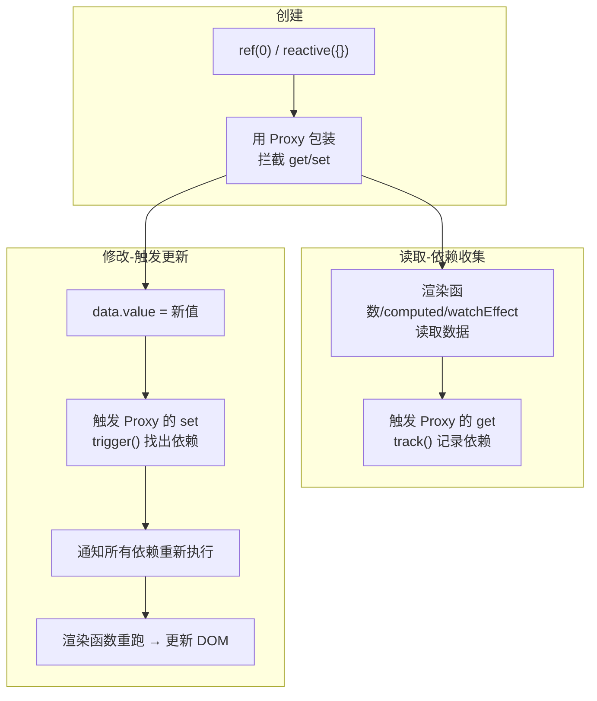

# 03 · 响应式基础（Reactivity Fundamentals）

> Vue 的灵魂：把普通数据变成「响应式」数据，数据一改，用到它的界面和逻辑自动更新。

## 📖 知识讲解

### `ref()` vs `reactive()`

| API | 适合 | 访问方式（JS） | 访问方式（模板） |
| --- | --- | --- | --- |
| `ref(x)` | 任意类型（尤其基本类型 number/string/boolean） | `obj.value` | 自动解包，直接写 |
| `reactive(obj)` | **只能**是对象 / 数组 / Map / Set | 直接访问属性 | 直接访问属性 |

经验法则：**优先用 `ref`**（更统一、不易踩坑），对象也可以用 ref；`reactive` 在确定是对象且想直接 `.属性` 访问时用。

### 响应式原理（Vue 3 用 Proxy）

Vue 2 用 `Object.defineProperty` 劫持属性；**Vue 3 改用 ES6 `Proxy`** 代理整个对象，从而解决了 Vue 2 的「不能监听新增属性 / 数组索引」等问题。

核心三步：
1. **依赖收集（track）**：当一段逻辑（如渲染、computed、watchEffect）读取响应式数据时，Vue 记下「谁用到了这个数据」。
2. **触发更新（trigger）**：当数据被修改时，Vue 找到所有依赖它的地方，通知它们重新执行。
3. **重新渲染**：组件的渲染函数作为一个「副作用」被重新运行，生成新虚拟 DOM 并 diff 更新真实 DOM。

## 🔄 流程图 / 原理图



## 💻 代码说明

```js
const count = ref(0);                       // 基本类型用 ref
const user  = reactive({ name: '小明', age: 18 }); // 对象用 reactive

count.value++;        // JS 里 ref 要 .value
user.age++;           // reactive 直接改属性

watchEffect(() => {   // 自动追踪内部用到的 count.value、user.age
  console.log(count.value, user.age); // 任一变化都会重跑
});
```

模板中：`{{ count }}`（自动解包），`{{ user.age }}`（直接访问）。

## ⚠️ 常见坑 / 最佳实践

- **JS 里漏写 `.value`**：`count++` 不会生效，必须 `count.value++`（模板里才不用）。
- **解构 reactive 会丢失响应式**：`const { age } = user` 后 `age` 是普通值。需要解构请用 `toRefs(user)`。
- **直接替换整个 reactive 对象会断联**：`user = reactive({...})` 行不通；改用 ref 存对象，或逐属性赋值 / `Object.assign`。
- `reactive` 不能包装基本类型：`reactive(0)` 无效。

## 🔗 官方文档

- 响应式基础：https://cn.vuejs.org/guide/essentials/reactivity-fundamentals.html
- 深入响应式系统：https://cn.vuejs.org/guide/extras/reactivity-in-depth.html
