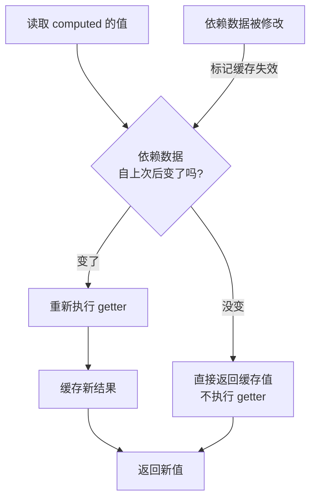

# 04 · 计算属性（Computed Properties）

> 基于响应式数据「派生」出新数据，且带缓存 —— 依赖不变就不重新计算。

## 📖 知识讲解

当一个值需要由其它响应式数据「算出来」时，用 `computed`：

```js
const fullName = computed(() => firstName.value + lastName.value);
```

### computed vs 普通方法（method）
两者都能算出结果，但关键区别是 **缓存**：

| | computed | method |
| --- | --- | --- |
| 缓存 | ✅ 依赖不变就返回缓存，不重算 | ❌ 每次渲染都重新执行 |
| 适用 | 派生状态、重计算开销大 | 事件处理、确实要每次执行 |

computed 只有当它**依赖的响应式数据**发生变化时，才会重新求值。

### 可写计算属性
默认 computed 是只读的（只有 getter）。需要「反向赋值」时，传入 `get` + `set`：

```js
const allDone = computed({
  get: () => todos.every(t => t.done),
  set: (v) => todos.forEach(t => t.done = v),
});
allDone.value = true; // 触发 set，把所有 todo 设为完成
```

## 🔄 流程图 / 原理图



## 💻 代码说明

- `fullName`：典型派生数据，姓名任一改变它就更新。
- `cachedTime` vs `methodTime()`：点击「tick」按钮触发重渲染，computed 因依赖没变保持不变，method 每次都算出新时间戳 —— 直观展示缓存。
- `allDone`：可写计算属性，勾选「全部完成」会反向修改所有 todo。

## ▶️ 运行方式

CDN 免构建：直接用浏览器打开 `index.html`。

## ⚠️ 常见坑 / 最佳实践

- **不要在 getter 里产生副作用**（如发请求、改别的状态）：getter 应是纯函数，副作用请用 `watch`。
- **不要直接修改 computed 的返回值**（只读 computed 赋值会警告）；需要可写就用 get/set 形式。
- 能用 computed 就别用 method 算派生值 —— 缓存能省很多无谓计算。
- computed 内部访问 ref 仍需 `.value`。

## 🔗 官方文档

- 计算属性：https://cn.vuejs.org/guide/essentials/computed.html
