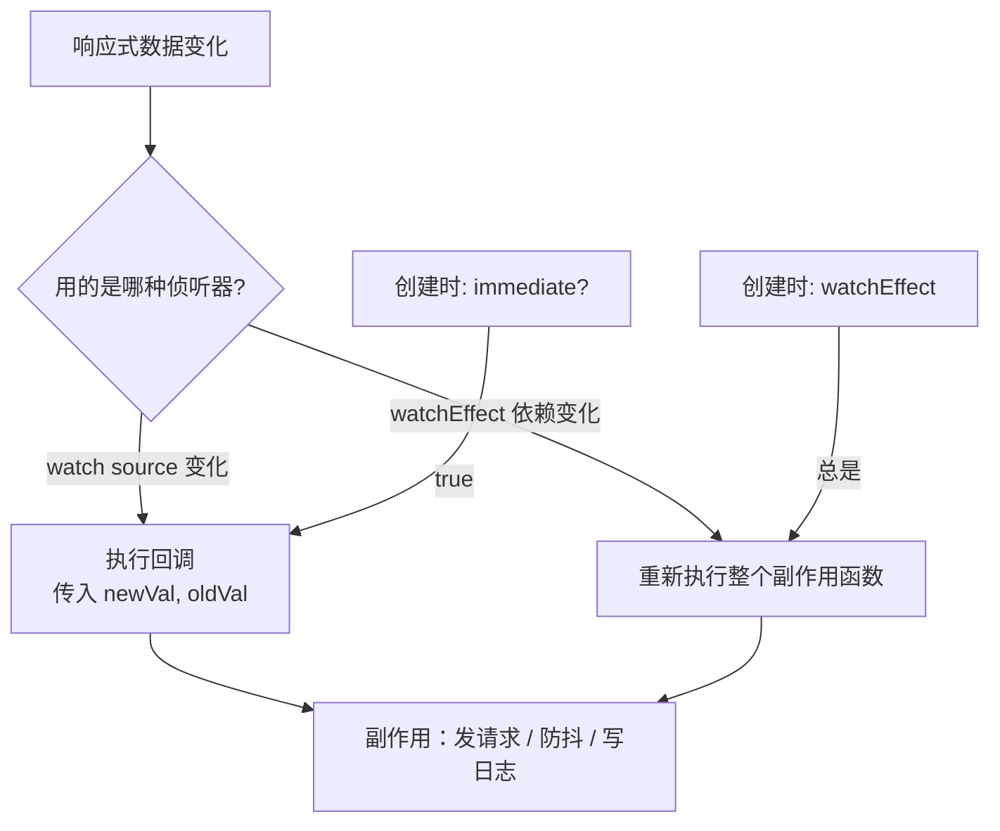

# 05 · 侦听器（Watchers）

> 当某个数据变化时，执行「副作用」—— 发请求、写日志、操作 DOM、防抖搜索等。

## 📖 知识讲解

`computed` 用于「算出一个值」，而 `watch` 用于「数据变了之后去做一件事」（副作用）。

### `watch` —— 精确监听指定数据源

```js
watch(source, (newVal, oldVal) => { /* ... */ }, options);
```

- `source` 可以是：一个 ref、一个 getter 函数 `() => obj.x`、或一个数组（监听多个）。
- 回调能拿到 **新值和旧值**。
- 常用选项：
  - `immediate: true` —— 创建时立即执行一次。
  - `deep: true` —— 深度监听对象内部所有嵌套属性的变化。

### `watchEffect` —— 自动收集依赖

```js
watchEffect(() => { console.log(a.value + b.value); });
```

- **立即执行一次**，并自动追踪回调里用到的所有响应式数据作为依赖。
- 任一依赖变化就重跑；**拿不到旧值**。
- 适合「逻辑里用到啥就监听啥」的场景，省去手动列依赖。

### watch vs watchEffect

| | watch | watchEffect |
| --- | --- | --- |
| 依赖 | 手动指定 source | 自动收集 |
| 初始执行 | 默认否（可 immediate） | 总是立即执行一次 |
| 新旧值 | ✅ 能拿到 | ❌ 拿不到旧值 |
| 适用 | 需要旧值/精确控制 | 多依赖、懒得列 |

## 🔄 流程图 / 原理图



## 💻 代码说明

- **防抖搜索**：`watch(keyword, ...)` 里用 `setTimeout` 实现「停止输入 500ms 后才搜索」，这是 watch 处理副作用的经典用法。
- **深度监听**：`watch(form, cb, { deep: true })` 监听对象内部任意属性变化（`reactive` 对象传入时默认就是深度）。
- **watchEffect**：回调里用了 `a` 和 `b`，无需手动声明依赖，二者任一变化都会重跑。

## ▶️ 运行方式

CDN 免构建：直接用浏览器打开 `index.html`。

## ⚠️ 常见坑 / 最佳实践

- **直接监听 reactive 对象的某个属性**：`watch(obj.count, ...)` 行不通（传入的是普通值）；要写成 getter：`watch(() => obj.count, ...)`。
- **深度监听性能开销大**：大对象慎用 `deep: true`，能用 getter 精确监听就别全量深听。
- watch 默认是 **惰性的**（数据变了才执行）；要立即跑加 `immediate: true`。
- 别滥用 watch 去同步派生数据 —— 那是 `computed` 的活儿。

## 🔗 官方文档

- 侦听器：https://cn.vuejs.org/guide/essentials/watchers.html
