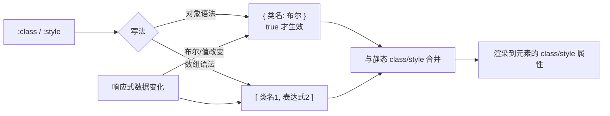

# 06 · Class 与 Style 绑定（Class & Style Bindings）

> 用数据动态控制元素的 class 和内联样式 —— Vue 对 `:class` 和 `:style` 做了特殊增强。

## 📖 知识讲解

`:class` 和 `:style` 本质是 `v-bind`，但 Vue 为它们提供了 **对象** 和 **数组** 两种便捷写法。

### 绑定 class

**对象语法**（最常用）：key 是类名，value 是布尔，为 `true` 时该类生效。
```html
<div :class="{ active: isActive, danger: hasError }"></div>
```

**数组语法**：数组里每项是一个类名（或表达式）。
```html
<div :class="[baseClass, isBig ? 'big' : '']"></div>
```

> 元素上的 **静态 `class`** 会和动态 `:class` 自动合并，不会互相覆盖。

### 绑定 style

**对象语法**：key 是 CSS 属性名（用驼峰 `backgroundColor` 或带引号的短横线 `'background-color'`）。
```html
<div :style="{ backgroundColor: color, fontSize: size + 'px' }"></div>
```

## 🔄 流程图 / 原理图



## 💻 代码说明

- **对象绑 class**：`:class="{ active: isActive, danger: hasError }"`，切换布尔即增删类。
- **数组绑 class**：`:class="[baseClass, isBig ? 'big' : '']"`，适合类名本身存在变量里。
- **绑 style**：`:style="{ backgroundColor: bgColor, borderRadius: radius+'px' }"`，配合滑块实时改颜色和圆角；`bgColor` 用 `computed` 由 `hue` 派生。

## ▶️ 运行方式

CDN 免构建：直接用浏览器打开 `index.html`。

## ⚠️ 常见坑 / 最佳实践

- **CSS 属性名**：对象语法里要么用驼峰 `fontSize`，要么用引号包短横线 `'font-size'`，直接写 `font-size`（不加引号）会语法错。
- **带单位的值要自己拼**：`fontSize: size + 'px'`，光写数字不生效。
- 复杂的 class 逻辑建议用 `computed` 返回对象/数组，保持模板干净。
- 优先用 class 控制样式（可复用、可主题化），`:style` 只在值真正动态（如随滑块变化）时用。

## 🔗 官方文档

- Class 与 Style 绑定：https://cn.vuejs.org/guide/essentials/class-and-style.html
