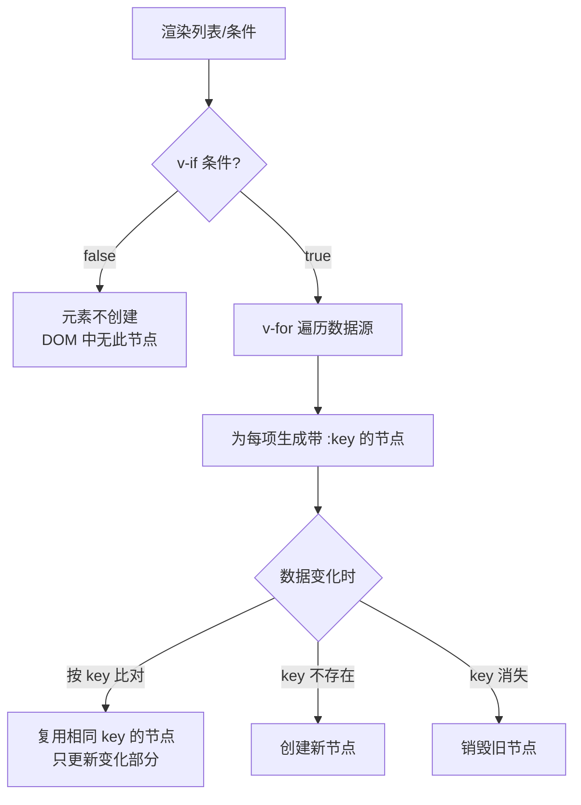

# 07 · 条件渲染与列表渲染（v-if / v-for）

> 根据条件决定「渲不渲染」，根据数组/对象「循环渲染」一组元素。

## 📖 知识讲解

### 条件渲染

| 指令 | 行为 | 适用 |
| --- | --- | --- |
| `v-if` / `v-else-if` / `v-else` | 条件为假时元素**根本不在 DOM 里**（真正销毁/创建） | 条件很少变、初始可能不渲染 |
| `v-show` | 元素始终在 DOM，只切换 `display:none` | **频繁切换**显隐 |

口诀：**切换频繁用 `v-show`，条件稳定用 `v-if`**。

### 列表渲染 `v-for`

```html
<li v-for="(item, index) in list" :key="item.id">{{ item.text }}</li>
```

- 可遍历数组、对象 `v-for="(value, key) in obj"`、数字 `v-for="n in 10"`。
- **必须绑定 `:key`**，且用 **稳定唯一** 的值（通常是 id），不要用 index 当 key（增删/排序时会出 bug）。

### key 的作用

`:key` 让 Vue 能识别「哪个节点是哪个」，从而在列表变化时复用而非重建 DOM，既高效又避免状态错乱（如输入框内容串位）。

## 🔄 流程图 / 原理图



## 💻 代码说明

- `v-if/else-if/else`：按分数显示「优秀/及格/不及格」，假分支不渲染到 DOM。
- `v-show`：切换显隐时元素始终在 DOM，只改 display。
- `v-for` + `:key="todo.id"`：增删任务时 Vue 按 id 精准更新。
- **过滤用 computed**：`shownNumbers` 用 `computed` + `filter` 实现「只看偶数」，而不是在 `v-for` 元素上叠加 `v-if`。

## ▶️ 运行方式

CDN 免构建：直接用浏览器打开 `index.html`。

## ⚠️ 常见坑 / 最佳实践

- **不要在同一元素上同时用 `v-if` 和 `v-for`**：Vue 3 中 `v-if` 优先级更高，会拿不到循环变量。需要过滤时用 `computed` 先过滤好。
- **不要用 index 作 `:key`**：列表会增删/排序时会导致渲染错乱、组件状态错位。
- 想对一组元素（无包裹标签）做条件/循环，用 `<template v-if>` / `<template v-for>`，它不产生真实 DOM。
- `v-show` 不支持 `<template>`，也不支持 `v-else`。

## 🔗 官方文档

- 条件渲染：https://cn.vuejs.org/guide/essentials/conditional.html
- 列表渲染：https://cn.vuejs.org/guide/essentials/list.html
