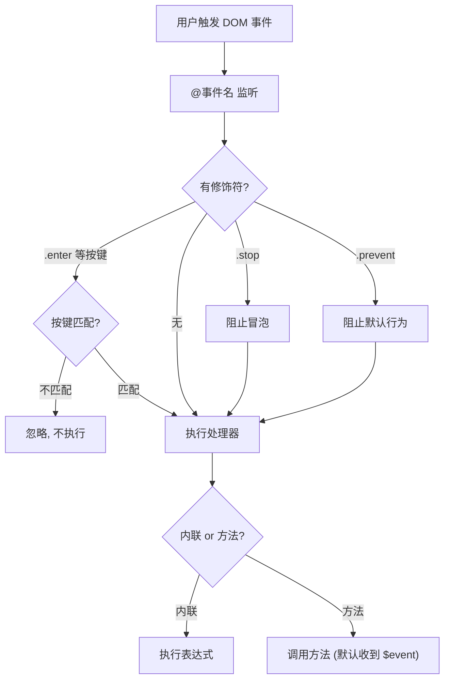

# 08 · 事件处理（Event Handling）

> 用 `v-on`（简写 `@`）监听 DOM 事件，并用「修饰符」优雅处理冒泡、默认行为、按键等。

## 📖 知识讲解

### 监听事件：`v-on:click` / `@click`

两种写法：

- **内联处理器**：直接写表达式 `@click="count++"`。
- **方法处理器**：传方法名 `@click="add"`，方法会自动收到 **原生事件对象**。
- **传参 + 拿事件**：`@click="addN(5, $event)"`，`$event` 是原生事件。

### 事件修饰符（重点）

修饰符让你在模板里声明式处理常见需求，无需在方法里写 `e.stopPropagation()`：

| 修饰符 | 作用 |
| --- | --- |
| `.stop` | 阻止事件冒泡（`stopPropagation`） |
| `.prevent` | 阻止默认行为（`preventDefault`，如链接跳转、表单提交） |
| `.once` | 只触发一次 |
| `.self` | 只有事件从元素自身触发才执行（点子元素冒泡上来不算） |
| `.capture` | 使用捕获模式 |

### 按键修饰符

针对键盘事件：`@keyup.enter`、`@keyup.esc`、`@keyup.tab`、`@keydown.ctrl.s` 等。

## 🔄 流程图 / 原理图

## 💻 代码说明

- **内联 vs 方法**：`@click="count++"` 直接改值；`@click="add"` 调方法并收到 `event`；`@click="addN(5, $event)"` 既传参又拿事件。
- **`.stop`**：内层 div 点击不再冒泡到外层。
- **`.prevent`**：链接点击不跳转。
- **`.enter`**：输入框按回车才提交。
- **`.once`**：按钮只第一次点击生效。

## ▶️ 运行方式

CDN 免构建：直接用浏览器打开 `index.html`。

## ⚠️ 常见坑 / 最佳实践

- **方法传参后还想要事件对象**，必须显式传 `$event`：`@click="fn(arg, $event)"`。
- 修饰符可串联：`@click.stop.prevent="fn"`（顺序有意义，从左到右）。
- `.prevent` 用在表单提交：`<form @submit.prevent="onSubmit">` 是最常见写法。
- 不要在模板内联里写复杂逻辑，超过一两步就抽成方法。

## 🔗 官方文档

- 事件处理：https://cn.vuejs.org/guide/essentials/event-handling.html
