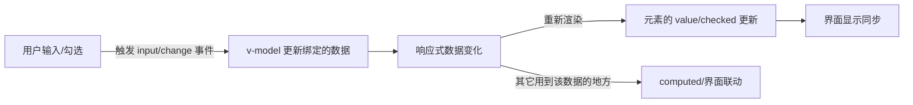

# 09 · 表单输入绑定（v-model）

> `v-model` 在表单元素上实现「双向绑定」：界面改 → 数据改，数据改 → 界面改。

## 📖 知识讲解

### v-model 的本质

`v-model` 是语法糖，对不同元素自动绑定不同的属性 + 事件：

| 元素 | 等价于 |
| --- | --- |
| `<input type="text">` | `:value` + `@input` |
| `<input type="checkbox">` | `:checked` + `@change` |
| `<select>` | `:value` + `@change` |

### 各类表单元素

- **文本 / textarea**：绑字符串。
- **单个复选框**：绑布尔值。
- **多个复选框**（共享同一个 v-model）：绑 **数组**，勾选项的 `value` 进数组。
- **单选 radio**：绑选中项的 `value`。
- **select**：绑选中 option 的值。

### 修饰符

| 修饰符 | 作用 |
| --- | --- |
| `.lazy` | 从 `input` 事件改为 `change` 事件同步（失焦/回车才更新） |
| `.number` | 自动把输入转成数字 |
| `.trim` | 自动去除首尾空白 |

## 🔄 流程图 / 原理图

## 💻 代码说明

- **文本/多行**：`v-model="text"`、`v-model="message"`。
- **复选框**：单个绑布尔 `agree`；多个共享 `v-model="frameworks"` 绑数组。
- **单选/下拉**：`v-model="gender"`、`v-model="city"`。
- **修饰符**：`v-model.number="age"` 让 `age` 是数字（`age + 1` 才是数学加法而非字符串拼接）；`v-model.trim="username"` 自动去空格。
- 右下角 `result` 用 computed 实时序列化所有字段，直观看到双向绑定效果。

## ▶️ 运行方式

CDN 免构建：直接用浏览器打开 `index.html`。

## ⚠️ 常见坑 / 最佳实践

- **不加 `.number` 时输入框的值永远是字符串**，做数学运算会变成字符串拼接（`"18" + 1 = "181"`）。
- 多个复选框要共享同一个 **数组** 类型的 v-model，且每个 `<input>` 要写 `value`。
- `<select>` 建议放一个 `disabled value=""` 的占位 option 作为「请选择」。
- 自定义组件也能用 `v-model`（基于 `props.modelValue` + `emit('update:modelValue')`），见组件相关模块。

## 🔗 官方文档

- 表单输入绑定：https://cn.vuejs.org/guide/essentials/forms.html
