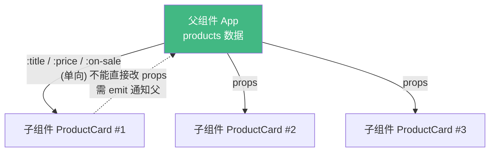

# 10 · 组件与 Props（Components & Props / 父传子）

> 把界面拆成可复用的「组件」，父组件通过 `props` 把数据传给子组件。

## 📖 知识讲解

### 组件化思想

复杂界面拆成一棵 **组件树**：每个组件管自己的一块 UI + 逻辑，可复用、可组合。本例把「商品卡片」抽成 `ProductCard` 组件，父组件用 `v-for` 渲染一组。

### 注册组件（CDN 方式）

```js
app.component('ProductCard', { props: {...}, setup() {...}, template: `...` });
```

> 在 Vite/SFC 项目中，组件是 `.vue` 单文件，`import` 后在 `<script setup>` 里直接用（见模块 14、16）。

### Props —— 父传子

props 是子组件声明的「对外输入接口」：

```js
props: {
  title:  { type: String,  required: true },   // 类型 + 必填
  price:  { type: Number,  required: true },
  onSale: { type: Boolean, default: false },   // 默认值
}
```

父组件传值用 `v-bind`：
```html
<product-card :title="p.title" :price="p.price" :on-sale="p.onSale" />
```

### 单向数据流（重点）

数据从父 **单向** 流向子。**子组件不能直接修改 props**（`props` 是只读的）。需要改时要么用本地副本，要么通过事件通知父组件改（见模块 11）。

## 🔄 流程图 / 原理图



## 💻 代码说明

- `app.component('ProductCard', {...})` 注册全局组件。
- `props` 用对象语法声明类型/必填/默认值，Vue 会做类型校验（不符会在控制台警告）。
- `setup(props)` 的第一个参数就是 props，模板里用 `props.title` 访问。
- 父组件「全场打 9 折」直接改 `products` 里的 price，子组件 props 随之更新 —— 体现单向数据流。

### 命名约定
JS 里 props 用驼峰 `onSale`，HTML 模板里写短横线 `on-sale`（HTML 属性大小写不敏感）。

## ▶️ 运行方式

CDN 免构建：直接用浏览器打开 `index.html`。

## ⚠️ 常见坑 / 最佳实践

- **不要在子组件里改 props**（如 `props.price = 0`）会触发警告且不可靠。要本地修改请 `const local = ref(props.price)`，要改父数据请 emit 事件。
- props 名 **驼峰声明、短横线传递**（`onSale` ↔ `on-sale`）。
- Boolean 类型 props 写 `<comp on-sale>` 即等于 `true`。
- props 校验（type/required/default/validator）能帮你尽早发现传错值。

## 🔗 官方文档

- 组件基础：https://cn.vuejs.org/guide/essentials/component-basics.html
- Props 详解：https://cn.vuejs.org/guide/components/props.html
