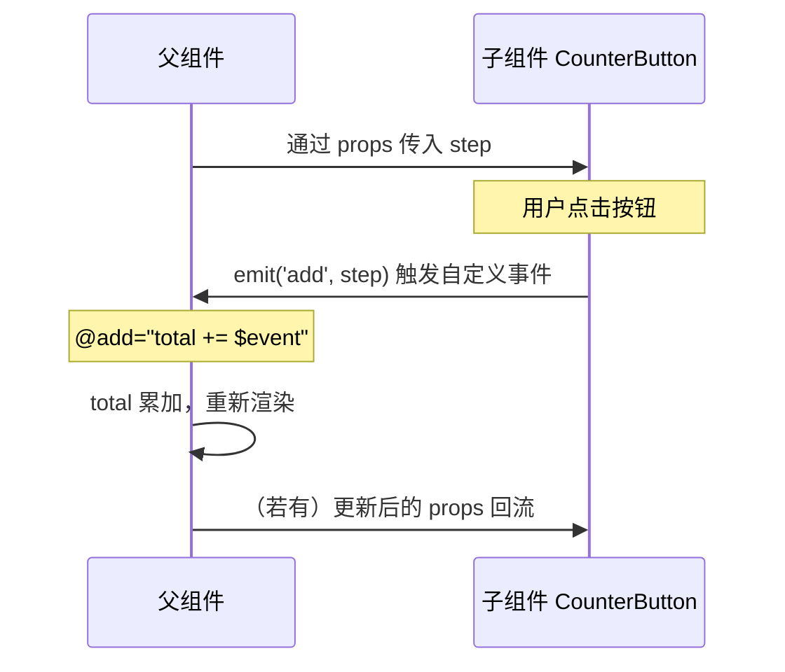

# 11 · 自定义事件（Emits / 子传父）

> props 把数据父→子；要把数据/动作子→父，子组件通过 `emit` 触发「自定义事件」。

## 📖 知识讲解

### 子传父：emit

子组件不能直接改父组件的数据（单向数据流）。要影响父组件，子组件 **触发事件**，父组件 **监听并响应**：

```js
// 子组件
emits: ['add'],                       // 声明会触发的事件
setup(props, { emit }) {
  const fire = () => emit('add', props.step); // 触发 add 事件并携带数据
}
```

```html
<!-- 父组件监听 -->
<counter-button @add="total += $event" />   <!-- $event 是 emit 携带的值 -->
<counter-button @add="onAdd" />              <!-- 或交给方法处理 -->
```

`emits` 选项是 **显式声明**（推荐）：让组件接口清晰、便于校验、避免和原生事件混淆。

### 组件上的 `v-model`

`v-model` 用在自定义组件上时，等价于：

```
v-model="color"
  ≡ :modelValue="color" + @update:modelValue="color = $event"
```

所以一个支持 v-model 的组件只需：
- 接收 prop `modelValue`
- 在需要更新时 `emit('update:modelValue', 新值)`

## 🔄 流程图 / 原理图



## 💻 代码说明

- `CounterButton`：点击时 `emit('add', props.step)`，父组件用 `@add="total += $event"` 或 `@add="onAdd"` 接收。
- `ColorPicker`：实现了组件版 `v-model` —— 接收 `modelValue`，点击颜色时 `emit('update:modelValue', c)`，父组件 `<color-picker v-model="color" />` 即可双向绑定。

## ▶️ 运行方式

CDN 免构建：直接用浏览器打开 `index.html`。

## ⚠️ 常见坑 / 最佳实践

- **事件名大小写**：emit 用 camelCase（`update:modelValue`），模板监听用短横线（`@update:model-value`）也可，但 `update:modelValue` 这种约定名建议保持一致。
- **务必声明 `emits`**：否则事件会被当成原生属性透传到根元素，容易出怪问题。
- emit 可携带多个参数：`emit('change', a, b)`，监听端 `@change="fn(a, b)"`（不再有单一 `$event`）。
- 子组件想改 props，正确姿势永远是「emit 通知父组件去改」，而非直接赋值。

## 🔗 官方文档

- 组件事件：https://cn.vuejs.org/guide/components/events.html
- 组件 v-model：https://cn.vuejs.org/guide/components/v-model.html
