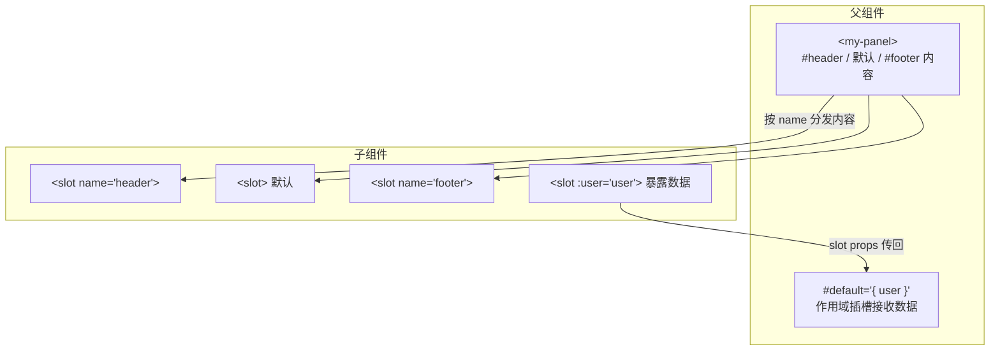

# 12 · 插槽（Slots）

> 让父组件把「一段模板内容」传进子组件的指定位置 —— 实现内容分发与高度可复用的容器组件。

## 📖 知识讲解

props 传的是「数据」，slot 传的是「模板/DOM 内容」。

### 默认插槽

子组件用 `<slot></slot>` 占位，父组件标签内的内容就会填进去：
```html
<!-- 子组件 --> <div><slot>占位默认值</slot></div>
<!-- 父组件 --> <my-comp>这段会进默认插槽</my-comp>
```
`<slot>` 里可写「后备内容」，父组件没传时显示。

### 具名插槽

一个组件可以有多个插槽，用 `name` 区分；父组件用 `<template #名字>` 指定：
```html
<!-- 子组件 -->
<slot name="header"></slot> <slot></slot> <slot name="footer"></slot>
<!-- 父组件 -->
<my-panel>
  <template #header>标题</template>
  <p>默认插槽内容</p>
  <template #footer>底部</template>
</my-panel>
```
`#header` 是 `v-slot:header` 的简写。

### 作用域插槽（重点）

默认情况下插槽内容只能访问 **父组件** 的数据。若想让父组件渲染时用到 **子组件内部** 的数据（如循环的每一项），子组件把数据「绑」在 slot 上传出来：
```html
<!-- 子组件：暴露 user/index --> <slot :user="user" :index="index"></slot>
<!-- 父组件：接收 --> <template #default="{ user, index }">...</template>
```
这样「数据由子组件提供，渲染方式由父组件决定」，灵活度极高（表格列、列表项等场景常用）。

## 🔄 流程图 / 原理图



## 💻 代码说明

- `MyPanel`：三个插槽 `header` / 默认 / `footer`，父组件用 `<template #header>` 等填充，body 的 `<p>` 进默认插槽。
- `UserList`：作用域插槽典范。子组件 `v-for` 遍历，`<slot :user="user" :index="index">` 把每项数据传出；父组件 `<template #default="{ user, index }">` 自定义每行长相。

## ▶️ 运行方式

CDN 免构建：直接用浏览器打开 `index.html`。

## ⚠️ 常见坑 / 最佳实践

- **作用域插槽的数据来自子组件**，父组件通过 `v-slot="slotProps"` 解构获取，别和父组件自己的数据搞混。
- 只有一个默认插槽时可把 `v-slot` 直接写在组件标签上：`<user-list v-slot="{ user }">`。
- 具名插槽简写 `#name`；动态插槽名 `#[dynamicName]`。
- 插槽内容在 **父组件作用域** 编译，所以默认能访问父组件数据，访问子组件数据必须靠作用域插槽。

## 🔗 官方文档

- 插槽：https://cn.vuejs.org/guide/components/slots.html
