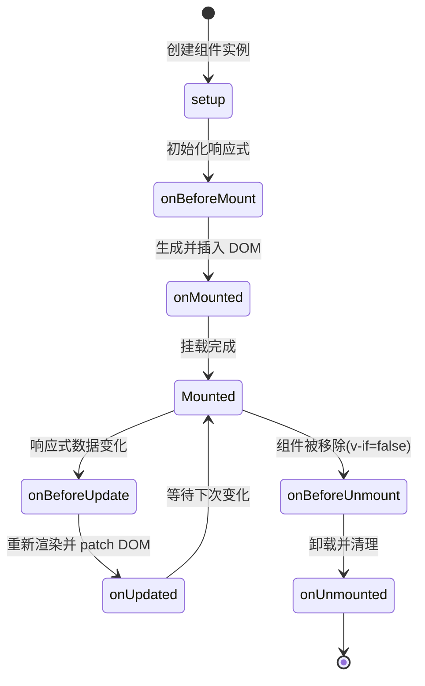

# 13 · 生命周期（Lifecycle Hooks）

> 组件从「创建 → 挂载 → 更新 → 卸载」会经历一系列阶段，Vue 在每个阶段给你一个「钩子」插入逻辑。

## 📖 知识讲解

组件实例有一条生命线。组合式 API 用 `onXxx` 注册钩子（在 `setup()` 里调用）：

| 钩子（组合式） | 时机 | 典型用途 |
| --- | --- | --- |
| `setup()` 本身 | 相当于 Options 的 beforeCreate/created | 初始化响应式数据 |
| `onBeforeMount` | 挂载前，DOM 还没生成 | 很少用 |
| `onMounted` | **挂载后**，真实 DOM 已就绪 | 访问 DOM、发请求、启动定时器、初始化第三方库 |
| `onBeforeUpdate` | 数据变了，DOM 即将更新 | 拿更新前的 DOM 状态 |
| `onUpdated` | DOM 已更新完 | 操作更新后的 DOM（慎用，易死循环） |
| `onBeforeUnmount` | 卸载前 | 准备清理 |
| `onUnmounted` | **卸载后** | 清理定时器/事件监听/订阅，防内存泄漏 |

最常用的是 **`onMounted`（进场初始化）** 和 **`onUnmounted`（离场清理）**。

## 🔄 流程图 / 原理图

## 💻 代码说明

- 点击「挂载/卸载子组件」切换 `v-if`，触发 `Clock` 的挂载（`onMounted`）和卸载（`onUnmounted`）。
- 点击「改变数据」让 `tick` 变化，触发 `onBeforeUpdate` / `onUpdated`。
- `onMounted` 里 `setInterval` 启动时钟；`onUnmounted` 里 `clearInterval` 清理 —— 这是「进场启动、离场清理」的经典范式。
- 页面 `pre` 区实时打印各钩子触发顺序，直观看到生命线。

## ▶️ 运行方式

CDN 免构建：直接用浏览器打开 `index.html`。

## ⚠️ 常见坑 / 最佳实践

- **定时器/事件监听/WebSocket 必须在 `onUnmounted` 里清理**，否则组件卸载后仍在跑，造成内存泄漏甚至报错。
- **DOM 操作放 `onMounted`**：`setup`/`onBeforeMount` 阶段 DOM 还不存在。
- `onUpdated` 里改响应式数据可能导致无限更新循环，要加条件。
- 组合式 API 没有单独的 `created`/`beforeCreate`，`setup()` 的同步代码就承担这个角色。

## 🔗 官方文档

- 生命周期钩子：https://cn.vuejs.org/guide/essentials/lifecycle.html
- 组合式 API 生命周期：https://cn.vuejs.org/api/composition-api-lifecycle.html
