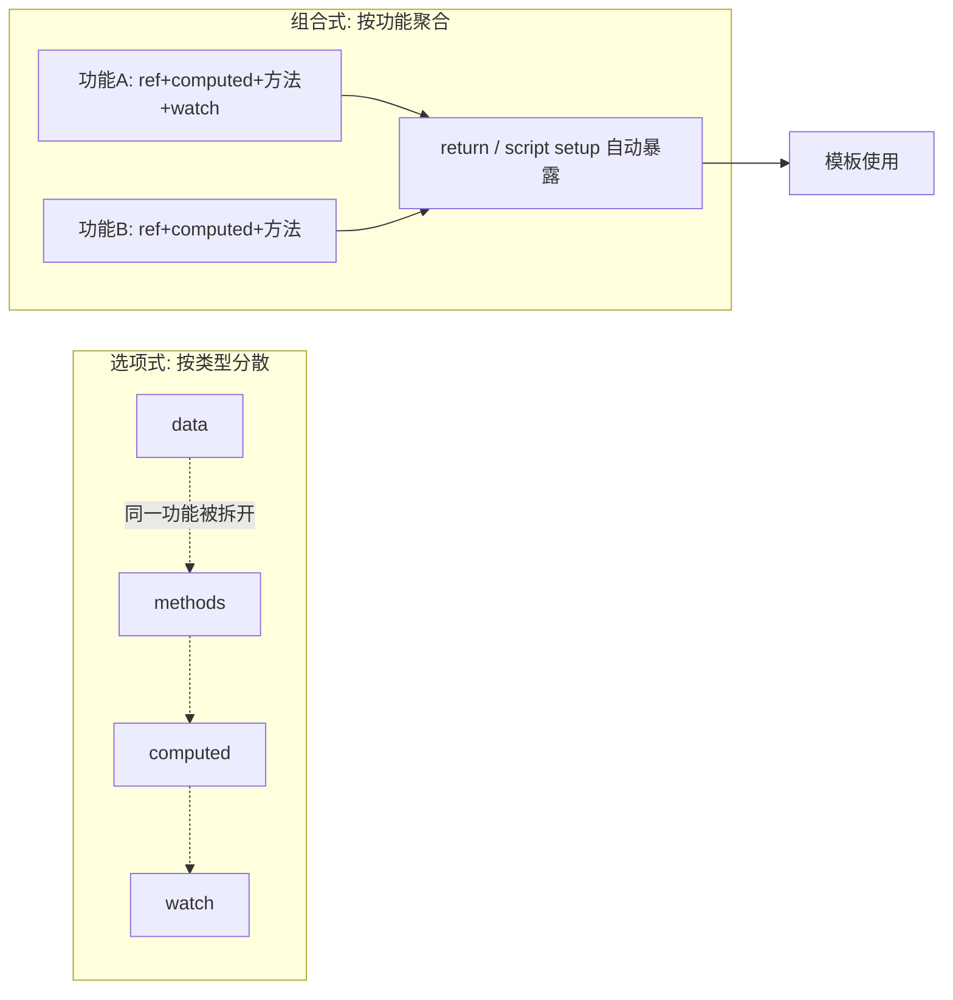

# 14 · 组合式 API 与 setup（Composition API & `<script setup>`）

> 把「同一个功能」的数据、计算、方法、侦听写在一起，而不是按选项类型分散 —— 逻辑更聚合、更易复用。

## 📖 知识讲解

### 两种 API 风格

| | 选项式 API（Options） | 组合式 API（Composition） |
| --- | --- | --- |
| 组织方式 | 按 `data` / `methods` / `computed` 分类 | 按「功能/逻辑关注点」聚合 |
| 入口 | 各个选项 | `setup()` 函数 |
| 逻辑复用 | mixins（易冲突） | 组合式函数 composables（清晰，见模块 18） |
| 推荐 | 简单组件可用 | **大型应用 / 本合集统一采用** |

### `setup()`（CDN/通用写法）

```js
setup() {
  const count = ref(0);
  const double = computed(() => count.value * 2);
  const inc = () => count.value++;
  return { count, double, inc };   // 必须 return，模板才能用
}
```

### `<script setup>`（SFC 语法糖，最推荐）

在 `.vue` 单文件组件里，用 `<script setup>` 可省去 `setup()` 和 `return` —— 顶层声明的东西**自动暴露**给模板：

```vue
<script setup>
import { ref, computed } from 'vue'
const count = ref(0)
const double = computed(() => count.value * 2)
const inc = () => count.value++
</script>

<template>
  <p>{{ count }} / {{ double }}</p>
  <button @click="inc">+1</button>
</template>
```

> ⚠️ `<script setup>` 必须配合构建工具（Vite）。本模块用 CDN 演示等价的 `setup()` 写法；模块 16/17 是真正的 Vite + `<script setup>` 项目。

## 🔄 流程图 / 原理图



## 💻 代码说明

demo 把计数器的 `count`、计算属性 `double`、方法 `increment/reset`、侦听器 `watch` 全部写在一个 `setup()` 里 —— 这就是「逻辑聚合」。对照 README 中 `<script setup>` 版本，可见后者更简洁（无需 return）。

## ▶️ 运行方式

CDN 免构建：直接用浏览器打开 `index.html`。
（`<script setup>` 完整体验见模块 16 `vue-router` / 17 `pinia-store` 的 Vite 项目。）

## ⚠️ 常见坑 / 最佳实践

- `setup()` 写法 **必须 return**；`<script setup>` 则自动暴露，别混淆两者。
- `<script setup>` 只能用在 `.vue` 单文件 + 构建工具下，CDN 里用不了。
- 组合式 API 不是「淘汰选项式」，而是更适合复杂逻辑和复用；两者可共存。
- 把可复用逻辑抽成 `useXxx()` 组合式函数，是组合式 API 的最大价值（模块 18）。

## 🔗 官方文档

- 组合式 API FAQ：https://cn.vuejs.org/guide/extras/composition-api-faq.html
- `<script setup>`：https://cn.vuejs.org/api/sfc-script-setup.html
