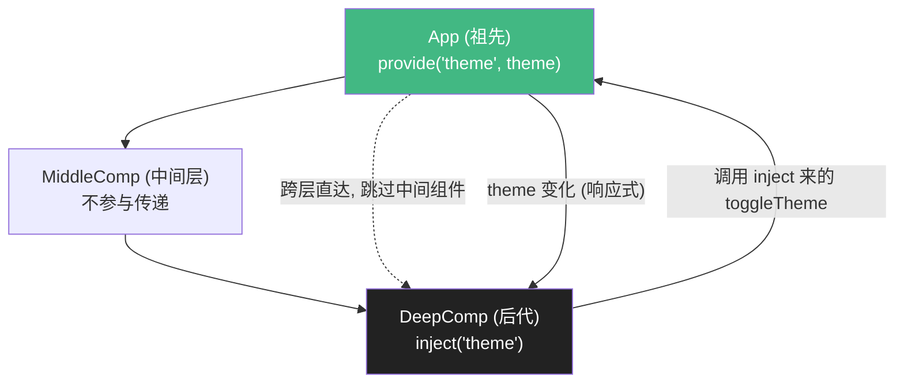

# 15 · 依赖注入（Provide / Inject）

> 祖先组件 `provide` 数据，任意层级的后代组件直接 `inject` 取用 —— 跨多层传递，免去「props 逐层透传」。

## 📖 知识讲解

### 解决什么问题

当一个数据要从顶层传到很深的子组件，用 props 得一层层往下传（叫 **prop drilling / 逐级透传**），中间组件明明用不到也得帮忙转手，很啰嗦。

`provide` / `inject` 让祖先和后代「直接对话」，跳过中间层。

### 用法

```js
// 祖先组件
provide('theme', theme);          // provide(注入名, 值)

// 任意后代组件
const theme = inject('theme', 默认值);  // inject(注入名, 可选默认值)
```

### 保持响应式

`provide` 一个 **ref / reactive**，后代 inject 到的就是响应式的，祖先改值后代自动更新。

### 最佳实践：连同「修改方法」一起提供

为了可维护，推荐把「数据 + 修改它的方法」一起 provide，后代通过方法修改，而不是直接改注入的值 —— 保持「谁拥有数据谁负责修改」的清晰边界：

```js
provide('theme', theme);
provide('toggleTheme', toggleTheme); // 修改逻辑收敛在提供方
```

## 🔄 流程图 / 原理图



## 💻 代码说明

- `App` 用 `provide('theme', theme)` 和 `provide('toggleTheme', fn)` 提供主题状态和切换方法。
- `MiddleComp` 完全不碰 theme，仅渲染孙子组件 —— 体现「跳过中间层」。
- `DeepComp` 用 `inject('theme')` 直接拿到主题，并能调用注入来的 `toggleTheme` 反向切换；因为提供的是 ref，主题切换后所有相关组件同步更新。

## ▶️ 运行方式

CDN 免构建：直接用浏览器打开 `index.html`。

## ⚠️ 常见坑 / 最佳实践

- **inject 要写默认值**（`inject('theme', 默认)`），否则祖先没 provide 时会是 `undefined` 并告警。
- 想保持响应式就 provide **ref/reactive**；provide 一个普通值（如 `theme.value`）后代拿到的是死值。
- 建议用 `Symbol` 作为注入名避免命名冲突（大型项目）；本例为简洁用字符串。
- provide/inject 适合「主题、语言、用户信息」等跨层共享；**跨组件的复杂全局状态用 Pinia**（模块 17）更合适。

## 🔗 官方文档

- 依赖注入：https://cn.vuejs.org/guide/components/provide-inject.html
