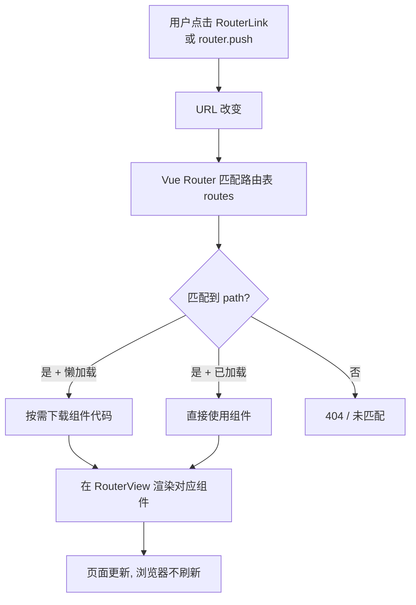

# 16 · 路由（Vue Router）

> 用 Vue Router 把不同 URL 映射到不同组件，构建「单页应用（SPA）」—— 切换页面不刷新浏览器。

## 📖 知识讲解

**单页应用（SPA）**：整个网站只有一个 HTML，页面切换由 JS 在前端完成，不向服务器请求新页面，体验更流畅。Vue Router 是 Vue 官方的路由库。

### 核心概念

| 概念 | 说明 |
| --- | --- |
| 路由表 `routes` | `path`（URL）↔ `component`（组件）的映射数组 |
| `createRouter` | 创建路由实例 |
| `history` 模式 | `createWebHashHistory`（URL 带 `#`，免服务器配置）/ `createWebHistory`（干净 URL，需服务器支持） |
| `<RouterLink>` | 声明式导航，渲染成 `<a>`，点击切换路由不刷新 |
| `<RouterView>` | 路由出口，匹配到的组件渲染在这里 |
| `useRoute()` | 读取当前路由信息（`params` / `query` / `path`） |
| `useRouter()` | 拿到路由实例做编程式导航（`router.push`） |

### 动态路由

`path: '/user/:id'` 中的 `:id` 是 **路径参数**，可匹配 `/user/1`、`/user/2`，组件里用 `route.params.id` 读取。
> ⚠️ 同组件在不同参数间切换时**不会重建**，需用 `watch(() => route.params.id, ...)` 响应变化。

### 懒加载

`component: () => import('./views/Lazy.vue')` 让该路由组件 **按需加载**，减小首屏体积。

## 🔄 流程图 / 原理图



## 💻 代码说明

- `src/router/index.js`：定义路由表，含静态路由、动态路由 `/user/:id`、懒加载 `/lazy`。
- `src/App.vue`：`<RouterLink>` 导航 + `<RouterView>` 出口；`router-link-active` 类自动标记当前页。
- `src/views/Home.vue`：`useRouter().push()` 编程式导航。
- `src/views/User.vue`：`useRoute().params.id` 读参数，`watch` 响应参数切换。

## ▶️ 运行方式

本模块是 **Vite 脚手架项目**，需要安装依赖：

```bash
cd 16-vue-router
npm install
npm run dev
```

然后浏览器打开终端提示的地址（默认 http://localhost:5173 ）。

## ⚠️ 常见坑 / 最佳实践

- **动态路由组件复用**：`/user/1` → `/user/2` 不会重新创建组件，必须 `watch` 参数或用 `:key` 强制重建。
- `createWebHistory`（无 #）部署到服务器需配置「所有路径回退到 index.html」，否则刷新子路由 404；本地学习用 `createWebHashHistory` 最省心。
- `RouterLink` 用 `to`，不要用 `href`；编程式导航用 `router.push`。
- 路由懒加载能显著减小首屏包体积，列表型/低频页面建议懒加载。

## 🔗 官方文档

- Vue Router 官方文档：https://router.vuejs.org/zh/
- 入门：https://router.vuejs.org/zh/guide/
