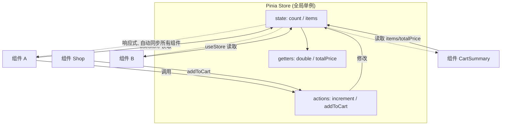

# 17 · 状态管理（Pinia Store）

> Pinia 是 Vue 官方推荐的状态管理库。把「多个组件共享的状态」集中存放，任何组件都能直接读写，无需层层传 props/emit。

## 📖 知识讲解

### 为什么需要状态管理

当很多组件要共享同一份数据（登录用户、购物车、主题…），用 props/emit 层层传递会非常痛苦。**Pinia** 提供一个集中的「仓库（store）」，组件直接访问，天然响应式。

### 定义 Store（Setup Store 写法）

`defineStore('唯一id', setup函数)`，内部和组合式 API 完全一样：

```js
export const useCounterStore = defineStore('counter', () => {
  const count = ref(0)                        // state 状态
  const double = computed(() => count.value*2) // getter 派生
  function increment() { count.value++ }       // action 修改方法
  return { count, double, increment }          // 必须 return
})
```

| Pinia 概念 | Setup Store 对应 | 作用 |
| --- | --- | --- |
| state | `ref()` | 存放数据 |
| getters | `computed()` | 派生数据（带缓存） |
| actions | 普通函数 | 修改 state 的逻辑（可异步） |

### 使用 Store

```js
const counter = useCounterStore()
counter.count          // 读 state
counter.double         // 读 getter
counter.increment()    // 调 action
```

### `storeToRefs`（重点）

直接解构 store（`const { count } = counter`）会**丢失响应式**。要解构 state/getter 必须用 `storeToRefs`：
```js
const { count, double } = storeToRefs(counter) // 保持响应式
// 注意：action（方法）直接从 store 解构即可，不需要 storeToRefs
```

## 🔄 流程图 / 原理图



## 💻 代码说明

- `src/stores/counter.js`：计数器 store，演示 state/getter/action 三件套。
- `src/stores/cart.js`：购物车 store，`addToCart` 处理「已存在则数量+1」，`totalCount`/`totalPrice` 是 getter。
- `Counter.vue` 与 `CounterMirror.vue`：两个无父子关系的组件读同一个 counter store，A 改 B 同步；B 用 `storeToRefs` 解构保持响应式。
- `Shop.vue` 加购，`CartSummary.vue` 显示购物车 —— 跨组件共享状态，零 props。

## ▶️ 运行方式

本模块是 **Vite 脚手架项目**：

```bash
cd 17-pinia-store
npm install
npm run dev
```

浏览器打开终端提示地址（默认 http://localhost:5173 ）。

## ⚠️ 常见坑 / 最佳实践

- **解构 store 丢响应式**：`const { count } = store` 是错的，要用 `storeToRefs(store)`；但 **action 方法**直接解构没问题。
- store 的 `id`（第一个参数）必须 **全局唯一**。
- action 里可以写异步逻辑（如 `await fetch`），这是放业务逻辑的好地方。
- store 是「全局单例」：多次 `useXxxStore()` 拿到的是同一个实例。
- 简单的跨层共享可用 `provide/inject`（模块 15）；**复杂、多组件、需调试**的全局状态用 Pinia。

## 🔗 官方文档

- Pinia 官方文档：https://pinia.vuejs.org/zh/
- 核心概念：https://pinia.vuejs.org/zh/core-concepts/
