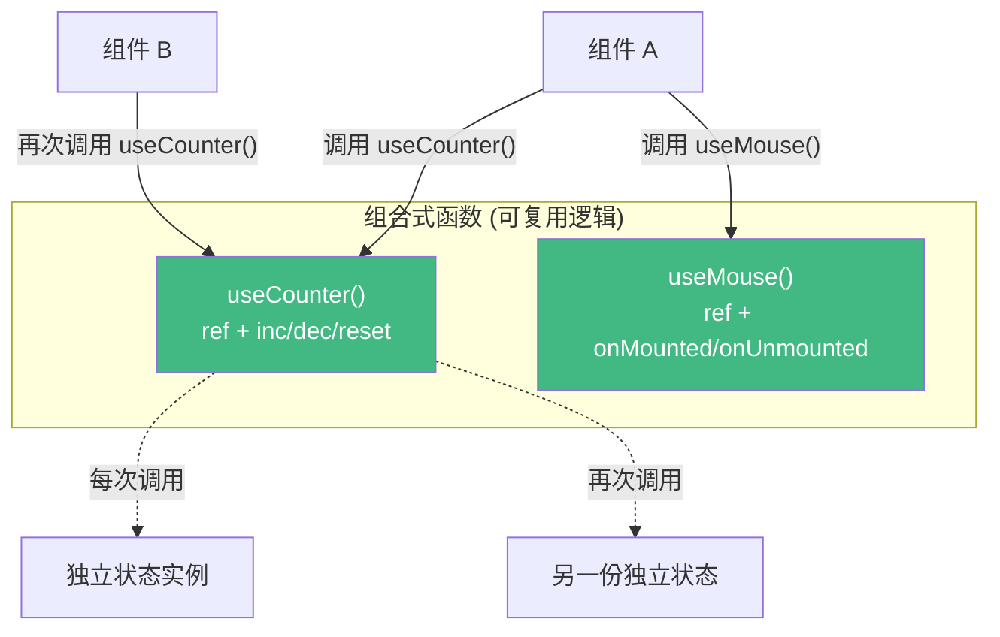

# 18 · 组合式函数（Composables）

> 把「有状态的可复用逻辑」抽成以 `use` 开头的函数 —— 组合式 API 复用逻辑的标准方式，替代 Vue 2 的 mixins。

## 📖 知识讲解

### 什么是组合式函数

一个 **以 `use` 开头、内部使用 Vue 响应式 API（ref/computed/watch/生命周期）** 的普通函数，用来封装和复用「有状态的逻辑」。

```js
function useCounter(initial = 0) {
  const count = ref(initial);
  const inc = () => count.value++;
  return { count, inc };   // 返回状态 + 方法
}
```

组件里直接调用：
```js
const { count, inc } = useCounter();
```

### 关键特性

- **每次调用创建独立状态**：`useCounter()` 调两次得到两份互不干扰的 `count`。
- **可内含生命周期**：组合式函数里能用 `onMounted` / `onUnmounted`，把「注册事件 + 清理事件」一起封装（如 `useMouse`）。
- **可组合**：一个组合式函数里可以调用别的组合式函数，层层搭积木。

### vs mixins（为什么更好）

| | mixins（Vue 2） | composables（Vue 3） |
| --- | --- | --- |
| 来源清晰 | ❌ 属性来自哪个 mixin 不明 | ✅ 显式 `const x = useX()` |
| 命名冲突 | ❌ 容易冲突 | ✅ 自己解构命名 |
| 类型推导 | 差 | 好 |

## 🔄 流程图 / 原理图



## 💻 代码说明

- `useCounter(initial)`：封装计数状态与增删重置方法；demo 里调用两次（A 从 0、B 从 100），二者状态独立。
- `useMouse()`：封装鼠标坐标追踪，内部 `onMounted` 注册 `mousemove`、`onUnmounted` 移除监听 —— 使用方完全无需关心事件清理，杜绝内存泄漏。

## ▶️ 运行方式

CDN 免构建：直接用浏览器打开 `index.html`，移动鼠标观察坐标变化。

## ⚠️ 常见坑 / 最佳实践

- **命名约定**：组合式函数一律 `useXxx`，一眼可识别。
- **在 `setup`（或另一个组合式函数）顶层同步调用**：因为内部可能注册生命周期钩子，不能放在异步回调/条件分支里调用。
- **返回响应式数据**：返回 ref 或 reactive，调用方才能保持响应性；返回普通解构值会断联。
- 社区有现成的组合式函数库 **VueUse**，封装了大量常用 use 函数。

## 🔗 官方文档

- 组合式函数：https://cn.vuejs.org/guide/reusability/composables.html
- VueUse（社区库）：https://vueuse.org/
