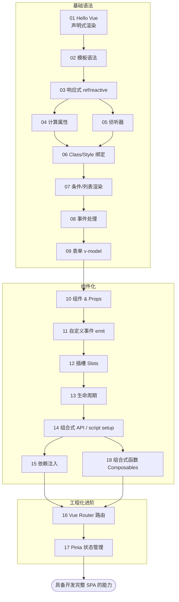

# 07 · Vue 3 渐进式前端框架

> Vue 是一款用于构建用户界面的 **渐进式 JavaScript 框架**。它以「声明式渲染」和「响应式系统」为核心，既能像库一样用 CDN 渐进增强已有页面，也能配合工程化工具（Vite + Vue Router + Pinia）构建完整的单页应用。本合集统一采用 **Vue 3 + 组合式 API（Composition API）** 风格。

## 📚 模块索引

| 模块 | 知识点 | 运行方式 | 关键内容 |
| --- | --- | --- | --- |
| [01-hello-vue](./01-hello-vue/) | 你好 Vue / 声明式渲染 | CDN | createApp、ref、`{{ }}`、mount |
| [02-template-syntax](./02-template-syntax/) | 模板语法 | CDN | 插值、v-html、v-bind、动态参数 |
| [03-reactivity](./03-reactivity/) | 响应式基础（配图） | CDN | ref vs reactive、Proxy 原理 |
| [04-computed](./04-computed/) | 计算属性 | CDN | 派生数据、缓存、可写 computed |
| [05-watch](./05-watch/) | 侦听器 | CDN | watch、watchEffect、深度监听 |
| [06-class-style-binding](./06-class-style-binding/) | Class/Style 绑定 | CDN | 对象/数组语法、内联 style |
| [07-conditional-list](./07-conditional-list/) | 条件/列表渲染 | CDN | v-if/v-show、v-for、:key |
| [08-event-handling](./08-event-handling/) | 事件处理 | CDN | v-on、修饰符、按键修饰符 |
| [09-form-v-model](./09-form-v-model/) | 表单绑定 | CDN | v-model、各表单元素、修饰符 |
| [10-components-props](./10-components-props/) | 组件与 Props（父传子） | CDN | 组件注册、props、单向数据流 |
| [11-emits-events](./11-emits-events/) | 自定义事件（子传父） | CDN | emit、组件 v-model |
| [12-slots](./12-slots/) | 插槽 | CDN | 默认/具名/作用域插槽 |
| [13-lifecycle](./13-lifecycle/) | 生命周期（配状态图） | CDN | onMounted/onUnmounted 等 |
| [14-composition-setup](./14-composition-setup/) | 组合式 API 与 setup | CDN | setup() 与 `<script setup>` |
| [15-provide-inject](./15-provide-inject/) | 依赖注入 | CDN | provide/inject 跨层传递 |
| [16-vue-router](./16-vue-router/) | 路由 | **Vite** | RouterLink/View、动态路由、懒加载 |
| [17-pinia-store](./17-pinia-store/) | 状态管理 | **Vite** | Pinia store、state/getter/action |
| [18-composables](./18-composables/) | 组合式函数复用 | CDN | useXxx、逻辑复用、生命周期封装 |

## 🗺️ 学习路线图



学习建议：
1. **基础语法（01–09）**：用 CDN 快速过一遍，建立「数据驱动视图」的直觉。
2. **组件化（10–15、18）**：掌握组件通信（props / emit / slot / provide-inject）和组合式 API，这是 Vue 的核心。
3. **工程化进阶（16–17）**：上 Vite 脚手架，学路由和状态管理，能独立写完整单页应用。

## ▶️ 运行说明（两类）

本工程的模块分两种运行方式：

### 一、CDN 免构建模块（01–15、18）

无需安装任何东西，**直接用浏览器打开模块目录下的 `index.html`** 即可：

```
双击 07-vue/01-hello-vue/index.html
```

这些模块通过 `<script src="https://unpkg.com/vue@3/dist/vue.global.js">` 引入 Vue 的全局构建版，使用 `setup()` 形式的组合式 API。适合快速学习语法概念。

### 二、Vite 脚手架模块（16-vue-router、17-pinia-store）

涉及路由 / 状态管理的工程化模块，使用官方推荐的 **Vite** 构建，并采用 SFC 单文件组件（`.vue`）+ `<script setup>` 语法。需要 Node.js 环境：

```bash
# 以路由模块为例
cd 07-vue/16-vue-router
npm install     # 安装依赖
npm run dev     # 启动开发服务器
# 浏览器打开终端提示的地址（默认 http://localhost:5173）
```

17-pinia-store 同理（`cd 07-vue/17-pinia-store && npm install && npm run dev`）。

> 提示：CDN 用 `setup()` 写法，Vite 用 `<script setup>` 写法，二者是同一套组合式 API，只是后者是单文件组件下的语法糖（更简洁、无需 return）。

## 🔗 官方文档

- Vue 3 中文官方文档：https://cn.vuejs.org/
- 快速上手：https://cn.vuejs.org/guide/quick-start.html
- Vue Router：https://router.vuejs.org/zh/
- Pinia：https://pinia.vuejs.org/zh/
