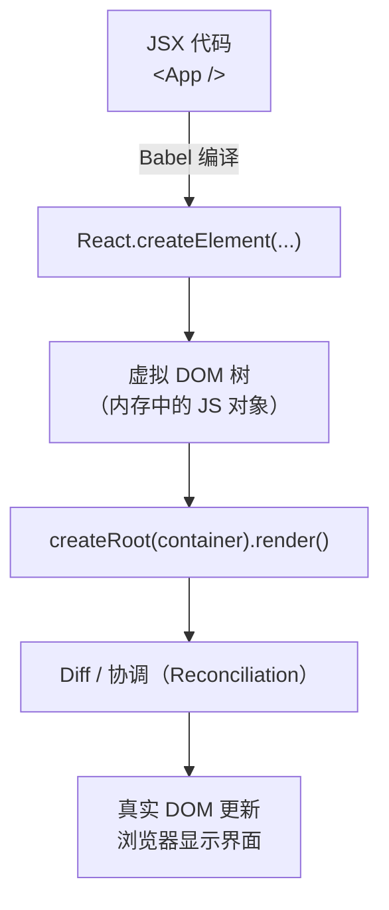

# 01 · 你好 React（Hello React）
> React 是用于构建用户界面的 JavaScript 库，核心思想是「声明式 + 组件化」：你描述 UI 该长什么样，React 负责高效地把它渲染成真实 DOM。

## 📖 知识讲解

### React 是什么
- **声明式 UI**：你只写「数据是这样时，界面应该长这样」，不写「先找到节点、再 setAttribute、再 appendChild」这类命令式操作。数据变化时，React 自动算出最小差异并更新真实 DOM。
- **组件化**：UI 拆成一个个可复用、可组合的组件。组件就是一个**首字母大写、返回 JSX 的函数**。
- **虚拟 DOM**：React 在内存里维护一棵轻量的 JS 对象树（虚拟 DOM），每次更新先在内存做 diff，再批量更新真实 DOM，避免频繁直接操作 DOM 带来的性能损耗。

### 核心 API
| API | 作用 |
| --- | --- |
| `React.createElement(type, props, ...children)` | 创建虚拟 DOM 节点（JSX 编译后的真身） |
| `ReactDOM.createRoot(container)` | React 18 新入口，创建并发模式根 |
| `root.render(<App />)` | 把组件渲染进容器 |

### React 18 `createRoot` vs 旧版 `ReactDOM.render`
```js
// 旧版（React 17 及以前），React 18 仍能用但会告警，已不推荐
ReactDOM.render(<App />, document.getElementById('root'));

// React 18 推荐写法：两步走
const root = ReactDOM.createRoot(document.getElementById('root'));
root.render(<App />);
```
- 新版启用了 **并发渲染（Concurrent Rendering）** 能力（自动批处理、`useTransition` 等）。
- `createRoot` 返回的 `root` 可复用，后续更新只需再次 `root.render(...)`。

## 🔄 流程图 / 原理图



## 💻 代码说明

```jsx
const { useState, useEffect } = React; // CDN 下 React 是全局变量，按需解构
```
- 从全局 `React` 解构出 Hook。

```jsx
function Hello() {
  return <h1>Hello React 👋</h1>;
}
```
- 最小组件：一个返回 JSX 的函数，名字必须大写。

```jsx
const [now, setNow] = useState(new Date());
useEffect(() => {
  const timer = setInterval(() => setNow(new Date()), 1000);
  return () => clearInterval(timer);
}, []);
```
- `Clock` 用 `useState` 存当前时间，`useEffect` 每秒更新一次；state 改变就触发重渲染，体现「声明式」——我们从不手动改 DOM 文本。

```jsx
const root = ReactDOM.createRoot(document.getElementById('root'));
root.render(<App />);
```
- React 18 标准入口：先建根，再渲染。

## ▶️ 运行方式

CDN 免构建：用浏览器**直接双击打开** `index.html` 即可，无需安装任何依赖。

## ⚠️ 常见坑 / 最佳实践
- **组件名必须大写**：`function App()` 用 `<App/>`；小写会被当成普通 HTML 标签。
- **React 18 用 `createRoot`**，不要再用 `ReactDOM.render`（会有废弃告警）。
- CDN + Babel standalone **仅用于学习**：JSX 在浏览器实时编译有性能开销，生产环境请用 Vite/CRA 预编译。
- 生产环境记得换成 `react.production.min.js`，开发版体积大但报错友好。

## 🔗 官方文档
- React 快速上手：https://react.dev/learn
- `createRoot` API：https://react.dev/reference/react-dom/client/createRoot
