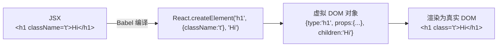

# 02 · JSX 语法（JSX Syntax）
> JSX 是一种「在 JS 里写类 HTML 结构」的语法扩展，它最终被编译成 `React.createElement(...)` 调用，让你用声明式方式描述 UI。

## 📖 知识讲解

### JSX 核心规则
| 规则 | 说明 | 示例 |
| --- | --- | --- |
| 表达式插值 `{}` | 花括号里放**任意 JS 表达式**（变量、运算、三元、函数调用） | `<p>{1 + 1}</p>` |
| `className` | HTML 的 `class` → JSX 写 `className`（`class` 是 JS 关键字） | `<div className="box">` |
| `htmlFor` | HTML 的 `for` → JSX 写 `htmlFor` | `<label htmlFor="id">` |
| `style` 是对象 | 值是 **JS 对象**，属性名**驼峰式**，数值带单位用字符串 | `style={{ fontSize: '14px' }}` |
| 单根节点 | 组件必须返回**单个根元素**，多个用 Fragment 包裹 | `<>...</>` |
| 自闭合标签 | 无子节点的标签必须自闭合 | `<br />`、`` |
| 注释 | 在 JSX 中用 `{/* ... */}` | `{/* 这是注释 */}` |

### JSX 是语法糖
```jsx
// 你写的 JSX：
const el = <h1 className="title">Hi</h1>;

// Babel 编译后约等于：
const el = React.createElement('h1', { className: 'title' }, 'Hi');
```
所以 JSX 不是 HTML，也不是字符串——它是创建虚拟 DOM 节点的函数调用。

### Fragment（片段）
当需要返回多个并列元素又不想多包一层 `div` 时，用 `<>...</>`（`React.Fragment` 简写），它不会在真实 DOM 中产生额外节点。

## 🔄 流程图 / 原理图



## 💻 代码说明

```jsx
const badgeStyle = { backgroundColor: user.vip ? '#f5a623' : '#bbb', fontSize: '12px' };
```
- `style` 接收**对象**，CSS 属性写成**驼峰**（`background-color` → `backgroundColor`）。

```jsx
return (
  <>
    <div className="user-card"> ... </div>
  </>
);
```
- 用 Fragment `<>` 保证单根节点；`class` 写成 `className`。

```jsx
<p>年龄：{user.age} 岁（明年 {user.age + 1} 岁）</p>
<span>{user.vip ? 'VIP 会员' : '普通用户'}</span>
```
- `{}` 内可插变量、做运算、写三元条件。

```jsx
<label htmlFor="nick">昵称：</label>
<input id="nick" defaultValue={user.name} />
```
- `for` 写成 `htmlFor`；`<input />` 自闭合。

## ▶️ 运行方式

CDN 免构建：浏览器直接打开 `index.html` 即可看到用户卡片。

## ⚠️ 常见坑 / 最佳实践
- **`class` → `className`、`for` → `htmlFor`**：写错不会报错但属性不生效。
- **`style` 是对象不是字符串**：`style="color:red"`（❌） → `style={{ color: 'red' }}`（✅，外层 `{}` 是插值，内层 `{}` 是对象）。
- **必须单根节点**：返回多个并列元素要用 `<>...</>` 或一个父容器包裹。
- **JSX 注释**用 `{/* */}`，不能用 HTML 的 `<!-- -->`。
- **`{}` 里只能放表达式**，不能放 `if`/`for` 语句（可用三元、`&&`、`.map()` 替代）。

## 🔗 官方文档
- 用 JSX 书写标签：https://react.dev/learn/writing-markup-with-jsx
- JSX 中使用花括号：https://react.dev/learn/javascript-in-jsx-with-curly-braces
