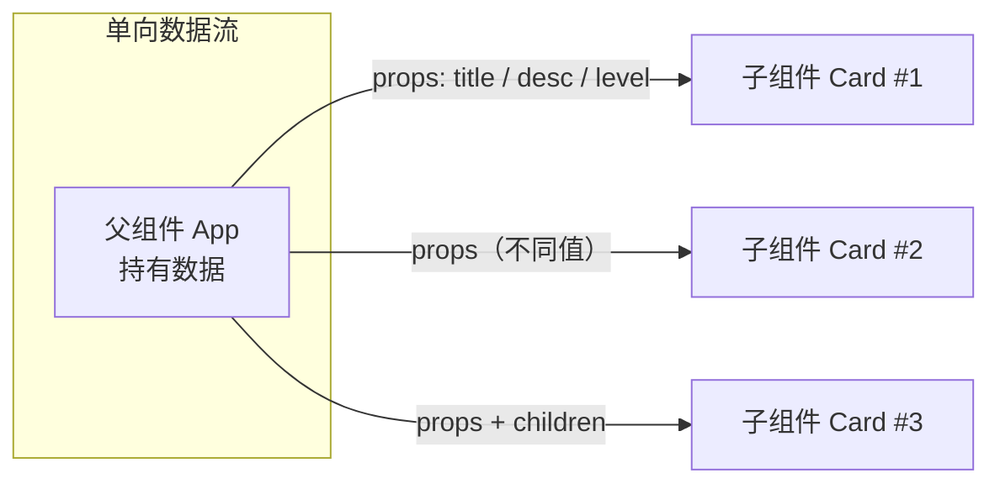

# 03 · 组件与 Props（Components & Props）
> 组件是 UI 的复用单元，props 是父组件向子组件传数据的「只读参数」，数据单向从父流向子。

## 📖 知识讲解

### 函数组件
- 组件就是一个**返回 JSX 的函数**，**首字母必须大写**（小写会被当成普通 HTML 标签）。
- 一个组件应聚焦一件事，便于复用与维护。

### Props（属性）
- 父组件通过**标签属性**把数据传给子组件：`<Card title="HTML" />`。
- 子组件以**单一对象参数**接收：`function Card(props)`，常直接**解构**：`function Card({ title, desc })`。
- **Props 是只读的**：子组件不能修改 props（违反单向数据流）。要变化请用 state（见 04）。
- **默认值**：在解构时写 `level = '普通'`，父组件没传时生效。

### children
- 写在组件标签**之间**的内容，会作为特殊 prop `children` 传入：
```jsx
<Card>这里的内容就是 children</Card>
```

### 单向数据流
数据只能**父 → 子**流动，子组件想通知父组件得靠父组件传下来的回调函数（事件向上，数据向下）。

## 🔄 流程图 / 原理图



## 💻 代码说明

```jsx
function Card({ title, desc, level = '普通', children }) { ... }
```
- 解构接收 props；`level` 带默认值；`children` 取嵌套内容。

```jsx
<Card title="HTML" desc="网页结构骨架">
  <small>👉 学习第 1 站</small>
</Card>
```
- 通过属性传 `title`/`desc`；`<small>` 作为 `children` 传入。

```jsx
<Card title="React" desc="构建用户界面的库" level="进阶">...</Card>
<Card title="TypeScript" desc="带类型的 JS" level="进阶" />
```
- 同一个 `Card` 用不同 props **复用**；最后一张不传 `children`，子组件里 `{children}` 渲染为空。

## ▶️ 运行方式

CDN 免构建：浏览器直接打开 `index.html`，可见三张复用同一组件的卡片。

## ⚠️ 常见坑 / 最佳实践
- **组件名必须大写**：`function card()` + `<card/>` 会被当成未知 HTML 标签，不会渲染你的组件。
- **Props 只读**：不要写 `props.title = 'x'`，要变化用 state。
- **单向数据流**：子改父数据要靠父传下来的回调，不能直接反向赋值。
- 默认值优先用**解构默认值**（`{ level = '普通' }`），旧的 `Card.defaultProps` 在函数组件中已不推荐。
- 传布尔/数字/对象用 `{}`：`<Card count={3} active={true} />`；纯字符串可直接用引号。

## 🔗 官方文档
- 你的第一个组件：https://react.dev/learn/your-first-component
- 向组件传递 props：https://react.dev/learn/passing-props-to-a-component
