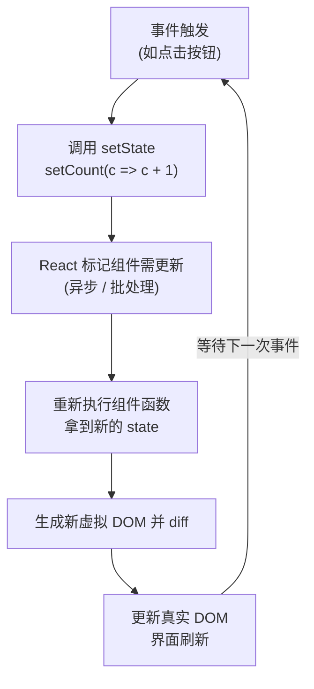

# 04 · 状态管理 useState（useState Hook）
> `useState` 让函数组件拥有「记忆」：保存会变化的数据，并在数据更新时自动触发重新渲染。

## 📖 知识讲解

### 基本用法
```jsx
const [count, setCount] = useState(0);
//     ↑当前值   ↑更新函数        ↑初始值（仅首次渲染生效）
```
- `useState(初始值)` 返回一个数组：`[当前状态, 更新函数]`，用解构接收。
- 调用 `setCount(newValue)` 会：① 更新 state；② **触发组件重新渲染**，界面随之刷新。

### 函数式更新
当新值依赖旧值时，应传**函数**而非直接值：
```jsx
setCount(c => c + 1); // c 是 React 保证的「最新值」
```
- 在同一事件里连续多次更新时，**只有函数式更新能正确累加**。

### 状态是异步、批量更新的
- 调用 `setCount` 后，`count` 变量**不会立刻变**，要等下一次渲染才拿到新值。
- React 18 会把同一事件里的多次 `setState` **批处理**成一次重渲染（性能优化）。

### 状态不可变（Immutability）
- **不要直接改 state**，必须传**新引用**，React 靠引用比较判断是否要重渲染：
```jsx
// 对象
setUser({ ...user, age: user.age + 1 });
// 数组
setList([...list, newItem]);
```

## 🔄 流程图 / 原理图



## 💻 代码说明

```jsx
const [count, setCount] = useState(0);
```
- 声明计数状态，初始 0。

```jsx
const addWrong = () => { setCount(count + 1); setCount(count + 1); setCount(count + 1); };
```
- **错误**：本轮 `count` 是固定旧值，三次都等价 `setCount(1)`，最终只 +1。

```jsx
const addRight = () => { setCount(c => c + 1); setCount(c => c + 1); setCount(c => c + 1); };
```
- **正确**：函数式更新每次基于最新值累加，结果 +3。

```jsx
const [on, setOn] = useState(false);
<button onClick={() => setOn(v => !v)}>...</button>
```
- 布尔开关用 `v => !v` 取反，干净且不依赖外部旧值。

## ▶️ 运行方式

CDN 免构建：浏览器直接打开 `index.html`，对比「连点3次(错)」与「连点3次(对)」的差异。

## ⚠️ 常见坑 / 最佳实践
- **直接改 state 不会重渲染**：`count++`、`user.age = 1`（❌），必须调用 setter 并传新值/新引用。
- **连续 `setCount(count + 1)` 只 +1**：依赖旧值时用函数式更新 `setCount(c => c + 1)`。
- **setState 后立即读 state 还是旧值**：state 更新是异步的，新值要到下次渲染才能拿到。
- **对象/数组要返回新引用**：用展开运算符 `{...obj}` / `[...arr]`，否则 React 认为没变化不重渲染。
- **初始值只在首次渲染生效**：之后再传不同初始值不会重置 state。

## 🔗 官方文档
- useState 参考：https://react.dev/reference/react/useState
- state：组件的记忆：https://react.dev/learn/state-a-components-memory
