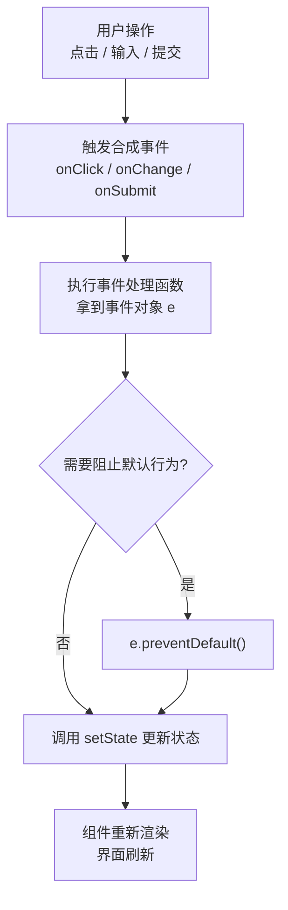

# 05 · 事件处理（Event Handling）
> React 用 `onClick`、`onChange` 等驼峰式属性绑定事件，背后是统一封装的「合成事件」，并以此驱动 state 更新与界面刷新。

## 📖 知识讲解

### 绑定事件
- 用**驼峰命名**的属性绑定：`onClick`、`onChange`、`onSubmit`、`onInput`…
- 值传**函数引用**，**不要加括号**：
```jsx
<button onClick={handleClick}>   // ✅ 传函数
<button onClick={handleClick()}> // ❌ 渲染时立即执行
```

### 传参：用箭头函数包一层
```jsx
<button onClick={() => greet('小明')}>...</button>
```
- 直接写 `onClick={greet('小明')}` 会在渲染时立刻执行。用箭头函数延迟到点击时才调用。

### 事件对象 e（合成事件 SyntheticEvent）
- 处理函数自动收到事件对象 `e`，它是 React 对原生事件的**跨浏览器封装**，API 与原生基本一致。
- `e.target.value`：取输入框当前值。
- `e.preventDefault()`：阻止默认行为（如表单提交刷新页面、链接跳转）。
- `e.stopPropagation()`：阻止事件冒泡。

### 合成事件 vs 原生事件
- React 17+ 把事件委托挂在**渲染容器根节点**上统一分发（不是 document）。
- 合成事件做了跨浏览器兼容与性能优化；多数场景无需接触原生事件。

## 🔄 流程图 / 原理图



## 💻 代码说明

```jsx
<button onClick={handleClick}>点我</button>
```
- 传函数引用（不加括号），点击时才执行。

```jsx
<button onClick={() => greet('小明')}>跟小明打招呼</button>
```
- 需要传参，用箭头函数包一层延迟执行。

```jsx
function handleChange(e) { setText(e.target.value); }
<input value={text} onChange={handleChange} />
```
- `onChange` 每次输入实时触发，从 `e.target.value` 取值更新 state（受控输入）。

```jsx
function handleSubmit(e) { e.preventDefault(); setSubmitted(text); }
<form onSubmit={handleSubmit}>...</form>
```
- 表单提交先 `e.preventDefault()` 阻止页面刷新，再处理数据。

## ▶️ 运行方式

CDN 免构建：浏览器直接打开 `index.html`，分别试点击、输入、提交三个区域。

## ⚠️ 常见坑 / 最佳实践
- **`onClick={handler()}` 会在渲染时立即执行**：去掉括号传引用，或用 `() => handler()`。
- **传参必须用箭头函数包**：`onClick={() => fn(arg)}`，不能写 `onClick={fn(arg)}`。
- **表单不写 `e.preventDefault()` 会刷新页面**，导致 state 全部丢失。
- **事件名是驼峰**：`onClick` 而非 `onclick`；`onChange` 而非 `onchange`。
- 受控输入要同时给 `value` 和 `onChange`，否则输入框无法编辑（只读警告）。

## 🔗 官方文档
- 响应事件：https://react.dev/learn/responding-to-events
- React 事件对象：https://react.dev/reference/react-dom/components/common#react-event-object
