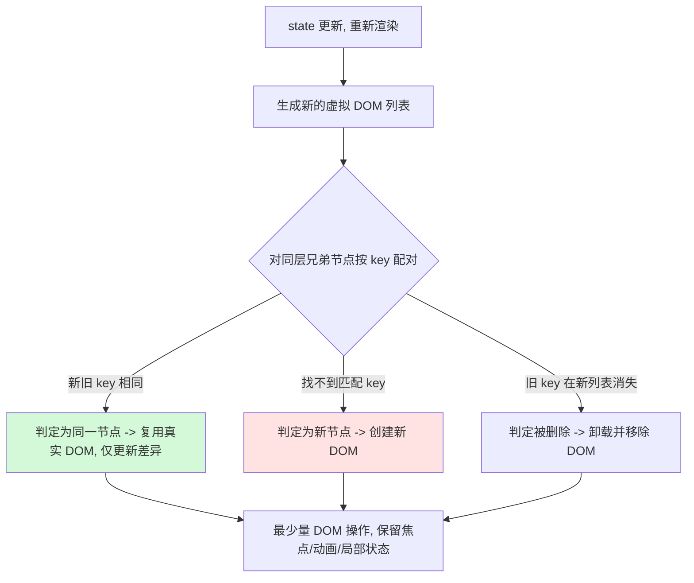

# 07 · 列表与 Key（Lists & Keys）
> 用 `array.map()` 把数据数组渲染成一组元素，并用 `key` 帮 React 在更新时高效复用节点。

## 📖 知识讲解
渲染列表的标准做法：对数据数组调用 `map()`，每项返回一个 JSX 元素。

核心 API / 语法：
- `arr.map((item) => <li key={item.id}>{item.text}</li>)`
- `key` 是给 React 内部用的特殊属性（**不会**作为 props 传给组件），用于在两次渲染之间识别「哪个元素是同一个」。

**key 的作用与原理**：React 更新时会对比新旧虚拟 DOM（diff）。在同一层的兄弟节点中，React 用 `key` 把新旧元素一一配对：

- key 相同 → 认为是同一个节点 → 复用真实 DOM，只更新变化的属性/内容。
- key 不存在或变了 → 认为是新节点 → 销毁旧 DOM、创建新 DOM。

所以 key 必须**稳定、唯一、可预测**：通常用数据本身的业务 id（数据库主键等）。

易错点：
- 列表项缺少 `key` → 控制台 warning，且 diff 退化、可能出现状态错位。
- 用数组 `index` 当 key → 一旦插入/删除/排序，index 与数据错位，导致 DOM 复用错误（输入框内容、勾选状态跑到别的行）。
- 用 `Math.random()` 当 key → 每次渲染都不同，React 每次都全删全建，性能差且丢失状态。

## 🔄 流程图 / 原理图

## 💻 代码说明
- **数据结构**：每个 todo 是 `{ id, text }`，`id` 由全局自增的 `nextId` 生成 —— 保证稳定唯一。
- **add()**：`setTodos([...todos, { id: nextId++, text }])`，新对象拿到全新 id。
- **remove(id)**：`todos.filter(t => t.id !== id)`，剩余项 id 不变，React 据 `key={t.id}` 精确复用未删除的行。
- **moveUp(i)**：交换相邻两项顺序。因为 key 用的是 `t.id` 而非 `index`，顺序变化后 React 仍能正确把节点搬到新位置，而不是把内容“串行”。
- **渲染**：`todos.map((t, i) => <li key={t.id}>…</li>)`，注意 `key` 取 `t.id`，`i` 只用于 moveUp 计算位置。

## ▶️ 运行方式
CDN 免构建：浏览器直接打开本目录 `index.html` 即可。

## ⚠️ 常见坑 / 最佳实践
- 🚫 `key={index}`：列表会增删/排序时绝不要用，会导致状态错位。仅当列表是「静态、永不重排、无本地状态」时才勉强可用。
- 🚫 `key={Math.random()}`：每次渲染都变，等于全量重建，性能与状态双输。
- ✅ 用业务唯一 id 当 key；没有 id 时在数据进入时生成一次并保存，而不是渲染时临时生成。
- ✅ key 只需在「同一层兄弟之间」唯一，不必全局唯一。
- ✅ `map` 里若要写多行逻辑，用 `{...}` 加 `return`；只返回单个元素可用箭头隐式返回。

## 🔗 官方文档
- 渲染列表：https://react.dev/learn/rendering-lists
- 为什么需要 key：https://react.dev/learn/rendering-lists#keeping-list-items-in-order-with-key
