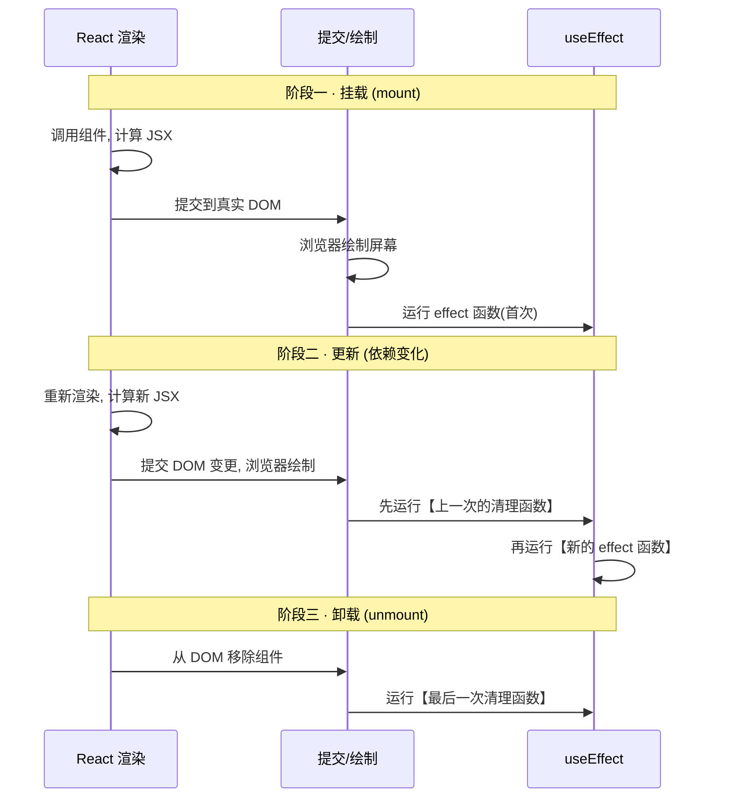
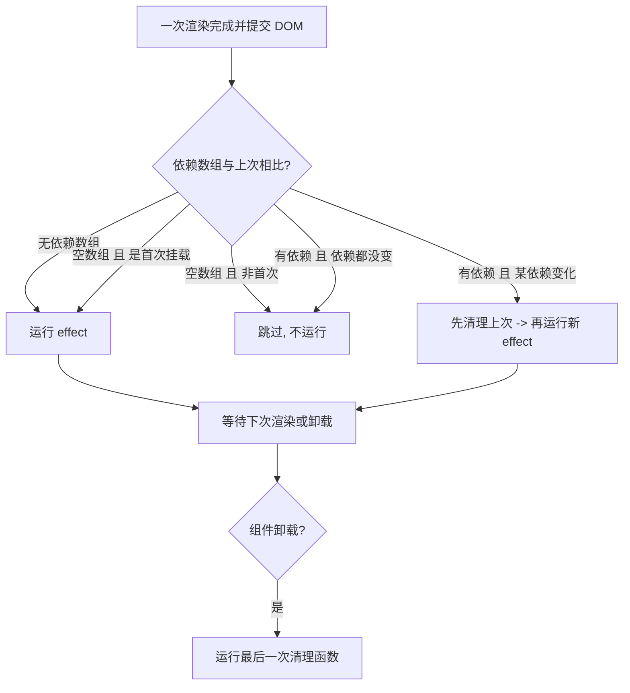

# 08 · useEffect（副作用与执行时机）
> 在「渲染之外」做副作用：定时器、事件订阅、网络请求、手动操作 DOM —— 并在合适时机清理它们。

## 📖 知识讲解
组件的渲染应当是「纯」的（只根据 props/state 算出 JSX）。但有些事情必须发生在渲染之后、与外部世界交互——这些叫**副作用**。`useEffect` 就是把副作用从渲染中分离出来的钩子。

核心 API / 语法：
```js
useEffect(() => {
  // 副作用：订阅、定时器、请求…
  return () => { /* 清理函数（可选） */ };
}, [依赖]);
```

**依赖数组三种形态**：
| 写法 | 何时运行 | 典型用途 |
| --- | --- | --- |
| `useEffect(fn)` 无第二参 | **每次渲染**提交后都运行 | 很少用，容易性能问题 |
| `useEffect(fn, [])` 空数组 | **仅挂载时**运行一次，卸载时清理 | 一次性订阅、初始化 |
| `useEffect(fn, [dep])` | 挂载时 + **dep 变化**时运行 | 依赖某值的副作用 |

**清理函数 `return () => {}` 的时机**：
- 在**下一次 effect 运行之前**，先运行上一次 effect 的清理。
- 在**组件卸载时**运行最后一次清理。
- 用途：清掉定时器、取消订阅、关闭连接，避免内存泄漏。

**严格模式（StrictMode）**：开发环境下 React 会故意「挂载 → 立即卸载 → 再次挂载」，导致 effect 与清理各跑两次。这是为了帮你发现「没写清理」的副作用，**生产环境只跑一次**。

## 🔄 流程图 / 原理图
useEffect 在三个阶段的执行时机：



补充的决策流：



## 💻 代码说明
- **Timer（`[running]` 依赖 + 清理）**：用 `setInterval` 每秒 `setSeconds(s => s + 1)`（函数式更新避免闭包旧值）。`return () => clearInterval(id)` 在 running 变化或卸载时清掉定时器。把组件用开关卸载，可在控制台看到「清理 setInterval」。
- **WindowSize（`[]` + 订阅清理）**：挂载时 `addEventListener('resize')`，清理里 `removeEventListener`。空依赖表示只订阅一次。
- **RenderLogger（无依赖数组）**：对比演示——每次渲染都打印日志，说明无依赖 effect 的运行频率。

打开浏览器控制台即可观察各 effect 的「建立 / 清理」日志；StrictMode 下挂载阶段会成对出现两次。

## ▶️ 运行方式
CDN 免构建：浏览器直接打开本目录 `index.html` 即可，打开控制台看日志效果更佳。

## ⚠️ 常见坑 / 最佳实践
- 🚫 **忘记清理**：`setInterval` / 事件监听 / 订阅不清理 → 内存泄漏、计时叠加、卸载后 setState 报警。务必 `return` 清理函数。
- 🚫 **依赖数组遗漏**：effect 里用到的 props/state 都应进依赖数组，否则拿到旧值（stale closure）。用 ESLint 的 `react-hooks/exhaustive-deps` 检查。
- 🚫 **无限循环**：effect 里 `setState`，又把该 state 放进依赖（或没写依赖）→ 改 state 触发渲染 → 再跑 effect → 再改 state… 解决：去掉不必要的依赖、用函数式更新、或把逻辑挪到事件处理里。
- 🚫 **把不该用 effect 的逻辑塞进 effect**：能由 props/state 直接算出的数据不需要 effect；用户操作引发的逻辑应放事件处理函数。
- ℹ️ **StrictMode 双调用**：开发环境 effect 跑两次是正常的，只要清理写对就不会有问题，别为了消除它而删 StrictMode。
- ✅ 计时器/订阅类副作用，依赖能少则少，并务必成对写「建立 ↔ 清理」。

## 🔗 官方文档
- useEffect 参考：https://react.dev/reference/react/useEffect
- 同步副作用到外部系统：https://react.dev/learn/synchronizing-with-effects
- 你可能不需要 Effect：https://react.dev/learn/you-might-not-need-an-effect
