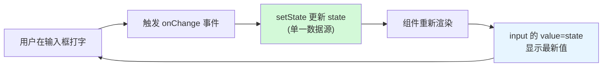

# 09 · 受控表单（Controlled Forms）
> 让 React 的 state 成为表单输入的「唯一数据源」：界面值由 state 决定，输入又通过 onChange 写回 state。

## 📖 知识讲解
HTML 表单元素（input/select/textarea）天生自己维护内部状态。React 里我们通常把它们改造成**受控组件**：值由 state 提供（`value` / `checked`），变化通过 `onChange` 回写 state。这样 state 就是「单一数据源」，界面和数据永远一致。

核心写法：
- **文本框**：`<input value={state} onChange={e => setState(e.target.value)} />`
- **下拉 select**：受控用 `value`，**不要**给 `<option>` 加 `selected`。
- **复选框 checkbox**：受控用 `checked={布尔}`，回写读 `e.target.checked`，**不是 value**。
- **单选 radio**：同一组用相同 `name`，每个用 `checked={当前值 === 该选项值}`。
- **多字段**：用一个对象 state + 通用 `handleChange`，靠 `name` 定位字段、计算属性名 `[name]` 更新。
- **提交**：`<form onSubmit={...}>` 里 `e.preventDefault()` 阻止整页刷新。

受控的本质是一个**单向闭环**：`输入 → onChange → setState → 重新渲染 → value 更新到新 state`。

易错点：
- 只写了 `value` 却没写 `onChange` → React 警告「你提供了 value 但没有 onChange，字段变只读」。要么补 onChange，要么用 `defaultValue`（变非受控）。
- checkbox 误用 `value` 绑定 → 永远勾不动；必须用 `checked`。
- 受控 ↔ 非受控不能中途切换（value 从 `undefined` 变成有值），会报警告。

## 🔄 流程图 / 原理图

## 💻 代码说明
- **统一对象 state**：`{ username, gender, agree, role }` 一个 `useState` 管理全部字段。
- **通用 handleChange**：从 `e.target` 解构 `name, type, value, checked`；`type === 'checkbox'` 时取 `checked`，否则取 `value`；用 `[name]` 计算属性名更新对应字段，`...prev` 保留其它字段。
- **各控件受控点**：
  - 文本框 `value={form.username}`；
  - select `value={form.gender}`；
  - radio `checked={form.role === '...'}`，同 `name="role"`；
  - checkbox `checked={form.agree}`。
- **提交**：`onSubmit` 里 `e.preventDefault()` 后弹出 JSON；`disabled={!form.agree}` 演示「用 state 驱动按钮可用性」。
- **实时回显**：底部 `<pre>{JSON.stringify(form)}</pre>` 随输入同步变化，直观证明单一数据源。

## ▶️ 运行方式
CDN 免构建：浏览器直接打开本目录 `index.html`，边输入边看下方 state 实时变化。

## ⚠️ 常见坑 / 最佳实践
- 🚫 只写 `value` 不写 `onChange` → 字段只读且控制台报警。受控组件二者必须成对。
- 🚫 checkbox 用 `value={...}` → 勾不动。受控复选框用 `checked` + 读 `e.target.checked`。
- 🚫 select 给 option 写 `selected` → 在受控模式无效，应在 `<select value={...}>` 上控制。
- ⚖️ **受控 vs 非受控**：受控（value+onChange，state 驱动，便于校验/联动）；非受控（用 `defaultValue` + `ref` 读取，代码少但难实时控制）。同一字段不要中途切换。
- ✅ 多字段优先用一个对象 + 通用 handleChange，配 `name` 属性，减少重复代码。
- ✅ 更新对象 state 要用 `{...prev, [name]: ...}` 复制后修改，不要直接改原对象。

## 🔗 官方文档
- 表单与输入：https://react.dev/reference/react-dom/components/input
- 用 state 响应输入：https://react.dev/learn/reacting-to-input-with-state
- select 组件：https://react.dev/reference/react-dom/components/select
