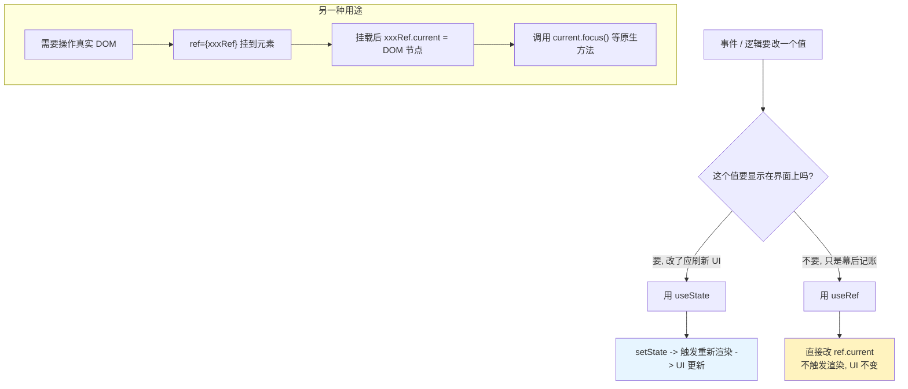

# 10 · useRef（引用 DOM 与可变值）
> 用 `useRef` 拿到真实 DOM 节点，或保存一个「跨渲染存在、但修改它不会触发重新渲染」的可变值。

## 📖 知识讲解
`useRef(initial)` 返回一个对象 `{ current: initial }`。这个对象在组件的整个生命周期里**保持同一个引用**，你可以随意读写它的 `.current`，而**React 不会因为 `.current` 变化而重新渲染**。它有两大用途：

1. **访问 DOM 节点**：把 ref 挂到 JSX 元素的 `ref` 属性上，React 在挂载后会把对应的真实 DOM 写进 `ref.current`，于是你能调用原生方法（`focus()`、`scrollIntoView()`、测量尺寸等）。
   ```jsx
   const inputRef = useRef(null);
   <input ref={inputRef} />
   inputRef.current.focus();
   ```
2. **保存可变值（不触发渲染）**：定时器 id、上一次的值、是否首次渲染等「需要在多次渲染间记住、但不需要显示在界面上」的数据。

核心 API / 语法：`const ref = useRef(初始值)`；读写 `ref.current`。

**ref vs state 的关键区别**：
| | state | ref |
| --- | --- | --- |
| 改变后是否重渲染 | ✅ 会 | ❌ 不会 |
| 读取的是 | 本次渲染的快照 | 永远是最新的 `.current` |
| 用途 | 要显示在 UI、参与渲染的数据 | 不参与渲染的「幕后」数据、DOM 引用 |

## 🔄 流程图 / 原理图


## 💻 代码说明
- **FocusInput（ref 操作 DOM）**：`const inputRef = useRef(null)`，`<input ref={inputRef} />`。挂载后 `inputRef.current` 就是真实 input；按钮里调用 `inputRef.current.focus()` / `.select()` 聚焦并选中。
- **RenderCounter（ref 存可变值）**：
  - `renderCount = useRef(0)`，每次渲染 `renderCount.current += 1` 记录渲染次数。因为改 ref 不触发渲染，所以**不会**造成无限循环；只有点「手动重渲染」或输入（`setText`）这种 state 变化才会重渲染，届时数字才会刷新显示。
  - `prevValue = useRef('（无）')`，配合 `useEffect` 在每次渲染提交后把当前 `text` 存进去，于是下次渲染时它代表「上一次的值」，实现「当前值 vs 上一次值」的对比。

## ▶️ 运行方式
CDN 免构建：浏览器直接打开本目录 `index.html` 即可。

## ⚠️ 常见坑 / 最佳实践
- 🚫 **挂载前 `ref.current` 是 null**：DOM 还没渲染时（如组件首次渲染期间）`current` 为 `null`，访问它的方法会报错。要在事件回调或 `useEffect` 里访问，那时 DOM 已就绪。
- 🚫 **不要在渲染期间读写 ref.current 做渲染逻辑**：渲染应保持纯粹。读写 ref 放到事件处理函数或 effect 里（示例中 `renderCount.current += 1` 仅作教学演示渲染次数，不参与决定渲染结果）。
- 🚫 **指望改 ref 刷新 UI**：改 `ref.current` 不会重渲染，界面不会更新。要让界面变就用 `state`。
- ✅ 定时器 id、订阅句柄、上一次的值、DOM 节点 → 用 ref；要显示、要驱动 UI 的数据 → 用 state。
- ✅ 给 DOM 用的 ref 初始值写 `null`；给数据用的 ref 写它的初始数据。

## 🔗 官方文档
- useRef 参考：https://react.dev/reference/react/useRef
- 用 ref 引用值：https://react.dev/learn/referencing-values-with-refs
- 用 ref 操作 DOM：https://react.dev/learn/manipulating-the-dom-with-refs
