# 12 · 复杂状态管理（useReducer）
> useReducer 把分散的状态更新逻辑收敛到一个 `(state, action) => newState` 的纯函数里，适合状态多、操作多、相互关联的场景。

## 📖 知识讲解
当一个 state 有多种更新方式（增、删、改、切换……）时，用一堆 `useState` 会让逻辑散落各处。`useReducer` 把这些逻辑集中到一个 **reducer 函数** 中：

- **reducer**：`(state, action) => newState`，纯函数，根据 `action.type` 返回**全新**的 state。
- **dispatch**：`dispatch(action)`，组件里只负责「派发动作」，不关心怎么算，逻辑全在 reducer。
- **action**：一个描述「发生了什么」的对象，约定含 `type`（动作类型）和 `payload`（数据）。

调用方式：`const [state, dispatch] = useReducer(reducer, initialState)`。

**与 useState 的取舍**：
- 状态简单、彼此独立 → `useState` 更轻便。
- 状态结构复杂 / 下一个 state 依赖上一个 / 多处触发同类更新 → `useReducer` 更清晰、可测试（reducer 是纯函数，单测很容易）。

这正是 Redux 的核心思想：**单向数据流**。

## 🔄 流程图 / 原理图

```mermaid
flowchart LR
  U[用户操作<br/>点击/输入] --> D[dispatch&#40;action&#41;<br/>type + payload]
  D --> R["reducer&#40;state, action&#41;"]
  R --> N[返回新的 newState]
  N --> RR[React 重渲染]
  RR --> U
```

## 💻 代码说明
- `todoReducer` 用 `switch(action.type)` 处理 `add / toggle / remove / edit` 四种动作，每个分支都返回**新数组**（`[...]`、`map`、`filter`），不改原 state。
- `default` 分支原样 `return state`，防止未知 action 把 state 弄丢。
- 组件里只写 `dispatch({ type, payload })`，把「怎么更新」全部交给 reducer。

## ▶️ 运行方式
CDN 免构建：用浏览器直接打开本目录的 `index.html` 即可，无需任何构建工具。

## ⚠️ 常见坑 / 最佳实践
- **reducer 必须是纯函数**：不能 `state.push(...)`、`todo.done = true` 这样直接改原 state，必须返回新对象/新数组，否则 React 可能不更新或出现诡异 bug。
- **忘记 default 分支**：遗漏后未匹配的 action 会让函数返回 `undefined`，state 直接丢失。务必兜底 `return state`。
- **action.type 拼写错误**：字符串拼错不会报错，只是悄悄走进 default 什么都不做。可用常量或 TypeScript 字面量类型约束，减少手滑。

## 🔗 官方文档
- useReducer: https://react.dev/reference/react/useReducer
- 把 state 逻辑迁移到 reducer: https://react.dev/learn/extracting-state-logic-into-a-reducer
