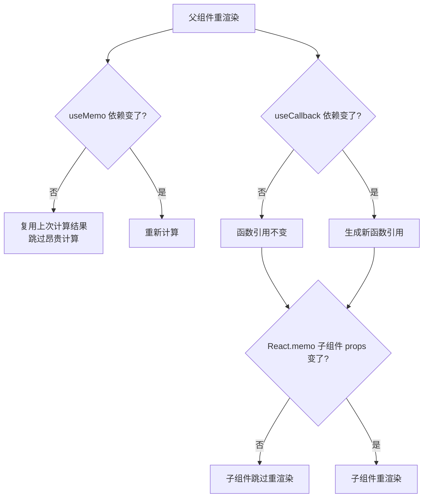

# 13 · 性能优化（useMemo / useCallback）
> useMemo 缓存「计算结果」，useCallback 缓存「函数引用」，配合 React.memo 跳过不必要的子组件重渲染。

## 📖 知识讲解
React 默认在组件每次重渲染时，会**重新执行函数体内的所有计算**、**重新创建所有内联函数**。大多数时候这没问题，但当：
- 某个计算很**昂贵**（大数组过滤、复杂运算），或
- 某个函数被当 props 传给用 `React.memo` 优化过的子组件，

重复创建就会造成浪费。三件套各司其职：

- **useMemo(fn, deps)**：返回 `fn()` 的**计算结果**，只有 `deps` 变化时才重新计算，否则复用上次结果。
- **useCallback(fn, deps)**：返回 `fn` **这个函数本身**（引用稳定），`deps` 不变就一直是同一个函数。等价于 `useMemo(() => fn, deps)`。
- **React.memo(Component)**：包裹子组件，只有当它收到的 props 引用发生变化时才重渲染。要让它生效，传进去的函数 props 必须用 `useCallback` 保证引用稳定。

一句话区别：**useMemo 给值，useCallback 给函数**。

## 🔄 流程图 / 原理图

## 💻 代码说明
- `expensiveFilter` 里用三百万次循环模拟耗时，并 `console.log` 标记每次执行。
- `filtered = useMemo(() => expensiveFilter(...), [keyword])`：点击与列表无关的「count+1」时，`keyword` 没变，过滤不会重跑。
- `handleSelect = useCallback(fn, [])`：函数引用恒定。
- `ListItem = memo(...)`：因为 `onSelect` 引用稳定，count++ 引发父组件重渲染时，子组件不会重渲染（控制台无 `🔁`）。

打开控制台对比「点 count+1」与「改输入框」两种操作的日志差异即可直观感受。

## ▶️ 运行方式
CDN 免构建：用浏览器直接打开本目录的 `index.html`，按 F12 打开控制台观察日志。

## ⚠️ 常见坑 / 最佳实践
- **不要过度优化**：useMemo/useCallback 本身有记忆和比较成本，给廉价计算或没被 memo 消费的函数加缓存，往往**更慢**还更难读。先测量再优化。
- **依赖数组写错**：漏写依赖会缓存到**旧值/旧闭包**（拿到过期的 state），导致逻辑错误；多写无关依赖又会让缓存频繁失效。务必把用到的外部变量都列全。
- **memo 形同虚设**：给 `React.memo` 子组件传了内联对象/内联函数（每次都是新引用），memo 永远判定「props 变了」，优化白做。必须搭配 useMemo/useCallback。
- **useMemo 返回值 vs useCallback 返回函数**：想缓存「算出来的东西」用 useMemo；想缓存「函数本身」用 useCallback。

## 🔗 官方文档
- useMemo: https://react.dev/reference/react/useMemo
- useCallback: https://react.dev/reference/react/useCallback
- memo: https://react.dev/reference/react/memo
