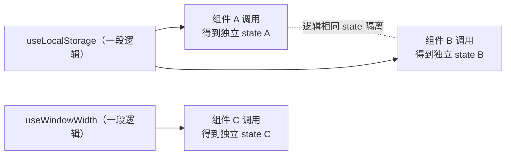

# 14 · 自定义 Hook（Custom Hooks）
> 把「带状态的可复用逻辑」抽成一个以 use 开头的函数，多个组件共享逻辑、但各自拥有独立的 state。

## 📖 知识讲解
自定义 Hook 就是一个**普通函数**，只是遵循两条约定：
1. **以 `use` 开头**命名（如 `useLocalStorage`）。这样 React 的 lint 规则（`eslint-plugin-react-hooks`）才会把它当 Hook 检查。
2. **内部可以调用其他 Hook**（`useState`、`useEffect`、甚至别的自定义 Hook）。

它解决的问题是**逻辑复用**：以前组件之间想共享「同步 localStorage」「监听窗口尺寸」「请求数据」这类带状态/副作用的逻辑很别扭，自定义 Hook 让你把这段逻辑打包，任意组件 `const x = useXxx()` 即可使用，返回值可以是任意东西（一个值、一个数组、一个对象都行）。

**关键认知**：自定义 Hook 共享的是「逻辑」，**不是 state**。两个组件调用同一个 `useLocalStorage`，各自得到一份**独立**的 state，互不影响——就像两个组件各自调用 `useState` 一样。

## 🔄 流程图 / 原理图

## 💻 代码说明
- **`useLocalStorage(key, initialValue)`**：用 `useState` 惰性初始化时先读 localStorage；用 `useEffect` 在 value 变化时写回。返回 `[value, setValue]`，用法和 `useState` 一致。
- **`useWindowWidth()`**：用 `useEffect` 注册 `resize` 监听并在清理函数里移除，返回当前宽度数字。
- `NameCard` 和 `ThemeCard` 都用 `useLocalStorage`，但 key 不同、state 完全独立，证明「共享逻辑、隔离状态」。

## ▶️ 运行方式
CDN 免构建：用浏览器直接打开本目录的 `index.html`。在输入框打字后刷新页面，内容仍在；拖动窗口大小可看到宽度实时变化。

## ⚠️ 常见坑 / 最佳实践
- **必须以 `use` 开头**：否则 React 的 Hook lint 规则不会校验「Hook 调用顺序」，可能漏掉在条件/循环里调用 Hook 的错误。
- **共享逻辑 ≠ 共享 state**：别误以为两个组件用同一个 Hook 就会同步数据。要真正共享数据请用 Context 或状态库。
- **不要在条件 / 循环 / 嵌套函数里调用 Hook**：自定义 Hook 内部调用的 useState/useEffect 同样受「只在顶层调用」规则约束，否则调用顺序错乱。
- **记得清理副作用**：像 `useWindowWidth` 这种加了事件监听的，`useEffect` 必须返回清理函数移除监听，避免内存泄漏。

## 🔗 官方文档
- 复用逻辑与自定义 Hook: https://react.dev/learn/reusing-logic-with-custom-hooks
- Hook 规则: https://react.dev/reference/rules/rules-of-hooks
