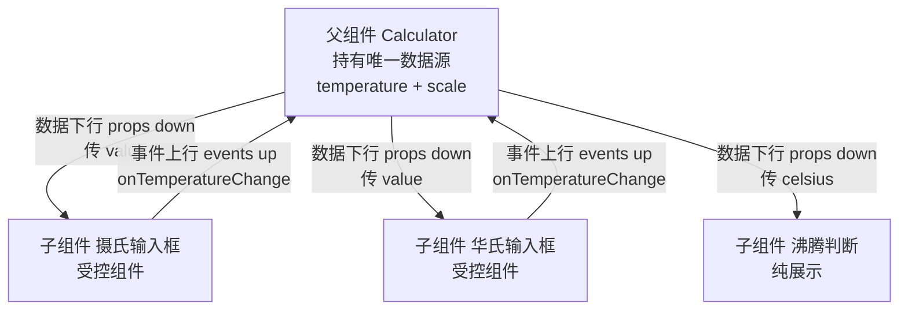

# 15 · 状态提升（Lifting State Up）
> 当多个组件需要共享并同步同一份数据时，把 state 提升到它们最近的公共父组件，由父组件统一管理、向下传值、向上收事件，从而保证“单一数据源”。

## 📖 知识讲解
在 React 中，state 是组件私有的。但很多场景里，两个兄弟组件（或一个组件和它的兄弟）需要"看到同一份数据"并保持同步。比如本例的摄氏 / 华氏两个温度输入框：改其中一个，另一个必须跟着变。

如果把温度 state 各自放在两个输入框里，它们就成了两份互相独立的数据，永远无法同步。解决办法是 **状态提升**：

1. **找到最近的公共父组件**（这里是 `Calculator`）。
2. **把共享的 state 移到父组件**（`temperature` + `scale`）。
3. **数据下行（props down）**：父组件把计算好的值通过 props 传给每个子输入框。
4. **事件上行（events up）**：子组件不直接改 state，而是调用父组件传下来的回调（`onTemperatureChange`），由父组件去更新 state。

这样所有显示都派生自父组件这一份"唯一数据源（single source of truth）"，天然同步。子输入框变成了 **受控组件**：它的值来自 props，由父组件掌控。

## 🔄 流程图 / 原理图

## 💻 代码说明
- `Calculator`（父组件）：用 `useState` 保存 `temperature`（输入值）和 `scale`（当前以哪个刻度输入）。这两个就是"唯一数据源"。
- `handleCelsiusChange` / `handleFahrenheitChange`：记录"是哪个框被改了 + 新值"。
- `celsius` / `fahrenheit`：根据唯一数据源 **派生计算** 出两个框各自该显示的值（另一个框的值是换算出来的）。
- `TemperatureInput`（子组件）：受控组件，`value` 来自 props，`onChange` 时只调用 `onTemperatureChange` 通知父组件，自己不存状态。
- `BoilingVerdict`（子组件）：纯展示组件，复用同一份共享状态判断是否沸腾，证明多个兄弟可共享一份数据。

## ▶️ 运行方式
CDN 免构建：浏览器直接打开 `index.html` 即可。无需安装任何依赖、无需启动服务器。

## ⚠️ 常见坑 / 最佳实践
- **状态放太低**：state 留在某个子组件里，兄弟组件拿不到，无法同步——需要提升。
- **状态放太高**：把 state 提到比"最近公共父组件"还高的层级，会导致不相关的组件树也跟着重渲染，影响性能。提到"刚好够用"的那一层即可。
- **受控组件由父控制**：子输入框的值必须来自 props，不要在子组件里再 `useState` 存一份，否则会出现两份数据打架。
- **派生数据不必存 state**：另一个刻度的值是算出来的，直接在渲染时计算即可，不要单独再放一个 state（避免数据冗余 / 不一致）。
- 提升后如果"穿透"层级太多（prop drilling 逐层透传），可考虑 `Context` 或状态管理库。

## 🔗 官方文档
- 共享组件间的状态（状态提升）：https://zh-hans.react.dev/learn/sharing-state-between-components
- 受控组件与 props：https://zh-hans.react.dev/learn/passing-props-to-a-component
