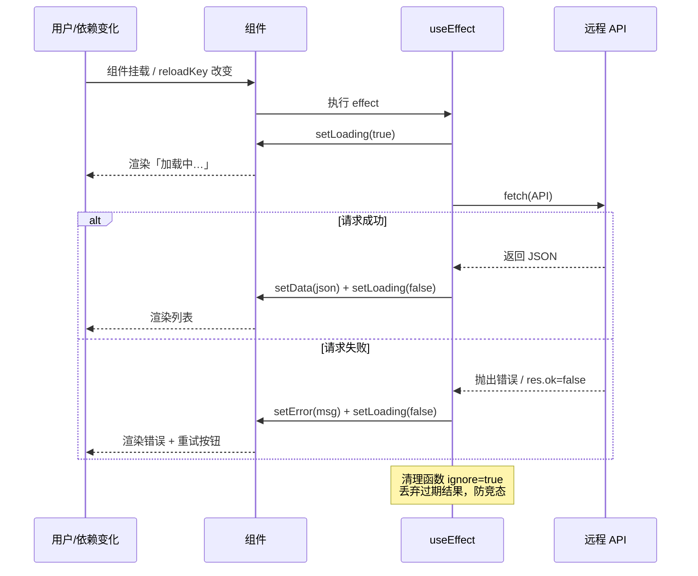

# 16 · 数据请求（Fetching Data）
> 在组件里用 `useEffect` + `fetch` 拉取远程数据，管理「加载中 / 出错 / 成功」三种状态，并处理依赖变化重新请求与竞态清理，避免渲染过期数据。

## 📖 知识讲解
组件渲染应当是「纯函数」，不能在渲染过程中直接发请求。数据请求属于 **副作用（side effect）**，要放进 `useEffect`：组件挂载后 React 才执行它去拉数据。

一次异步请求天然有三种结果状态，必须分别用 state 表示并渲染：
- **loading**：请求进行中，显示「加载中…」。
- **error**：请求失败（网络错误或 HTTP 4xx/5xx），显示错误信息。
- **data**：成功拿到数据，渲染列表。

关键细节：
- `fetch` 只在网络层失败时才 reject，HTTP 状态码 404/500 **不会自动抛错**，要手动判断 `res.ok`。
- `useEffect` 的回调函数本身 **不能是 async**（它需要返回清理函数，而 async 返回的是 Promise）。正确做法是在内部定义一个 async 函数再调用。
- **重新请求**：把一个会变化的值（本例的 `reloadKey`）放进依赖数组，它一变 effect 就重跑。
- **竞态条件（race condition）**：若依赖快速变化（如搜索词连打），多个请求并发，返回顺序不确定，旧请求可能晚于新请求返回并覆盖最新数据。用一个 `ignore` 标志（或 `AbortController`）在清理函数里把过期请求作废。

## 🔄 流程图 / 原理图

## 💻 代码说明
- 三个 state：`data` / `loading` / `error`，分别对应三态。
- `reloadKey`：点「重新请求」就 `+1`，作为 `useEffect` 依赖触发重拉。
- effect 内部定义 `fetchUsers` async 函数后立即调用，避免把 effect 回调写成 async。
- `if (!res.ok) throw` 手动处理 HTTP 错误。
- `let ignore = false` + 返回 `() => { ignore = true; }`：竞态保护，只有"当前有效"的请求结果才允许 `setState`。
- 渲染处按 `loading` → `error` → 成功 的顺序分支返回不同 UI。

## ▶️ 运行方式
CDN 免构建：浏览器直接打开 `index.html` 即可（需联网访问 `jsonplaceholder.typicode.com`）。

## ⚠️ 常见坑 / 最佳实践
- **别把 effect 回调写成 async**：`useEffect(async () => …)` 是错的，会破坏清理函数机制。请在内部定义 async 函数再调用。
- **竞态条件**：依赖频繁变化时，旧请求可能后到并覆盖新数据。用 `ignore` 标志或 `AbortController` 在清理函数里作废过期请求。
- **忘记依赖**：effect 用到的会变化的值都应放进依赖数组，否则拿到的是旧值（闭包陷阱）。
- **没处理错误**：`fetch` 不会因 404/500 reject，必须手动判断 `res.ok`，否则把错误页当成功数据解析。
- **StrictMode 双请求**：开发环境的 `StrictMode` 会故意挂载两次以暴露副作用问题，导致请求发两遍——这是正常的，清理函数能正确处理；生产环境不会双发。
- 真实项目建议用 React Query / SWR 等库，自带缓存、重试、去重、竞态处理。

## 🔗 官方文档
- 使用 Effect 同步外部系统：https://zh-hans.react.dev/learn/synchronizing-with-effects
- 你可能不需要 Effect（含数据请求注意事项）：https://zh-hans.react.dev/learn/you-might-not-need-an-effect
